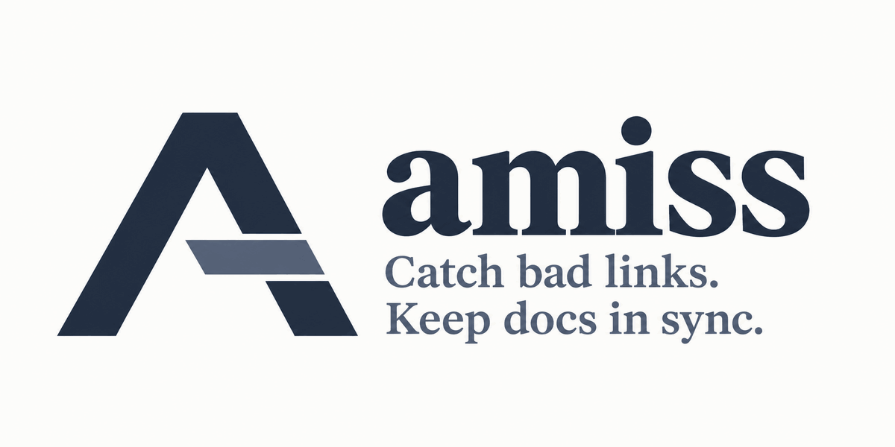

<p align="center">
  
</p>

<p align="center">
  <a href="https://crates.io/crates/amiss"></a>
  <a href="LICENSE.md"></a>
  <a href="https://scorecard.dev/viewer/?uri=github.com/HardMax71/amiss"></a>
</p>

Amiss checks the links and file references in a repository's documentation against the
git tree and fails the pull request when one stops resolving. It reads Markdown, MDX,
AsciiDoc and reStructuredText, and it compares two commits instead of inspecting one.
That second snapshot is what a link checker cannot see: a file that changed under a
paragraph that did not. External http links are never fetched; the report lists them, and
[Amiss and link checkers](https://hardmax71.github.io/amiss/comparison.html) shows the pipe
that hands them to lychee. Amiss reads structure, not meaning: it cannot tell you whether a
sentence is true, and it does not guess.

The engine keeps no state, runs nothing, never touches the network, and never writes. The
same inputs through the same binary give byte-identical reports.

Install from crates.io:

```sh
cargo install --locked amiss
```

Or take a prebuilt binary from the [release page](https://github.com/HardMax71/amiss/releases),
built for Linux x86_64 and aarch64, macOS x86_64 and aarch64, and Windows x86_64. The download
has no executable bit, and the checksum file lists every asset, so the check skips the ones
you did not fetch:

```sh
curl -sSLO https://github.com/HardMax71/amiss/releases/latest/download/amiss-linux-x86_64
curl -sSLO https://github.com/HardMax71/amiss/releases/latest/download/SHA256SUMS
sha256sum -c --ignore-missing SHA256SUMS
chmod +x amiss-linux-x86_64 && mv amiss-linux-x86_64 amiss
```

`cargo binstall amiss` does the same download and rename for you, and
`gh attestation verify amiss --repo HardMax71/amiss` (gh 2.49 or later) proves the file came
from this repository's release workflow.

Then check the staged state against the last commit. `--object-format` is `sha1` for nearly
every repository; `git rev-parse --show-object-format` prints yours. The form below names only
`HEAD`, so it works on a depth-1 clone and on any repository with at least one commit:

```sh
amiss check --repo . --object-format sha1 \
  --base "$(git rev-parse HEAD)" --index --profile observe
```

The first line is the verdict, `amiss: pass (fix 0, check 0, pre-existing 0, errors 0, exit 0)`
on a repository with nothing wrong. On one with three broken references, a row names the
target with the kind and reason its places share, and each place below names the document
and the position:

```text
amiss: pass (fix 0, check 0, pre-existing 3, errors 0, exit 0)
Pre-existing target "README.md" affected places 1 explicit-target-missing heading-anchor-not-found
  "README.md":3:33
Pre-existing target "docs/guide.md" affected places 1 explicit-target-missing path-not-found
  "README.md":3:5
Pre-existing target "src/lib.rs" affected places 1 explicit-target-missing line-fragment-out-of-range
  "README.md":3:59
```

A Fix is a reference this change broke. A Check is a file that changed under a paragraph that
did not, listed for a person to read. Pre-existing is the backlog, the problems that were
already there before this change. Exit 0 means the run completed and nothing blocks. Exit 1
means a finding blocks. Exit 2 means the run itself could not be trusted, so there is no
verdict.

There is no ignore file, no exclude list, and no way to silence one finding. A repository with
a backlog ramps with `--profile enforce-introduced`, which blocks what a change introduces and
leaves the pre-existing rows as warnings until they are worked off. A repository whose site is
built somewhere else names its router in one line, so destinations resolve against the URLs the
site publishes rather than against the source files.

In CI the same engine ships as an action that derives both commits from the event:

```yaml
name: docs
on: [pull_request, merge_group]
permissions:
  contents: read
jobs:
  amiss:
    runs-on: ubuntu-latest
    steps:
      - uses: actions/checkout@3d3c42e5aac5ba805825da76410c181273ba90b1 # v7.0.1
        with:
          fetch-depth: 2
      - uses: HardMax71/amiss@v0
        with:
          profile: observe
```

The action defaults to `enforce-introduced`, which blocks only what a change introduces, so
the snippet starts at `observe` and you drop the input once the first report is triaged.

[The documentation](https://hardmax71.github.io/amiss/) has the rest: the
[quickstart](https://hardmax71.github.io/amiss/quickstart.html),
[running it in CI](https://hardmax71.github.io/amiss/ci.html) with GitLab and the pre-commit
hook, [every finding kind](https://hardmax71.github.io/amiss/profiles.html),
[every analysis error](https://hardmax71.github.io/amiss/errors.html) and
[working with agents](https://hardmax71.github.io/amiss/agents.html). It is served as one file
at [llms-full.txt](https://hardmax71.github.io/amiss/llms-full.txt) too.

Amiss is source-available under FSL-1.1-ALv2: you may run it in your own CI, and each
release converts to Apache-2.0 two years after it ships. The terms are in
[the license](LICENSE.md) and third-party attributions in [notices](THIRD_PARTY_NOTICES.md).
