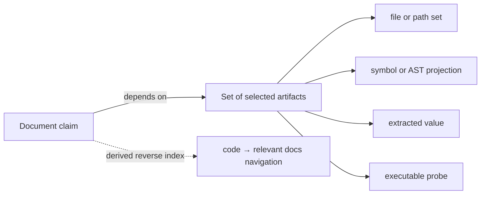
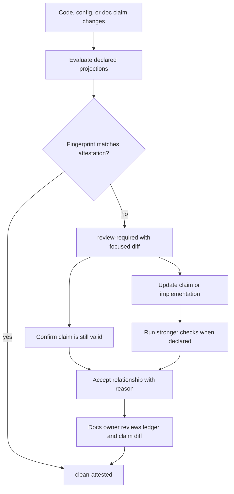

# Design: a review-impact graph, not a drift oracle

Date: 2026-07-10

Scope note (2026-07-10 revision): this file describes a standalone tool. The repository the
investigation started in appears only as user zero, the first corpus of use cases
([use-cases.md](./use-cases.md)) and of design-breaking conditions
([edge-cases.md](./edge-cases.md)). Nothing below assumes the tool runs in that repository.

Implementation status (2026-07-11): this is product rationale, not an executable contract. The
pre-implementation review found that automatic observations, governed attestations, deterministic
verification, and policy cannot safely share the identity and refresh semantics proposed below.
The final disposition is [implementation-readiness.md](./implementation-readiness.md); exact issue
mapping is in [issue-closure-matrix.md](./issue-closure-matrix.md). Do not implement this file's
trust-on-edit, global lock, refresh, bulk acceptance, or attribution-as-safety examples.

## The tool in two sentences

Point it at a repository and it reads the documentation as it is: every code reference the pages
already contain (paths, links, anchors, fences naming their sources, symbols where a grammar is
available) gets resolved, references that no longer resolve fail CI, and text whose referenced code changed
after it was last verified gets flagged for review, tracked per block and reported per section.
Editing the flagged text clears it, `assure ok <page>` clears it without an edit, and a committed
lockfile remembers; that is the entire ceremony.

Documentation means any text file, not a blessed format. Parsing dispatches by filetype: a format
parser (Markdown, MDX, reStructuredText, AsciiDoc, HTML) sharpens section boundaries, link syntax,
and fence metadata where one exists, and a plain-text fallback handles the rest, which is what
`.cursorrules`, `llms.txt`, and plenty of READMEs in the wild actually are. The core extraction
barely needs format awareness anyway: a token that matches a tracked path is a path reference by
construction, and a path-shaped token that resolves nowhere today but did resolve earlier in
history is a broken reference rather than noise, which keeps the check format-independent.
Reference confidence is position-sensitive: link targets weigh more than bare prose mentions,
fenced content binds only through tokens that actually resolve, and a tracked path that also
matches a gitignore pattern counts as tracked, so tutorials that tell the reader to create files
do not become permanent noise (OP-23, OP-28). Structureless files degrade honestly: no headings
means flags report per paragraph run instead of per section. Code files are not treated as
documents on day zero (doc-comments inside code are a later opt-in lane); everything else that is
text is in scope.

Concretely, mocked against user zero's real history: a plain-text agent file that names three
paths, with nothing authored for the tool, produces

```text
.cursorrules
  broken  modules/convention/src/main/scala/specrest/convention/dafny/Generator.scala
          existed in history, gone on main; rename candidate (content match 94%):
          modules/dafny/src/main/scala/specrest/dafny/Generator.scala
  stale   modules/verify/src/main/scala/specrest/verify/Config.scala changed twice
          since this paragraph was last verified
  fresh   modules/ir/src/main/scala/specrest/ir/generated/SpecRestGenerated.scala

1 broken (CI fails), 1 stale (reported, not blocking), 1 fresh
```

where the broken reference is distinguished from noise precisely because it resolved earlier in
history, and the rename candidate comes from content similarity, offered but never auto-applied.

A pull request that changes code and updates the affected section stays green with no extra
gesture, because a doc edit counts as re-verification (the trust-on-creation lesson, applied to
edits). Broken references fail where a pull request introduces them and otherwise fail the
default-branch job, because failure of every kind is attributed (OP-21); staleness reports until a
team promotes it. Nothing in this loop requires authoring a claim, choosing a kind, or learning a
schema, and it fires on the boring real drifts first: deleted files, renamed flags, moved anchors,
pages describing code that moved on. On user zero, with nothing configured, this loop already
fails on two dead references, reports a third as probable-broken (a path-shaped name aiming into
an existing directory whose siblings share its extension, a tier that reports and never
hard-fails, OP-03 in [open-problems.md](./open-problems.md)), and starts flagging the pages behind
most of the seven confirmed drift classes the next time their cited sources move.

### What stale means, exactly

A unit of documentation is a block: a paragraph, list, table, or fence in structured formats, a
paragraph run in plain text. Sections group blocks for reporting and for `assure ok` addressing
and are never identity (OP-20). A unit is stale when both of these hold: its identity has a
baseline in the ledger, and at least one target in its reference set has a current normalized
fingerprint different from the one recorded there. Identity is the unit's normalized token content
plus its document path, with an ordinal only for exact duplicates (harmless by construction, since
identical content carries identical reference sets), so "unchanged since baseline" is not a
separate condition: an edited unit is a new identity with no baseline and is fresh by
construction. Link targets are tokens, so retargeting a reference is itself an edit. Trust on
creation and trust on edit fall out of identity rather than being special events, the reference
set is pinned the same way, being a function of the unit's text, and a bare name that bound
uniquely keeps its resolved path in the ledger, so a same-named file appearing later affects only
new mentions (OP-24).

Only two writers touch the ledger: `assure ok`, and the refresh lane described below. The check
itself never writes; it is a pure function of tree and ledger. Time appears nowhere in the
predicate; reported age is for humans, and the
only sanctioned use of wall clock arrives later with external claims and their expiry. "Changed"
means the normalized projection moved: formatter sweeps and order-shuffling regeneration do not
count where a normalizer for the target's filetype exists (EC-A1, EC-A2; day zero ships
normalizers only where grammars reach, so raw-content targets keep formatter noise until then,
OP-04 in [open-problems.md](./open-problems.md)), a revert that restores baselined content
self-heals, and a commit that touches a file without moving its projection is invisible. The predicate is scoped to the unit's
reference set, so a callee changing behavior behind an unchanged referenced symbol does not flip
it; that documented miss is what v1 projections narrow.

Broken is not stale: a target that no longer resolves is a harder state, failing the work that
introduced it and the default-branch job otherwise (OP-21). Stale is not
wrong: it means the evidence this prose was last checked against has since moved, nothing more,
just as fresh does not mean right, because a baseline can bless a page that was already false
(EC-E2). Initialization is mass baseline creation: it trusts the present, reports only broken
references on day one, and accrues staleness from then on. The predicate is deliberately boolean
per unit and target rather than a numeric freshness score; scores invite threshold tuning and
cannot be explained in one sentence, so the tool reports the diff instead of grading it. In the
growth model's state table this same condition is called `review-required`.

### The lock and the refresh lane

The committed lock is eventually consistent and tree truth governs between refreshes. A pull
request check evaluates the candidate tree against the ledger as of main and writes nothing, which
keeps fork pull requests safe on read-only tokens; staleness never consults history, and the only
checkout depth needed is two, the merge candidate plus its base, because attribution compares the
two (OP-21). Two writers exist. `assure ok` records baselines explicitly at file, section, or
target scope. The refresh lane is a post-merge job on the default branch (or a schedule, for teams
that dislike per-merge bot commits) that records baselines for new unit identities, retires
orphaned ones, migrates baselines across renames and moves only on unique exact-hash matches, and
commits only when the ledger changed. It never updates an existing entry: staleness survives
refresh by construction, and that invariant is the tool's first test, because a lane that touched
existing fingerprints would silently absolve every stale unit on every merge (OP-19). On protected
default branches the lane runs as a GitHub App with bypass permission, an auto-merged bot pull
request, or a scheduled batch PR; lock-only commits carry a skip marker so they trigger neither CI
nor another refresh; refresh runs serialize through a concurrency group with rebase and retry; and
on the default-branch job, refresh runs before reporting, so a red repository still accumulates
baselines (OP-22).

Orphan collection is where absolution becomes auditable (OP-02): a unit that was stale and then
got edited died as an identity, the refresh commit enumerates exactly which stale baselines were
retired by edits, and the pull request doing the editing gets an informational finding ("this edit
clears staleness on N targets", diffs attached) so review sees the absolution before it lands.
Unit hashing is token-based (word tokens plus code spans and link targets), so reflow, wrapping,
and list-marker sweeps create no new identities and a formatting-only docs PR changes nothing in
the ledger.

Two honest imperfections, accepted and documented. Trust-on-edit is really
trust-on-merge-candidate: an editor vouches against the tree their PR merges into, and a target
that moved between their branch point and the merge gets a report-level note rather than a
re-flag. And between a merge and the next refresh there is a minutes-long window in which a
just-edited unit's staleness against very new target changes goes unobserved.

Everything below this point is the growth model behind that loop, adopted per pain and never
required on day zero. Typed claims and projections make the staleness signal progressively less
wrong; opt-in deterministic checks (values, inventories, trees, managed regions) turn specific
prose into hard assertions; attestation refinements (owners, reasons, tiers) arrive when a team is
large enough to need them; transcripts, graphs, and external claims come after that.

## Executive design decision

Model the system as a typed, directed **hypergraph of artifact relationships**. The common case is
one document claim that depends on one or more implementation selectors. The declaration lives in
the document itself; the tool derives the code-to-doc reverse index and records a deterministic
content fingerprint in a machine-owned ledger when the relationship is reviewed.

The blocking signal must be named `review-required` or `impacted`, not `documentation is wrong`.
A changed hash proves that selected evidence changed after the last attestation. An equal hash proves
only that the selected evidence did not change. Neither proves that prose is semantically true.

Use stronger mechanisms where possible:

1. Generate exact reference material from authoritative data.
2. Include source snippets rather than copying them.
3. Compile or execute examples and workflows.
4. Assert machine-readable contracts.
5. Fall back to change-triggered human attestation for irreducibly narrative claims.

The hash gate is the last item in that ladder, not a replacement for the first four.

## The object being tracked is not a pair

A pair is too weak. A statement such as "the compiler pipeline is parse, build, verify, map, emit,
then test generation" depends on several symbols, configuration points, and tests. Treating each
combination as an independent pair loses the fact that the evidence is meaningful only as a set.

The atomic object should be a relationship with these fields:

- A stable relationship ID, derived from the unit's normalized content plus its document path,
  with an ordinal only for exact duplicates; headings and positions are display metadata, never
  identity (OP-05 in [open-problems.md](./open-problems.md)).
- One or more subject selectors, normally a document section or claim.
- Zero or more dependency selectors, normally code, configuration, schemas, tests, or generated
  artifacts.
- A relationship type and authority policy.
- An assurance mechanism.
- An enforcement level and owner policy.
- An attested fingerprint for assurance mechanisms that require human review.
- A scope: current main, a release line, or a deployed environment (EC-D2 in
  [edge-cases.md](./edge-cases.md)).
- A validator cost class, so expensive or flaky evidence runs on a schedule with its age reported,
  rather than per pull request (EC-C3).
- A machine-owned marker for anchors inside generated trees, so remediation routes to the declared
  upstream source instead of telling someone to edit a generated file (EC-B2).

Conceptually, this is a directed hyperedge:



The graph can expose navigation in both directions without storing two independently maintainable
links. Bidirectional storage would create a second consistency problem: the two halves could
disagree.

## Direction and authority

"Docs to code or both ways?" actually contains three separate questions.

### Where should the declaration live?

In the document itself. The first draft of this file recommended per-document sidecar files
(`architecture.mdx.links.yaml`); that recommendation is withdrawn as configuration sprawl. The
documentation author knows the scope and meaning of the claim, so authorship belongs with the
prose, and a file beside each document is a second surface that can disagree with the first, which
is this tool's own definition of drift. Requirements engineering already ran the separate-file
experiment (Doorstop's YAML item per requirement), and the transfer analysis in
[prior-art.md](./prior-art.md) concluded it does not fit prose; every docs-as-code mechanism with
real adoption anchors in the document through fence attributes, comment markers, or inline
references.

The document is the single source of truth for what is claimed and where; the tool extracts claims
from it, and nothing about a claim lives anywhere an author must remember to update. Machine state
(fingerprints, attestations) is not authored content and goes in one tool-owned ledger, covered
under storage below. Line numbers are display hints, never identity.

### Which way does invalidation flow?

Use a directed dependency based on authority:

| Situation | Authority | Dependency direction | Expected response |
|---|---|---|---|
| Reference or architecture prose describes shipped code | Implementation | doc claim depends on code evidence | Code change requests doc review |
| Requirements or normative specification defines behavior | Document/spec | implementation or conformance test depends on doc claim | Spec change requests implementation review |
| Generated reference mirrors a schema | Schema | generated doc depends on schema and generator | Regenerate and compare exactly |
| Two artifacts claim equivalence | Neither alone | verifier depends on both | Run a two-input consistency assertion |
| ADR, changelog, incident report | Historical snapshot | document points to a pinned revision | Current code changes do not invalidate history |

Do not use an untyped symmetric edge. It cannot say which artifact is authoritative or what action
resolves a conflict.

### How should users navigate?

Compile the declarations into a reverse index. IDEs and repository UIs can then show "documents
affected by this symbol/file" without adding annotations to every programming language.

## Relationship states

Use precise state names:

| State | Meaning |
|---|---|
| `clean-attested` | The current subject and dependency projections equal the last reviewed projections |
| `review-required` | At least one selected projection changed after the last attestation |
| `verification-passed` | A current executable/generated assertion passed |
| `verification-failed` | A current executable/generated assertion failed; this is evidence of a real inconsistency within that assertion's scope |
| `broken-selector` | A document anchor, file, symbol, query, or pinned revision cannot be resolved |
| `unsupported` | The checker cannot evaluate the declared selector or assurance mechanism |
| `exempt` | A policy intentionally excludes the relationship, with a reason and optional expiry |

Never collapse `clean-attested` and `verification-passed` into "up to date." The distinction is the
central honesty constraint of the product.

The attestation fingerprint must include both sides. Otherwise a contributor could change the prose
to an incorrect statement while the code stayed unchanged and the gate would remain green.

## Assurance ladder

| Mechanism | What it can establish | What it cannot establish | Good uses |
|---|---|---|---|
| Link/anchor existence | Named files, headings, URLs, and symbols resolve | The surrounding prose is true | All docs |
| Exact inclusion | Displayed bytes come from the selected source | The explanation around the bytes is correct | Code snippets, configuration fragments |
| Generated projection | Rendered reference equals authoritative structured input | Runtime implementation honors that input | CLI/API/schema tables, module inventories |
| Compile/doctest | Example parses, compiles, or executes in a test environment | All reader environments and untested prose are correct | Tutorials and snippets |
| Behavioral assertion | A stated behavior holds for tested cases | Untested behavior or full semantics | How-to procedures and contract claims |
| API/schema diff | A public structural contract changed or stayed stable | Internal behavior and prose interpretation | Reference docs |
| Content fingerprint + attestation | Selected artifacts are unchanged since explicit review | The review was careful or correct; unlinked dependencies are covered | Architecture and explanation |
| LLM semantic scan | A model considers a mismatch likely and can explain why | Deterministic truth, stable CI behavior, complete coverage | Scheduled/advisory triage |

The checker should allow a relationship to combine mechanisms. For example, a CLI section can use a
generated flag table, executable examples, and a human-attested paragraph about intent.

## Selector model

Selectors need an explicit projection: the aspect of an artifact that matters to the claim. Hashing
whole files is a useful bootstrap but produces noise when irrelevant implementation details change.

### Recommended selectors for an initial release

- `file-content`: normalized tracked content plus the repository-relative path. A rename deliberately
  requests review.
- `path-set`: the sorted set of paths and modes matched by a glob. This ignores file-content changes.
- `file-set-content`: sorted path and content-fingerprint tuples.
- `text-region`: content between stable explicit markers, with an exact-quote/context fallback.
- `captured-value`: a declarative JSON/YAML/TOML path or a constrained regular-expression capture.
- `symbol-source`: a language plugin resolves a qualified symbol and projects its source or syntax
  tree.
- `public-shape`: a language-specific projection of exported signatures, enum cases, flags, or other
  interface data.
- `build-target`: a build system target or source set, including the selector/plugin version.
- `probe`: an allowlisted hermetic program produces canonical output and an exit status. The
  attestation records a fingerprint of the toolchain that ran it (binary digest, tool versions),
  because a green probe against a stale binary is worse than no probe; a mismatched environment
  fingerprint reports as unverified, not fresh (EC-C1, EC-C2).

### Avoid as identities

- Filesystem modification times: checkout, archive extraction, clocks, and generators rewrite them.
- "Latest commit touching the file": rebases, squashes, cherry-picks, and unrelated edits change it.
- Raw line ranges: insertions above the range move it and refactors destroy it.
- Bare symbol names: overloads and same-name definitions make them ambiguous.
- Repository-wide semantic embeddings: model upgrades and nondeterminism make a blocking baseline
  unstable.

Commit IDs remain useful as optional provenance for a human-readable diff. They should not be the
validity key. Git commits include tree, parent, authorship, and time metadata, while blobs represent
file content; a content projection is the relevant primitive. Git is also transitioning between
SHA-1 and SHA-256 object formats, so the ledger names its own fingerprint algorithm.

### Canonical fingerprint

One portable formulation is:

```text
SHA-256(canonical-json({
  schema_version,
  relationship_id,
  selector_engine_versions,
  subject_projection,
  sorted_dependency_projections
}))
```

For text, define newline and Unicode normalization explicitly. For binary data, hash raw bytes. For
sets, sort by normalized repository-relative path. Include the selector-engine version: changing the
meaning of a projection must invalidate or migrate its baseline rather than silently blessing old
digests.

Normalization is layered per target kind: post-formatter text, order-insensitive declaration sets,
or AST shape from a parser such as tree-sitter. Generated targets default to structural identity,
because regeneration can reorder semantically identical output and formatters sweep whole modules
without touching behavior (EC-A1 and EC-A2 in [edge-cases.md](./edge-cases.md)). The raw digest is
kept alongside for forensics; it is never the sole gate on those targets.

## Authoring surface

The rule, after two revisions of this section: the body of a document gains zero new characters in
the common case, because the document already names its evidence. Prose that describes code cites
it (paths, symbols in backticks, links, fences that name their source), and requiring a marker to
restate the citation was redundancy that polluted the source. Claims are therefore read out of
what pages already contain, and the residue costs one invisible line placed beside the section it
governs. The first draft's per-document YAML sidecar and the second draft's per-claim comment
markers are both withdrawn.

Channel one: citations are claims. A section's dependency set is the union of code references it
already contains: repository paths and same-repo links (link claims), fences carrying `file=` or
`src=` (snippet claims), inline code that resolves uniquely to a tracked path or qualified symbol.
Inferred dependencies start advisory. The act of attestation freezes the section's inferred set
into the ledger as its enforced selector set, so enforcement always follows a human decision about
a specific section, never bare string matching. A mention the author considers incidental is
pruned at that moment, in the accept flow, not by editing the page. User zero shows the volume
this channel covers: its pages cite sources so densely that a remark plugin exists just to
auto-link them.

Channel two: one adjacent invisible line for the residue. When a section depends on evidence it
does not name (the precedence warning of EC-F4 in [edge-cases.md](./edge-cases.md)), or needs a
parameterized check, a single line sits directly under the section's heading, written as a
standard link-reference definition, which CommonMark, GitHub, and MDX all render as nothing:

```markdown
### Expression precedence

[assure]: modules/parser/src/main/antlr4/Spec.g4#expr

`implies` binds loosest of the binary operators, so parenthesize invariant bodies.
```

Placement is scope: the line governs the section it sits in (or the paragraph it directly
precedes), so it travels with the text when a section moves between files and dies with the text
when the section is deleted. A bottom-of-file collection point was considered and rejected for
exactly those failure modes: detached lines get forgotten, and they get orphaned when their
section moves. The destination is the one-line selector grammar (a path, `path#Symbol`, a glob,
`check:<name>`, `url:<...>`). Because this is native Markdown rather than a comment, the MDX
divergence problem disappears (MDX does not parse HTML comments, but it parses reference
definitions). AsciiDoc and reStructuredText have equivalent invisible-target syntax. Two
housekeeping notes: markdownlint's unused-reference rule needs an exemption for the label, and the
lint prefers the zero-line fix where it reads well, which is citing the evidence in the prose
itself ("see the `expr` rule in `Spec.g4`"). That turns the residue back into channel one and
improves the page for human readers at the same time.

Channel three: stated-value checks replace inline wrappers. The previous draft wrapped a
two-character number in forty characters of comment. Instead, the prose states the number plainly
("there are 22 workflows"), an adjacent assure line binds the section to a value check, and
verification asserts that the section still states the current value. The binding lives at
document-and-check scope rather than block identity, so editing nearby prose does not disturb it
(OP-26); the ledger records the matched span as display metadata, and when the count moves to 23
the finding points at the stale "22" exactly. No inline syntax exists at all.

Channel four: managed regions, kept only where the tool writes the content. Trees, inventories,
tables, and transcripts keep a begin/end marker pair, because a rewrite target must be delimited,
and because that pattern (terraform-docs, cog) is the one authors already accept, checksum guard
included. `assure fmt` rewrites the region from its named check; `assure check` fails when a
rewrite would change anything. A marker pair around tool-written content is scaffolding; a marker
pair around prose was clutter, and it is gone.

Channel five, the zero-touch alternative: claims authored from the command line and stored only in
the ledger, anchored by section slug plus quote-and-context (the W3C annotation selector shape
already in the selector model). The document is untouched. The cost is visibility: an author
editing the page cannot see the claim without `assure show <page>` or an editor extension, and PR
annotations carry the awareness instead. Teams that consider any in-file line unacceptable get
this lane; the adjacent-line lane stays the default because one invisible line next to the prose it
governs is cheaper than tooling nobody remembers to run.

MDX sites can additionally layer components over the same model the way user zero's `<CliRun>`
already does; a rendered value component is generation rather than checking and is strictly
stronger where the site supports it.

Named checks live in one small file at the repository root, and the security model is why that
file exists at all: extractors and probes are executable surface and must be centrally defined and
reviewed, never spelled inline across a thousand documents. TOML keeps it flat and diff-friendly:

```toml
[check.workflows]
kind = "count"
glob = ".github/workflows/*.yml"

[check.python-postgres-golden]
kind = "tree"
root = "fixtures/golden/codegen/python/fastapi/postgres/url_shortener"

[[rule]]
paths = ["docs/research/**"]
lifecycle = "historical"
```

Selector precision works as before: an inventory claim about workflow names selects the path set,
not workflow contents, so an action-version bump inside a workflow does not disturb a claim about
the inventory.

Fingerprints and attestations are machine state, not authored content. They live in one
tool-written ledger (`assure.lock`), sorted and line-per-claim, with claim IDs derived from
document path, section anchor, claim kind, and ordinal, so no hand-written identifier exists
anywhere. The lockfile pattern is the one package managers trained everyone on: the human-authored
surface states intent, the lock records resolved state, and both travel through review together.
Kotlin's binary-compatibility validator shows the failure mode to avoid (a monolithic dump whose
large rewritten blocks conflict by construction); a sorted line-per-claim ledger conflicts rarely,
resolves mechanically by rerunning acceptance, and shards per docs subtree in a monorepo.

## Attestation workflow

The normal loop should be explicit and cheap:



An acceptance command should:

1. Resolve every selector and refuse broken or unsupported selectors.
2. Show the subject and dependency changes since the previous attestation.
3. Require a short reason for an unchanged-doc acceptance.
4. Update the fingerprint and optional provenance commit in the ledger.
5. Never edit prose automatically in the basic attestation mode.
6. Trust claims at creation. A newly declared claim is attested by its author and is never born
   suspect; requirements tools that marked fresh links suspect trained users to distrust the tool
   (Doorstop issues 173 and 174 record exactly this revolt, and Polarion ships auto-suspect as an
   option its users then script around).
7. Offer bulk acceptance as a first-class, distinctly logged operation. Every suspect-link
   ecosystem grew one under user pressure (`doorstop clear all`, Jama Clear All, Codebeamer mass
   processing). Refusing to ship it only moves the same gesture into a shell loop that hides the
   audit trail.

The checked-in acceptance is still only a claim by a contributor. Git history records who changed it;
branch protection and docs ownership provide independent review. A CI process cannot prove that the
reviewer read or understood the prose.

## Physical storage tradeoffs

| Placement | Advantages | Drawbacks |
|---|---|---|
| Citations and adjacent reference definitions in the document | Single source of truth; zero body footprint; visible in review beside the prose | One extra source line under a heading; linter exemption needed |
| Tool-owned ledger (lockfile) | Familiar pattern; keeps hashes out of prose; one place to audit; enables zero-touch claims | Conflicts unless sorted and line-per-claim; must be machine-written only; ledger-only claims are invisible while editing |
| Adjacent doc sidecars | Renderer-neutral | A second per-document surface that can disagree with the first; configuration sprawl; withdrawn |
| Central hand-edited manifest | Easy global queries | Detached from prose; ownership bottleneck; the item-file authoring model that does not fit docs |
| Annotations in source code | Easy code-to-doc discovery | Pollutes code, language-specific, reverses responsibility, misses narrative scope |

Recommendation: claims extracted from the documents themselves (citation inference, fence
attributes, adjacent reference definitions, marker pairs only around tool-written regions),
one machine-written `assure.lock` for fingerprints and attestations, one small TOML policy file
for named checks and lifecycle classes, and a generated, uncommitted reverse index. Nothing else
exists to author, so nothing else exists to rot.

## CI behavior

### Fast blocking job

Day zero runs the declaration-free subset of this job (reference resolution, fingerprint
comparison, attributed reporting); the full list below belongs to the growth model. Run a complete
deterministic relationship check on the merged candidate tree, not only on changed
files. The checked-in fingerprints already make unchanged relationships cheap and prevent a shallow
PR diff from hiding pre-existing breakage. Use the PR merge base only to produce helpful diffs.

The fast job should:

- Parse and schema-check all declarations.
- Resolve all document anchors and deterministic selectors.
- Recompute cached fingerprints.
- Run cheap generated/equality assertions.
- Emit grouped annotations at the document claim and changed dependencies.
- Fail on `block` relationships in `review-required`, `verification-failed`, `broken-selector`, or
  `unsupported` states.

It should report one relationship once, not the Cartesian product of changed files and documents.

### Heavier checks

Run compiled examples, browser workflows, service-dependent tests, and semantic scans in separate
jobs. Only deterministic, calibrated checks should block. Network-dependent and LLM checks belong in
advisory or scheduled jobs until their usefulness is measured on the repository.

### Merge queue and concurrency

Under the refresh-lane model, pull requests rarely write the ledger at all; only explicit
`assure ok` does, which shrinks conflicts to two PRs accepting the same unit, resolved by
rerunning acceptance on the merge result. Keep the ledger sorted and line-per-claim, and shard it
per docs subtree in monorepos. Evaluate on the actual merge-queue candidate, with failure
attributed to the PR's own diff (OP-12), so staleness introduced by other merges while queued
reports instead of bouncing entries. Never record a fingerprint computed from a tree other than
the one being merged.

### Reporting

A useful finding says:

```text
architecture.mdx#ci-surface attest-1: review required
claim: docs/content/docs/design/architecture.mdx#ci-surface
reason: path-set changed since attestation
added: .github/workflows/duplication.yml, .github/workflows/links.yml
action: update the section, or run assure accept 'architecture.mdx#ci-surface' --reason "..."
```

Include machine-readable JSON and optionally SARIF. Stable relationship IDs are better diagnostic
fingerprints than line numbers, which move as prose is edited.

### Policy: what fails, what reports, what is ignored

Three verbs cover enforcement: `fail` breaks the check, `report` annotates without breaking,
`ignore` suppresses the finding while still counting it. Defaults: `broken = fail`,
`stale = report`, `probable_broken = report`, `generated_reference = ignore` (tallied, like every
ignore); every finding kind, present and future, takes the same verbs (OP-27). Everything else is
one ordered rule list in the same root TOML, matched on
document path globs, last match wins, the convention gitignore and CODEOWNERS already taught
everyone:

```toml
[policy]
broken = "fail"
stale = "report"
probable_broken = "report"
generated_reference = "ignore"

[[rule]]
paths = ["docs/**"]
stale = "fail"

[[rule]]
paths = ["docs/research/**", "CHANGELOG.md"]
lifecycle = "historical"

[[rule]]
paths = ["fixtures/golden/**"]
exclude = true

[[rule]]
paths = ["docs/targets/**"]
stale = "ignore"
```

That one list answers the common demands. Strict mode, anything not up to date fails, is one line
(`stale = "fail"`), and its semantics are the api-report workflow: a code change that flags a page
stale forces the same pull request to edit the page or carry the `assure ok` lock update. Two
things make it livable: findings group by root cause (EC-E4), and failure is attributed. A finding
fails only when the pull request's own diff caused it, computed by evaluating the base tree and
the candidate tree against the same ledger and diffing the finding sets; staleness that other
merges introduced while a PR sat in review or in a queue reports into a cleanup queue instead of
bouncing unrelated work (OP-12). Attribution covers every kind, broken included: pre-existing dead
references fail the default-branch job and the adoption run, never an unrelated pull request
(OP-21). Adopt strict per directory as pages come clean rather than
repo-wide on a legacy tree; the rule list records that ratchet. Fail-everywhere-except is the
default plus downgrade rules, as the `docs/targets/**` line shows.

`exclude` and `ignore` are different words on purpose. Excluded paths are not documents at all:
user zero's golden trees contain generated `README.md` files that are emitter output, and scanning
them as living docs would demand edits to files a human must not touch (EC-B2). Ignored paths are
scanned and suppressed, and every run prints the suppressed tally, so a green check on a
half-ignored repository reads as what it is; a green that can mean "unscanned" is how the
freshness-date regimes died.

The rule law, in one paragraph: matching uses gitignore glob semantics; resolution is per key,
last match wins, so a rule that sets only `stale` inherits `broken` from earlier matches or the
defaults; `exclude = true` admits no other keys, and validation rejects the combination; `[check]`
tables and `[[rule]]` entries live in the one root TOML, never elsewhere. Precedence is locality
with a ceiling: built-in defaults, then `[policy]`, then rules in order, then an adjacent
`[assure]: skip` line, which downgrades enforcement by exactly one level (fail to report, report
to ignore) and is inert on paths a rule marks `local_override = false`; every run prints the skip
inventory with locations, so silence is never free (OP-09). Above everything sits the
organizational floor: the action and reusable workflow accept a minimum-enforcement input that
clamps repository policy upward and prints the clamp when it engages (OP-10); the floor may also
carry a protected path set on which `exclude` and `ignore` are inert, so nothing walks out of
scope silently (OP-25). Later finding kinds
(value, inventory, external expiry) take the same verbs in the same rules. The action input
`stale:` in the wiring example below is bootstrap shorthand for repositories without a TOML; when
both exist the TOML wins and the action says so.

### Wiring into a repository

The standard integration is a marketplace action wrapping the pinned binary:

```yaml
name: assure
on:
  pull_request:
  merge_group:
  push:
    branches: [main]
permissions:
  contents: read
jobs:
  check:
    runs-on: ubuntu-latest
    steps:
      - uses: actions/checkout@v4
      - uses: assure-dev/action@v1
        with:
          stale: report
```

Wiring facts that matter. A depth-two clone suffices, the merge candidate plus its base for
attribution; baselines live in the committed lock, and full history only enriches first-run
classification and rename candidates. The job must not be
path-filtered: user zero's own CI under-triggers its doc checks through path filters (EC-E5), and
the deterministic pass is cheap enough to run always, on the merge candidate that `pull_request`
and `merge_group` already check out. Fork pull requests run safely on the default read-only token
because checking needs no secrets and executes no repository-controlled code. Inline annotations
are capped per step, so findings group by root cause with the full report in the job summary, and
SARIF output feeds code scanning where teams want it.

Acceptance has three lanes, in ascending convenience. Local: a contributor runs `assure ok` and
the lock update rides their pull request, with no CI write access anywhere. Comment command: a
maintainer writes `/assure ok docs/cli.mdx`, and an `issue_comment` workflow with write permission
runs the pinned binary against the PR head and pushes the lock commit; this is safe only because
the binary is pinned and nothing repository-controlled executes in the privileged context. App: a
GitHub App posts the check run with an accept button (the Swimm interaction, pointed at
attestation), which is product surface rather than a workflow file.

Scaling out and special cases. An organization standardizes with a reusable workflow
(`uses: org/assure/.github/workflows/check.yml@v1`) or mandates the check across repositories with
a ruleset-required workflow, the platform-team deployment from [market.md](./market.md).
Repositories that cannot be modified still get an audit lane: a central repo clones targets
read-only on a schedule, runs report mode, and files digest issues; gating stays impossible there
because the lock has nowhere to live except a bot pull request. Scheduled jobs also carry the
later expensive lanes (external probes, transcript re-runs), which never block pull requests.
Bootstrap is a one-time `assure init` pull request carrying the initial lock, generated locally or
by `workflow_dispatch`, the release-please pattern.

## Coverage and the zero-link problem

The system can be perfectly green while every important document has zero links. Missing edges are
the largest false-negative source and cannot be solved by hashing.

Do not ban zero-link documents globally. Classify documentation lifecycle first:

| Document class | Default policy |
|---|---|
| Current technical reference | Require generated/asserted sources where practical; require at least one relationship for implementation-derived claims |
| Tutorial/how-to | Execute critical paths; attest narrative prerequisites and environment claims |
| Architecture/explanation | Attest selected current-state claims; avoid linking timeless rationale |
| ADR/changelog/incident report | Mark historical and pin relevant revision; do not chase current code |
| Research, proposal, roadmap | Label planned/historical/current explicitly; usually warn rather than block |
| Legal/policy/security claims | Use dedicated owners and evidence; hashes alone are insufficient |

Coverage suggestions may come from code-formatted identifiers, repository links, imports, and
historical co-change patterns. Suggestions must not silently become enforced links. Track coverage as
an audit metric before making it a gate; a contributor can otherwise game it with a single useless
repository-wide edge.

## False positives and false negatives

In attestation mode, "false positive" is technically the wrong phrase: the tool correctly observed a
change. The important product metric is the **irrelevant-trigger rate**: how often a relationship
requests review when no reasonable documentation or validation action is needed.

Typical noise sources:

- Formatting, comments, imports, and private refactors under a whole-file selector.
- Dependency fan-out from central utility files.
- Symbol moves and renames.
- Generated files changing due only to generator version or ordering.
- Branch-specific documentation and versioned docs.
- Historical references that intentionally name removed code.

Typical misses:

- A relationship was never declared.
- The baseline was accepted while the prose was already wrong.
- A linked symbol stayed textually identical while its transitive callees changed behavior.
- The selector projection is narrower than the claim.
- Runtime configuration, deployment, data, or an external service changed.
- A behavior differs only for cases the executable assertion did not test.
- A contributor rubber-stamped a new baseline.

The response is not "add AI and call it solved." Tune projections, generate more reference material,
turn testable prose into assertions, audit coverage, and use semantic models only as a ranked second
opinion.

## Scale and performance

The deterministic core is tractable for a monorepo if designed like an incremental build system:

- Cache projections by tracked content digest plus selector-engine version.
- Evaluate each unique selector once even if many relationships consume it.
- Store a reverse dependency index from paths/symbols to relationships.
- Bound glob cardinality and regex complexity.
- Avoid automatic transitive call-graph closure; it quickly makes everything depend on everything.
- Use public-interface projections or declared build targets at architectural boundaries.
- Partition ownership, and shard the ledger per docs subtree, to avoid a global hot spot.
- Report fan-out before enforcement. A single change invalidating hundreds of docs is a modeling
  problem that needs review, not hundreds of identical CI annotations.

Exact file and path-set hashing should take seconds or less even in a large repository when cached.
Language servers, compiler API extraction, service startup, browser testing, and LLM analysis need
separate budgets and job classes.

## Security model

Relationship files are untrusted repository input. In particular:

- Do not allow arbitrary shell strings in per-document declarations.
- Define probes in a centrally reviewed allowlist and reference them by ID.
- Run probes without secrets or network by default, with read-only repository access, timeouts,
  memory/output limits, and isolated temporary directories.
- Never execute untrusted PR code in a privileged `pull_request_target` context.
- Reject path traversal, symlink escapes, excessive globs, catastrophic regular expressions, and
  duplicate relationship IDs.
- Pin external repositories and schemas by immutable digest; check them on a scheduled job rather
  than making PR success depend on live networks.
- Protect the policy file, selector plugins, and the attestation ledger with owners. Protecting
  only the checker executable leaves an easy bypass through its configuration.

LLM analysis adds source-code disclosure, prompt-injection, model/version drift, cost, availability,
and nondeterminism concerns. Keep it out of the initial blocking path.

## Dogfood pilot on user zero

User zero already has a stronger pattern for some claims:
`docs/scripts/run-cli-snippets.mjs` discovers marked MDX snippets, executes the CLI, normalizes
unstable output, and compares committed goldens. The proposed graph should index and report that
mechanism, not replace it with hashes.

A useful first pilot is 8-12 relationships in current, high-churn pages:

1. The architecture page's CI inventory: `path-set(.github/workflows/*.yml)`.
2. Module layout and dependency prose: `build.sbt` project graph plus the existing architecture
   test.
3. Scala, Cats Effect, Z3, Alloy, and Handlebars version claims: captured build values.
4. CLI command/flag reference: generated parser metadata and existing executable snippets.
5. Spec-language grammar/reference: ANTLR grammar rules and parser fixtures.
6. Generated project file trees: golden codegen outputs or structured emitter inventories.
7. Verification exit-code tables: CLI ADT/constants plus executable cases.
8. Isabelle extraction claims: proof session inputs and generated Scala drift test.

Do not begin with the research archive, changelog, roadmap, every Markdown page, or whole-module
content globs. Those maximize fan-out before the team learns which projections are actionable.

## Product shape

The research settles several build decisions that were open in the first draft of this file.

Form factor: a single-binary CLI (`check`, `accept`, `refs`, `lint`, `migrate`) plus a thin CI
action and an optional pre-commit hook, reporting human text, JSON, and SARIF. Everything runs
offline against the checkout. Swimm's requirement of a full clone for history-based re-anchoring
is a documented adoption killer and is avoidable: with fingerprints committed in repository state,
checking needs no history at all, which fiberplane/drift independently validates.

Implementation language: Rust, and mostly not for speed. Go would be fast enough, since the check
is hash lookups plus fingerprinting cached by git blob OID, and both languages saturate that. Rust
wins on the load-bearing specifics. tree-sitter is first-party Rust, so grammars compile into the
binary without the cgo cross-compilation pain that would undermine Go's single-binary story. The
`ignore` crate is the canonical implementation of gitignore matching, which the policy law
specifies verbatim, and reimplementing those semantics is a known bug farm (OP-11). The
invariant-heavy core (the never-update refresh invariant, attribution set-diffs, identity
migration, normalization ladders) wants exhaustive enums and property tests. The same core
compiles to WebAssembly for the editor surface [comparison.md](./comparison.md) concedes to Swimm.
And the neighborhood matters: lychee is Rust with a reusable library crate, and the audience that
adopts fast single-binary developer tools expects Rust-grade startup in a pre-commit hook. No
async in the core; there is no network in it. Sketch: clap, `ignore`, comrak, tree-sitter with a
compiled-in grammar set, gix for read-path git access with shell-git fallback, blake3 or xxhash3
(the ledger names its algorithm), rayon, insta and proptest for the invariants, cargo-dist for
releases. Runner-up: Go, losing narrowly on cgo-for-tree-sitter and gitignore fidelity. Zig is
respected (fiberplane/drift proves the shape) and rejected on ecosystem depth and contributor
pool; TypeScript and Python serve the later web-app tier, not the binary.

Toolchain gates for the implementation, chosen so the whole policy lives in committed files and CI
only executes it. Memory: `unsafe_code = "forbid"` in `[workspace.lints]` (forbid cannot be
overridden by an inner allow), which makes the honest statement "safe Rust around a fuzzed C
core", since tree-sitter is C; the OP-14 fuzz targets run with AddressSanitizer to cover that
boundary, and miri is skipped deliberately because nothing of ours is unsafe and FFI cannot run
under it. Types: deny `clippy::unwrap_used`, `expect_used`, `panic`, `todo`, `unimplemented`, and
`dbg_macro` in source (a checker that parses attacker-controlled docs must never crash on input),
`clippy::pedantic` as warn with recorded allows, `-Dwarnings` in CI only, `overflow-checks = true`
and `panic = "abort"` in release; newtypes make the OP-06 ambiguity uncompilable (`DocRelPath`
versus `RepoRelPath`, opaque `Fingerprint` and `UnitId`), every boundary parses rather than
validates with `serde(deny_unknown_fields)`, and the policy verbs flow as one enum to an
`ExitCode` mapping with a test, because exit codes are contract. Dependencies: cargo-deny (one
`deny.toml`: advisories, license allowlist, bans, crates.io-only sources), cargo-machete,
committed `Cargo.lock`, `--locked` on every CI invocation. Tests: cargo-nextest with per-test
timeouts (a hung parser is a finding, not a stuck pipeline), insta snapshots for reports, proptest
on the named invariants (refresh never mutates an existing entry; attributed findings are a subset
of candidate findings; normalization is idempotent), fuzz smoke per PR with long runs scheduled,
cargo-mutants scheduled and report-only, cargo-llvm-cov report-only because gating coverage buys
goodharting. Skipped with reasons: miri, cargo-vet (process before there is a team), kani-tier
formal verification (the invariants are property-testable), cargo-geiger, cargo-udeps (nightly;
machete covers it). The enforcement surface is four small files (`rust-toolchain.toml`,
`Cargo.toml` lints and profiles, `deny.toml`, default `rustfmt.toml`) plus one CI line per gate:
fmt, clippy, deny, machete, nextest, fuzz smoke, release matrix.

State: claims extracted from the documents themselves (citation inference, fence attributes,
adjacent reference definitions), one machine-written `assure.lock` holding fingerprints and
attestations, one
small TOML policy file for named checks and policy rules, and a generated, uncommitted
reverse index served by `refs`. The ledger is sorted and line-per-claim precisely because Kotlin's
binary-compatibility-validator shows what a monolithic committed artifact does to parallel
branches; conflicts resolve by rerunning acceptance, and monorepos can shard it per docs subtree.

Anchoring: tree-sitter grammars for symbol and region selectors, launched with whatever language
set the grammar quality supports, raw-content selectors elsewhere. Anchor migration after renames
and moves is assisted, never silent: similarity-based method tracking reaches about 90% accuracy in
the literature (CodeShovel; refactoring-aware trackers improve on it), which is good enough to
propose retargets and not good enough to apply them without review.

Wrap rather than reimplement: consume link checkers, contract diffs (oasdiff, buf, japicmp),
doctest-family results, and architecture tests as declared evidence lanes; emit marker syntax
compatible with the include/regenerate family (cog, terraform-docs style) so renderers keep
working; adopt the api-report pattern (regenerate, diff, commit, review) as the attestation UX for
extracted inventories, including cog's committed-checksum trick for detecting unattested hand edits
inside managed regions.

Agent surface: a machine-readable export of claim states (claim, selectors, state, fingerprint,
last attestation, owner) published alongside the docs, so an agent can weight attested statements
above unattested prose. Half of documentation traffic on the largest host is already agents
([market.md](./market.md)); this output is cheap and no competitor has it.

The day-zero cut: every non-code text file in a single repository, parsers dispatched by filetype
with a plain-text fallback, inference only. Resolve what the docs already reference, fail broken
references, flag stale text, clear on doc edit or `assure ok`, remember in the lockfile. Nothing
to author, no LLM, no cross-repo selectors, no probes. A ledger-size measurement on user zero and
one large OSS repository is a v0 exit criterion (OP-29). Dogfood
on user zero against the known calibration drifts ([repo-audit.md](./repo-audit.md)), then on two
or three unaffiliated OSS repositories with drift found in the wild. v1 adds the opt-in
deterministic kinds (values, inventories, trees, managed regions, stated-value checks) and the
adjacent reference line. v2 adds transcript claims with environment fingerprints, graph claims,
external claims with time-to-live and a scheduled probe job, and a review app with one-click
accept (Swimm's approve-auto-sync interaction, pointed at attestation instead of auto-edit). The
advisory LLM lane comes last, calibrated against CoDocBench and the user-zero calibration cases
before it is allowed to comment on a pull request.

## Rollout

1. **Observe:** infer candidate relationships and run all declared edges as non-blocking for several
   weeks. Record every trigger and disposition.
2. **Tune:** replace broad file hashes with path-set, captured-value, symbol, or executable
   projections. Classify historical and planned docs.
3. **Block broken structure:** enforce duplicate IDs, missing anchors, missing files/symbols, and
   deterministic generated/asserted failures.
4. **Block calibrated attestations:** promote only relationships with a low irrelevant-trigger rate
   and clear owners.
5. **Expand assurance:** add language plugins and executable documentation where the measured value
   justifies their maintenance.
6. **Audit coverage:** sample supposedly clean pages manually and use the escaped-drift rate to guide
   new relationships.

Success requires metrics for both detection and burden: impacted relationships, doc edits versus
unchanged acceptances, time to resolution, CI latency, fan-out, deleted/bypassed relationships,
manual-audit escapes, and false or unactionable semantic findings.

## Bottom line

The defensible product is a **documentation change-impact and assurance system**. Its deterministic
core answers "which claims must be re-evaluated because their declared evidence changed?" Stronger
plugins answer narrower questions such as "does this snippet execute?" or "does this generated table
equal the current CLI schema?" No general system can answer "are all docs true?" from timestamps or
hashes.

That narrower claim is still valuable. It turns invisible documentation risk into an explicit,
reviewable dependency graph, provided the graph is kept small, typed, projection-aware, and honest
about what green means.
