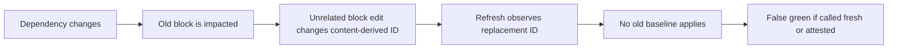

# Pre-implementation review: what to settle before building

Date: 2026-07-11.

Closure status (2026-07-11): this file is the review that opened the gates; it is no longer the
implementation handoff. The decisions were formalized in
[issue-closure-matrix.md](./issue-closure-matrix.md), measured in
[preimpl-experiments.md](./preimpl-experiments.md), and converted into the current go/no-go ruling
in [implementation-readiness.md](./implementation-readiness.md). Where this file says a schema or
contract has not yet been written, those later artifacts control; evidence gates that still require
real executions remain closed.

Current-contract correction: the historical proposals below involving automatic refresh,
trust-on-edit, state-writing initialization, inferred merge bases, bulk acceptance, or SARIF are
rejected or deferred. Scanner v0 is read-only; it compares the provider-supplied immutable base and
candidate snapshots, carries legacy structural debt only under exact finding-fact equality, and
emits JSON plus human logs. Governed acceptance, if its closed gates are later satisfied, remains a
one-claim explicit operation; split and merge are separate closed lifecycle transactions.

This is the original synthesis of the research dossier, the repository feasibility audit, the contract
review, and the adversarial pass. It resolves disagreements between those documents. Where this
file conflicts with a proposed default in [design.md](./design.md),
[open-problems.md](./open-problems.md), or [v0-contract-review.md](./v0-contract-review.md), this
file is the recommended pre-implementation decision.

## Bottom line

The product thesis survives. The current stateful design does not.

Build a read-only, stateless impact scanner as the first experiment. Do not yet freeze a public
directive grammar, `assure.lock`, claim identity, acceptance API, refresh bot, or blocking
narrative-attestation gate.

The useful core is real:

- native same-repository references can be resolved deterministically;
- selected code projections can be compared across a pull request;
- a code change can identify the document blocks that deserve attention;
- generated, executable, and equality checks can prove narrow facts;
- a typed reverse index can make affected documentation visible.

The unsafe part is treating automatically inferred observations as reviewed claims. The current
design lets a substantive or typo-level document edit create a new content-derived identity, lets
refresh baseline that identity, and can then present the result as current or attested. That is a
false green produced by state bookkeeping, not evidence.

The correction is to split the product into four evidence lanes and never collapse their states:

| Lane | How it is created | What it establishes | Initial enforcement |
| --- | --- | --- | --- |
| Structural reference | Native link or explicit path | A named target resolves in the evaluated tree | Candidate breakage may fail unless the exact finding fact is registered external adoption debt |
| Impact observation | Inferred document-to-artifact association | Selected evidence changed between two trees or observations | Report-only until calibrated |
| Governed narrative claim | Explicit stable claim declaration and acceptance | Someone accepted a named claim against named evidence | Defer blocking until identity, ownership, and final-tree semantics are proven |
| Deterministic validator | Equality, generation, compilation, schema, or behavioral rule | The narrow asserted property passed | May fail once deterministic and hermetic |

The zero-configuration wedge belongs in the first two lanes. The differentiated assurance product
belongs in the last two. Trying to give both the same identity, lock record, refresh behavior, and
green label caused most of the dossier's contradictions.

## What is already proven in user zero

This repository is a good calibration corpus, but not evidence that every proposed mechanism is
ready.

- It has 109 tracked Markdown/MDX files, about 0.9 MiB in total, and 22 workflows. A complete
  read-only documentation scan is cheap here.
- Its existing link checker scans 90 files and currently passes.
- That checker treats every `https:` target as external, so it misses two same-repository GitHub
  links to removed files in `convention-engine.mdx`: the old `Generator.scala` and the old
  `Naming.scala`.
- Two inline references in the Python/Postgres page still name the deleted `RouteKind.scala`.
  These are useful advisory inference cases, but inline-code path inference also finds deliberate
  historical and planned paths, so it is not a safe hard gate.
- The committed public OpenAPI copy differs from its current golden source. That is a strong future
  equality-check case, not justification for adding project-specific heuristics to a generic
  scanner.
- There is no tracked `CODEOWNERS`. A contributor can change code and generate a locally valid
  acceptance record in the same pull request. Git review gives visibility, not independent
  authorization.
- The repository's real workflows pin Actions to full commit SHAs, while the illustrative design
  uses mutable `@v1` and `@v4` tags. The implementation should follow the repository's actual
  hardened practice.

The detailed evidence and reproducible commands are in
[implementation-feasibility.md](./implementation-feasibility.md).

## The product decision hidden inside the design

There are two products here, and implementation should not pretend they are one maturity stage.

### Product A: pull-request impact linter

This product is mostly stateless. For each pull request or merge-group candidate it evaluates the
base tree and the exact candidate tree:

1. Resolve explicit references in the candidate.
2. Compare referenced dependency projections between base and candidate.
3. Compare the governing document block between base and candidate.
4. Report a broken reference, an unchanged-block impact, a co-change, an ambiguous inference, or
   an analysis error.

It needs no persistent freshness timestamp, initialization write, or post-merge refresh bot. Each
run compares the provider-supplied immutable base and candidate snapshots. Commit and tree object
IDs establish provenance; projection hashes establish equality. Wall-clock time establishes
neither, and checkout depth must not be used to guess the base.

This catches the common event the user originally cares about: code changes while the linked docs
do not. It cannot carry an unresolved advisory obligation across later merges, reconstruct an
auditable review history, or say when prose was last explicitly reviewed. Those are Product B
features.

### Product B: governed assurance ledger

This product persists stable claims, selected evidence, acceptance transitions, lifecycle events,
scope, and policy. It enables durable review obligations and audit-oriented reporting. It also
introduces the hard problems: stable identity across edits, explicit ceremony, concurrent
acceptance, deletion and retirement, reviewer authority, schema migration, lock conflicts, and
tamper claims.

The research supports building Product A first and treating Product B as a separately gated beta.
If the stateless linter captures most of the value, the team may never need the operational burden
of a committed assurance ledger. That would be a successful result, not a failed prototype.

## The identity no-free-lunch result

An inferred relationship cannot simultaneously have all three of these properties:

1. no authored stable identifier;
2. deterministic logical identity across meaningful edits, moves, splits, and merges;
3. an auditable lifecycle in which edits cannot accidentally discharge an existing obligation.

A content digest identifies a version of a block, not the continuing claim expressed by that
block. A path and heading are mutable locators, not identity. Duplicate ordinals change under
insertion. Git history and similarity can propose lineage but cannot make ambiguous lineage true.

Use two identities instead:

- `ObservationId` may be derived from location, normalized content, and extracted selectors. It is
  allowed to churn because an inferred observation makes no durable governance promise.
- `ClaimId` is immutable, unique, and explicitly authored for a governed claim. Content edits
  change its subject projection; moves change its locator; neither changes the claim ID.

Promotion from an inferred observation to a blocking narrative claim therefore costs one stable
identifier. That is the irreducible authoring cost of an honest audit trail. The product may hide
the syntax in an editor flow, but it cannot remove the underlying decision.

The proposed repeated `[assure]: ...` syntax is not suitable. CommonMark reference labels have
document-wide semantics, and when several definitions match, the first takes precedence. They are
not natively scoped to the nearest heading. See the
[CommonMark 0.31.2 specification](https://spec.commonmark.org/0.31.2/#link-reference-definitions).
A governed directive needs a unique claim ID, versioned grammar, explicit relation type, and an
unambiguous way to name multiple selectors. Its adjacency and section-scope semantics are custom
tool rules and must be tested as such.

Before choosing any directive, run a conformance matrix against this repository's actual
Fumadocs/MDX pipeline, GitHub-flavored Markdown, plain CommonMark, and the configured linters. Add
reStructuredText and AsciiDoc only when those adapters are genuinely supported. An illustrative
line in a design document must not become a public schema accidentally.

## Corrected evidence and state model

Do not implement one `RelationshipStatus` enum. Resolution, change, review, validation, lifecycle,
trust, and policy are simultaneous facts.

| Dimension | Minimum values | Rule |
| --- | --- | --- |
| Resolution, per endpoint | `resolved`, `missing`, `ambiguous`, `unsupported`, `error` | Unknown and error never mean clean |
| Observation | `unchanged`, `changed`, `deleted`, `unavailable` | Recomputed from the explicit evaluation snapshots; scanner v0 persists no observation state |
| Attestation | `not-required`, `unattested`, `current`, `review-required` | Only explicit acceptance advances a governed claim to `current` |
| Validation, per check | `not-configured`, `not-run`, `passed`, `failed`, `error`, `expired` | A pass cannot erase a review obligation or broken selector |
| Lifecycle | `active`, `migration-required`, `retirement-requested`, `retired` | Governed deletion is a transition, not garbage collection |
| Trust | `automatic`, `self-asserted`, `provider-verified`, `service-signed` | Git metadata alone does not prove who reviewed |
| Attribution | `introduced`, `pre-existing`, `resolved`, `unknown` | Diagnostic and adoption input, not a substitute for final-tree safety; unequal same-key facts are `unknown` |
| Waiver | `absent`, `current`, `expired`, `invalid` | Separate governed authorization; never an observed property |
| Disposition | `record`, `warn`, `fail` | Derived by policy and any valid waiver; never persisted as an evidence fact |

Important consequences:

- Scanner v0 has no state-writing initialization or refresh operation. Its observations exist only
  in the report for the evaluated snapshots.
- No automatic operation may create, advance, or replace an acceptance, including after a subject
  edit.
- Editing a governed subject invalidates its previous subject projection. It does not itself prove
  that the claim was reviewed against all dependencies.
- A zero-gesture mode may expose `acknowledged-by-cochange` as a weaker provenance class. It must
  not alias that state to `attestation-current`.
- `verification-passed` and `review-required` may coexist.
- `broken`, `changed`, and `waived` may coexist. The output must preserve the underlying facts.
- The only honest success sentence is “no blocking findings in the evaluated scope.” Every summary
  must also disclose scanned, excluded, unsupported, unlinked, governed, unattested, and waived
  counts.
- Agent-readable output must expose evidence kind, scope, and trust. It must not instruct agents to
  treat attested prose as true.

Replace product phrases now, before they harden into APIs:

| Avoid | Use instead |
| --- | --- |
| `fresh by construction` | `newly observed` or `unattested` |
| `editing clears staleness` | `the subject changed`; policy may recognize a co-change |
| `docs are in sync` | `no blocking findings in evaluated scope` |
| `verified true` | The exact validator result or `accepted against fingerprint` |
| `audit trail of who attested` | `unproven self-asserted record` locally; only authenticated provider or service evidence can establish reviewer identity |

## Canonical governed-claim model

If the stateful product proceeds, keep authored intent, observations, acceptance, and policy in
separate objects.

| Object | Contains | Must not contain or imply |
| --- | --- | --- |
| Claim definition | Stable `ClaimId`, relation kind, subject locator/projection kind, dependency selector intent, scope, validators | Current fingerprints, policy result, inferred pruning hidden in a lock |
| Endpoint observation | Selector ID, resolution, resolved scope, projection digest, engine/projection versions, bounded summary | Human review or truth |
| Acceptance event | Claim ID, complete endpoint snapshots, declaration digest, predecessor event digest, reason, trust class | Spoofable actor metadata presented as authoritative |
| Lifecycle event | Create, migrate, split, merge, retirement request, retirement, predecessor/successor IDs | Silent orphan deletion or ID reuse |
| Policy | Finding-to-disposition rules, protected surfaces, debt and waiver rules | Mutation of observed facts |

Start with a closed relation algebra rather than an unrestricted generic graph:

| Relation | Authority | Completion condition |
| --- | --- | --- |
| `reference` | The document names a target | The target resolves in scope |
| `describes` | Dependencies are evidence for narrative prose | Explicit acceptance is current |
| `generated-from` | Declared inputs and generator govern output | Hermetic regeneration/equality passes |
| `constrains` | A normative document governs implementation | A declared conformance validator passes, or a separately scoped implementation acceptance is current |
| `equivalent` | Neither endpoint alone is authoritative | A deterministic two-input consistency check passes |
| `historical-at` | The pinned revision is the intended subject | Immutable scope resolves; current-tree changes do not invalidate it |

This still compiles to a typed directed hypergraph and a derived reverse index. The restricted
algebra prevents the word “typed” from becoming decorative: every relation has explicit authority,
invalidation, legal selectors, and completion semantics. Only derivation relations need to be
acyclic; equivalence or mutual constraints may legitimately form cycles.

## Ledger rules, if and when a ledger is justified

Do not persist only one aggregate hash. Focused diagnosis and safe migration require the accepted
state of every endpoint. Store per-endpoint snapshots and derive one combined seal over the full
claim definition and accepted set.

The minimum persisted integrity contract is:

- a versioned schema and named cryptographic algorithm;
- domain-separated SHA-256 for portable IDs and seals; fast non-cryptographic hashes may be cache
  keys only;
- a declaration digest, subject projection, every dependency projection, resolved scope, and
  selector/projection engine versions;
- canonical encoding with published cross-platform golden vectors;
- a predecessor acceptance digest for compare-and-swap behavior;
- permanent tombstones for governed retirement and ID-reuse prevention;
- deterministic ordering and byte-for-byte read-only `check` behavior;
- an explicit migration event when selector meaning changes;
- raw and normalized projection digests where normalization can hide source changes.

The current “word tokens plus code spans and link targets” block normalization is too lossy for a
governed subject: punctuation, operators, number formatting, Unicode distinctions, and ordering can
change meaning. Start conservatively with explicit newline canonicalization and otherwise preserve
subject bytes. Formatter immunity is a promise made by a particular versioned projection, not a
global cleanup heuristic. Keep the raw digest even when a stronger typed dependency projection
intentionally ignores formatting.

JSON Lines plus a rigorously constrained JSON canonicalization scheme is a reasonable candidate,
not yet a fact. If RFC 8785 is chosen, restrict numbers to a portable safe subset, account for its
verified errata, reject duplicate keys, and publish vectors for Unicode, CRLF, sets, modes,
symlinks, empty values, and engine migration. See
[RFC 8785 and its errata](https://www.rfc-editor.org/errata/rfc8785).

Do not record the commit containing its own lock update as an input to that update. Do not claim
that `verify-lock` authenticates an acceptance. It can prove canonical structure and recomputed
digests. A contributor can still run the public acceptance algorithm correctly without reading the
claim. Local acceptance is therefore `self-asserted`; protected review or a provider/service is a
separate trust control.

A digest can prove equality and cannot reconstruct the old evidence the acceptance UI promises to
show. The product cannot simultaneously guarantee a focused since-attestation diff, require only a
shallow checkout, and store only small hashes. Choose explicitly among bounded structured
summaries, a content-addressed projection body store, or best-effort Git-history reconstruction,
and expose `diff-available`, `history-required`, or `unavailable` in machine output. Never imply
that the reviewer saw a diff the tool could not produce.

There is no governed-state refresh operation. A read-only scan may report an observation, migration
candidate, or orphan candidate, but it never advances an acceptance, retargets a selector, retires
a claim, clears a waiver, or writes a pull request. Any later governed transition is an explicit,
reviewed one-claim acceptance or a closed lifecycle transaction. Scanner v0 has no writer at all.

## Policy, deletion, and bypass resistance

Candidate policy cannot be allowed to erase evidence of its own weakening. The checker must compare
base and candidate declarations, configuration, policy, scope, waivers, and ledger transitions,
using a trusted external organizational floor where one exists.

Emit unsuppressible meta-findings for at least:

- `policy-weakened`;
- `coverage-reduced`;
- `governed-claim-removed`;
- `scope-weakened`;
- `validator-changed`;
- `acceptance-transition-invalid`;
- `engine-migration-required`.

Separate these concepts:

- severity policy maps a finding to `record`, `warn`, or `fail`;
- scan exclusion changes the coverage denominator and is always disclosed;
- lifecycle classification says current, planned, historical, or pinned;
- a waiver suppresses one stable finding under explicit authority.

A live waiver needs a stable target, reason, owner, creation evidence, and UTC expiry. A historical
classification is not an infinite waiver. Drop adjacent `skip` from the first governed release;
its interaction with the repeated reference label, organization floors, and policy weakening is
not worth the bypass surface.

Deleting a governed declaration or document must not make the candidate healthier. It creates a
retirement request or a removal finding. Splits and merges name their predecessors and successors.
Tombstones prevent ID reuse. Ephemeral inferred observations may disappear without lifecycle
ceremony because they never claimed governed coverage.

Adoption debt also needs first-class treatment. A repository with existing broken references
cannot remain permanently red, and no initialization command may mass-attest prose or write state
to make it green. An external adoption process records an eligible structural finding's exact key
and accepted fact digest. A debt record applies only while the candidate fact is byte-for-byte
equal under the published digest contract; any unequal fact is not grandfathered. Debt is never
permission to merge an invalid final-tree acceptance on a protected governed claim.

## CI and security contract

The blocking check evaluates the exact tree that may merge. Attribution improves explanation; it
does not weaken a protected invariant. GitHub merge queues can build a candidate from the base plus
changes from pull requests ahead in the queue, so “this PR did not cause it” is not enough to call
that candidate safe. GitHub's own documentation says checks run on the merge-group head SHA and
describes these combined candidates; see
[Managing a merge queue](https://docs.github.com/en/enterprise-cloud@latest/repositories/configuring-branches-and-merges-in-your-repository/configuring-pull-request-merges/managing-a-merge-queue).

Required initial posture:

- run on every pull request, merge-group candidate, and default-branch update, without path
  filters;
- pass or explicitly fetch the provider-supplied immutable base and candidate object IDs, and
  verify their object types and the exact candidate tree;
- use read-only repository permissions, no secrets, no network, and no writes;
- parse source without importing, compiling, or evaluating MDX, JSX, repository plugins, examples,
  generators, or probes;
- pin Actions and the checker to immutable full commit/digest identifiers;
- set explicit limits for file bytes, nesting, glob expansion, fan-out, parse time, total time,
  findings, and output;
- reject or explicitly classify invalid UTF-8, symlinks, submodules, sparse checkouts, LFS pointers,
  unmerged index stages, path traversal, and unsupported paths;
- distinguish missing, ambiguous, unsupported, timeout, parser error, truncated, and skipped;
- ensure no crash, timeout, or truncation can produce a passing result.

GitHub states that a full-length commit SHA is the only immutable way to pin an Action and warns
against processing an untrusted checkout in privileged `pull_request_target` or `workflow_run`
contexts. See its [secure-use reference](https://docs.github.com/en/actions/reference/security/secure-use).
The comment-command writer, acceptance App, arbitrary probes, and branch-bypass refresh lane are
therefore deferred. A pinned parser is still processing attacker-controlled bytes; pinning alone
does not make a privileged writer safe.

The proposed Rust hardening language also needs to stay precise. `unsafe_code = "forbid"` covers
owned Rust crates, not unsafe dependencies or bundled C grammars. `panic = "abort"` prevents a
process from catching and classifying a parser panic. If native parsers later enter a protected
lane, either use unwind-and-catch boundaries where sound or isolate them in a resource-limited
worker process; in both cases fuzz the real dependency boundary and ensure abnormal termination is
an analysis failure, never a pass.

Freeze a small exit contract before scripts depend on it:

| Exit | Meaning |
| --- | --- |
| `0` | Complete evaluation; no effective blocking finding |
| `1` | Complete evaluation; at least one effective blocking finding |
| `2` | Configuration, schema, Git-state, parser, resource, or internal failure prevented a trustworthy complete result |

Human output is not a parsing API. Deterministic JSON is the machine contract and human text is a
projection. SARIF is deferred: scanner v0 neither emits nor uploads it. The stateless spike may use
an explicitly experimental JSON shape so that measurement can change it without a compatibility
promise.

## Scope that is safe to implement first

The current “every non-code text file, every format, many tree-sitter grammars” day-zero cut is not
small. It combines a universal document classifier, five structured formats, a plain-text parser,
history-assisted rename recovery, roughly fifteen source grammars, a state ledger, policy, and
SARIF,
and automation. That is several products' worth of compatibility surface.

The first scanner should support:

1. tracked UTF-8 Markdown and MDX;
2. conventional root documentation and agent files through an explicit plain-text mode;
3. native relative links and same-repository GitHub `blob`/`tree` links;
4. explicit repository-rooted inline paths as advisory unless their syntax is unambiguous;
5. the repository's existing literal `file=`/`src=` fence metadata;
6. current-tree resolution and base/candidate projection comparison;
7. `scope --explain`-style counts for discovered, scanned, excluded, unsupported, linked, unlinked,
   explicit, and inferred items;
8. deterministic human output and experimental JSON.

Its only validity scope is the co-versioned base/candidate workspace. Conventional historical,
versioned, release, proposal, and research trees may still receive structural link checks, but an
inferred narrative relationship to current code is `scope-unresolved` and advisory until scope is
declared. Full Git history may enrich “previously existed” and rename suggestions; it is not
required for equality and cannot be silently assumed in a shallow checkout.

Exclude from the first scanner:

- persisted observations and attestations;
- public directive and lock schemas;
- symbols, AST/public-shape selectors, and compiled grammar bundles;
- counts, inventories, managed regions, and graph claims;
- network URLs, external or cross-repository claims;
- executable snippets, repository commands, browser tests, and probes;
- automatic retargeting or prose edits;
- LLM judgment;
- issue-comment writers, Apps, and refresh commits.

Use the current repository's Node 20 and MDX packages for a disposable calibration harness if speed
matters. Keep it isolated from the full 548 MiB documentation install and do not mistake it for the
product architecture. A long-lived generic product can still be a standalone Rust binary after
the semantics and parser contract survive the spike. Implementing it as a Scala module would tie an
always-on generic check to this repository's application build and startup cost.

## Required experiments before stateful implementation

### 1. Historical replay

Replay enough history to include meaningful documentation and refactor activity. Measure, by
reference class rather than as one blended score:

- precision of native links, explicit paths, inline paths, fences, and any symbol inference;
- number of dependency changes that affect referenced blocks;
- number of alerts judged actionable, irrelevant, ambiguous, historical, or generated;
- how often a document edit would have implicitly cleared an older or unrelated obligation;
- how often block identity, document moves, duplicate content, split, or merge creates ambiguous
  lineage;
- how many known drift cases each mechanism would actually have caught before the drift landed;
- runtime, peak memory, finding volume, and report truncation;
- simulated observation/ledger entries, bytes, diff churn, bot commits, and merge conflicts.

The last two measurements determine whether a ledger and compiled grammar set are justified. Do not
optimize or shard a lock whose real size and churn are unknown.

### 2. Parser and directive conformance

Build fixtures for frontmatter, GFM tables, repeated and unique definitions, nested JSX, ESM,
expressions, literal component attributes, footnotes, HTML links, fences, CRLF, Unicode, invalid
input, and oversized input. Compare extraction and source spans with this site's actual MDX
pipeline. Fuzz the non-evaluating parser. A syntax may become public only after identical governed
semantics are demonstrated for every format claimed as supported.

MDX combines Markdown with JSX, JavaScript expressions, and ESM; see the
[official MDX description](https://mdxjs.com/docs/what-is-mdx/). The checker must parse only the
source constructs it needs. Compiling or importing a pull-request page changes the threat model
from document analysis to untrusted code execution.

### 3. Prospective shadow run

Run report-only on user zero and two or three unrelated repositories until the sample contains
enough real code, docs, refactor, and merge activity. Review every finding, not only failures. Also
sample supposedly clean and unlinked documents manually; precision alone hides false negatives and
coverage avoidance.

Before the run, each participating team sets its own actionability, latency, and maintenance-cost
thresholds. Do not bake an attractive universal percentage into the tool before observing the
base rate. A hard structural gate should be effectively deterministic; an inference lane that
misses its pre-registered threshold stays advisory.

### 4. Governed-claim pilot

Only after the shadow run, add a handful of high-value claims with explicit stable IDs. Use local
acceptance committed through normal review, no refresh capability, and no provider writer.
Exercise moves, edits, dependency changes, deletion, split/merge, two concurrent
acceptances, policy weakening, and selector-engine migration.

The first deterministic rule should be the known OpenAPI equality case. Then add one path-set
inventory and one captured value. Narrative claims come after the deterministic state model works,
not before it.

## Build gates

The following are go/no-go conditions, not backlog items to discover after publishing a lock
format.

### Gate A: before the discard-state scanner

- Exact supported document and reference classes are written down.
- Candidate-tree, local-worktree, and index input semantics are explicit.
- The threat model forbids source evaluation and defines resource limits.
- Findings cannot silently disappear on parser or Git errors.
- Output is marked experimental and no repository state is written.

### Gate B: before a persisted observation ledger

- Historical replay quantifies ledger size, churn, and the value of carrying obligations across
  merges.
- Observation is distinct from attestation in schema and UI.
- Canonical encoding, digest domains, engine versions, and golden vectors are frozen.
- No refresh command or writer exists; all governed transitions are explicit acceptance or
  lifecycle operations.
- A state migration plan exists for every persisted schema version.

### Gate C: before governed claims

- Stable explicit `ClaimId` and directive RFC pass the renderer/parser matrix.
- Definition, observation, acceptance, lifecycle, policy, and trust are separate records or types.
- Claim deletion, retirement, move, retarget, split, merge, and ID reuse have tested transitions.
- Local acceptance is labeled self-asserted; ownership and approval expectations are documented.
- Candidate declaration, policy, scope, waiver, validator, and lock changes receive base-diff
  validation and unsuppressible meta-findings.

### Gate D: before any required narrative gate

- The exact final merge candidate is evaluated, including real merge-queue tests.
- Concurrent acceptance uses predecessor compare-and-swap and fails safely after rebase.
- Protected claim owners and approval policy exist in the repository or provider integration.
- Pre-existing structural debt is externally registered and applies only under exact key and fact
  digest equality.
- Shadow data meets the team's pre-registered actionability and cost thresholds.
- All adversarial tests in [preimpl-red-team.md](./preimpl-red-team.md#required-adversarial-tests-before-the-schema-is-declared-stable)
  pass.
- A parser error, unsupported protected selector, timeout, or truncated evaluation fails closed.

## Kill, narrow, or pivot criteria

Do not preserve the full product shape merely because implementation is possible.

- If native structural checks and deterministic equality/generation catch most valuable drift,
  ship those and do not add narrative attestation ceremony.
- If inferred impact has high noise, keep it as discovery and let teams promote only explicit
  relations.
- If maintainers routinely make token edits or script repeated one-claim acceptances without
  reviewing evidence, the attestation lane is measuring compliance theater; move effort toward
  generation, execution, and ownership review.
- If the committed ledger creates frequent bot commits, merge conflicts, or review fatigue, use a
  stateless gate or an external observation service rather than sharding the problem prematurely.
- If parser behavior differs materially across documentation systems, market supported adapters
  explicitly instead of claiming “any text file.”
- If claims with no stable owner dominate, do not block them.
- If random audits find significant escaped drift in supposedly covered surfaces, improve the
  declared denominator or narrow the product claim; a clean finding set is not coverage.
- If users will not accept a stable claim identifier for governed narrative prose, do not promise a
  durable claim audit trail.

## Commercial and legal housekeeping

The product's likely moat is not zero-config link detection; that slice is imitable. The potential
moat is the combination of precise extraction defaults, deterministic evidence adapters, honest
state/provenance, low-friction governed claims, and accumulated calibration data. Those are also the
parts with the highest adoption risk, so willingness to maintain claims and act on alerts must be
validated rather than inferred from general documentation-pain surveys.

There is also a patent issue worth treating seriously but proportionately. U.S. patent application
20080059977, associated with U.S. 8,266,591, describes stored links between requirement and
configuration-management objects, marking related links suspect after an object changes, and
clearing suspect status after user input. See the
[published application and claims](https://patents.justia.com/patent/20080059977). That is close
enough to the proposed change-impact and suspect-link workflow to justify a professional
freedom-to-operate and current-status review before commercializing it. This is not a conclusion
about validity, status, jurisdiction, or infringement, and it need not block a read-only internal
calibration spike.

## Recommended decision set

Accept these defaults before implementation planning:

1. V0 is a stateless, read-only base-versus-candidate scanner.
2. Native explicit same-repository references are the only initial hard-fail candidates; inference
   starts advisory.
3. Projection hashes establish selected-content equality; commits establish tree provenance;
   timestamps do not establish freshness.
4. Inferred observations and governed claims have different identity and state models.
5. Governed claims require stable explicit IDs.
6. A document edit may be reported as a co-change but is not a human attestation.
7. Scanner v0 has no state-writing initialization or refresh; no automatic operation creates or
   advances an acceptance.
8. Deterministic validators and narrative review remain separate evidence axes.
9. A hard governed invariant applies to the exact final candidate; attribution cannot excuse it.
10. Policy weakening, coverage reduction, claim removal, and invalid state transitions are
    unsuppressible findings.
11. The first checker executes no repository code, uses no network or secrets, writes nothing, and
    has bounded failure behavior.
12. The directive, lock, JSON, and migration schemas wait for replay and shadow evidence.
13. Product Rust remains a reasonable destination, not a precondition for the disposable
    experiment.
14. Commercial change-impact or suspect-link functionality gets a professional patent review
    before launch.

With those decisions, scaffold and conformance-harness implementation can begin narrowly; parser
integration and the evaluator still wait for the complete parser-profile corpus. This avoids
baking the dossier's current contradictions into a compatibility contract. Without those gates,
the most likely outcome is a polished
checker whose easiest path to green is to edit the document, refresh the ledger, or weaken the
policy—the exact behavior this idea is meant to prevent.

## Supporting reviews

- [preimpl-red-team.md](./preimpl-red-team.md): ranked blockers, resolutions, adversarial tests,
  deferrals, and product-language corrections.
- [implementation-feasibility.md](./implementation-feasibility.md): repository facts, parser and Git
  constraints, smallest vertical slice, CI shape, tests, and future file locations.
- [v0-contract-review.md](./v0-contract-review.md): detailed candidate artifact, selector,
  fingerprint, output, and policy contracts. Its content-derived governed identity,
  trust-on-edit, automatic orphan removal, and attribution defaults are intentionally superseded by
  this synthesis.
- [failure-modes.md](./failure-modes.md): epistemic, organizational, security, scale, and incentive
  failure modes.
- [prior-art.md](./prior-art.md): requirements suspect links, executable and generated docs,
  traceability, semantic research, and nearby products.
