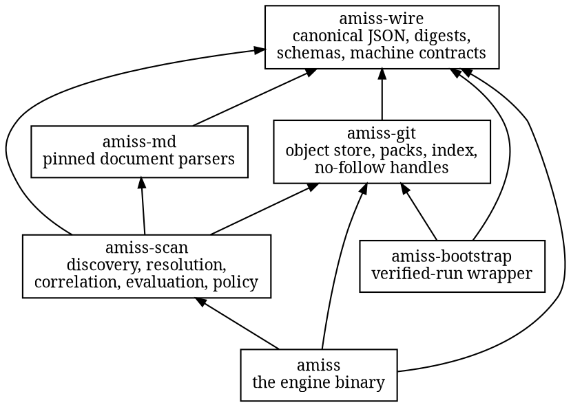
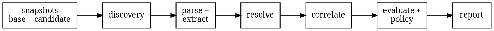

# Architecture

The offline root workspace has six production crates, and trust flows in one direction; a
seventh exists only for tests. An unpublished provider-controller foundation lives in a
separate nested Rust workspace.

The graph above is the root workspace. `amiss-wire` is its foundation: strict JSON with
canonical output, the digest rules, the report format, and every machine contract. Nothing in
it knows what a repository is.

`amiss-git` reads Git storage behind the never-follow-links boundary: loose objects, packs,
deltas, and the index, each under a parser that rejects malformed input and a published
resource ceiling. It repairs nothing.

`amiss-md` holds the document parsers, pinned against the official [CommonMark](https://commonmark.org) and
[GFM](https://github.github.com/gfm/) test
suites plus the [MDX](https://mdxjs.com) grammar's own tests. The pin is a checked-in manifest recording node
counts, extraction results, and byte positions for every test case. A parser change that
moves any of those moves the manifest, and review sees the diff.

`amiss-scan` is the evaluation itself: discovery, resolution, correlation, the
base-versus-candidate comparison, policy, and report construction. It is a library that
does no I/O beyond the store handed to it.

`amiss` is the binary: the closed public command grammar, the in-process run, the two output
formats, and a private sealed entry reserved for the bootstrap. `amiss-bootstrap` validates a
pinned action tree and externally supplied constraint as data, validates three canonical
requests, and launches the verified engine with a cleared environment and a closed stdin
frame. It is the root production crate allowed to start a process, and the process it starts
is the binary it just verified. The sealed path exists but is not integrated into the
published convenience Action; [Project status](status.md) keeps that distinction explicit.
A seventh crate, `amiss-fixtures`, exists only for tests: it writes hostile Git bytes
straight into test repositories so the same fixtures exist on every platform.

The nested [`controller/`](https://github.com/HardMax71/amiss/tree/main/controller) workspace
is outside that graph and outside the root lockfile. Its unpublished `amiss-controller` crate
depends only on `amiss-wire`. It defines transport-neutral traits and identities for
this sequence: authenticate an untouched delivery, claim its replay key durably, refresh exact
provider change state, hand a repository/dialect/ref/commit/tree identity and lease heartbeat to a
runner, refresh again, publish only a still-current result, then record durable completion. A long
run renews cooperatively and stops if ownership cannot be proven. `ProviderAdapter`,
`DeliveryLedger`, and `Runner` remain provider-neutral boundaries. The ledger contract requires
exact delivery/run binding, stable evaluation IDs, expiring leases, monotonic fences, and
fail-closed stale ownership. It also requires atomic staging before external I/O and an atomic
staged-to-terminal transition so retries cannot rerun and race a different result. The boundary
has no implementation.
SQL and database backends are outside the design; future replay coordination must meet the
contract through a non-database mechanism.

No HTTP transport, provider SDK, credential source, repository acquisition worker, bootstrap
runner, durable ledger, provider publisher, or deployable service exists in that workspace yet.
There is therefore still no arrow from the controller into the supported delivery graph.

Inside an engine run, the stages form a line:

Each stage charges resource counters at a defined admission or observation point, and a
crossed ceiling is a refusal, never a repair. Not every counter is a pre-work bound:
document bytes are admitted before parsing, while parser node and nesting totals are
charged after the grammar returns. [Security model](security.md) records the CPU-boundary
limitation that follows from that ordering. Subject to those declared inputs and
boundaries, the report is a pure function of the two snapshots and the invocation.
