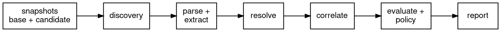

# Architecture

Six shipped crates, and trust flows in one direction; a seventh exists only for tests.

`amiss-wire` is the foundation: strict JSON with canonical output, the digest rules, the
report format, and every machine contract. Nothing in it knows what a repository is.

`amiss-git` reads Git storage behind the never-follow-links boundary: loose objects, packs,
deltas, and the index, each under a parser that rejects malformed input and a published
resource ceiling. It repairs nothing.

`amiss-md` holds the document parsers, pinned against the official [CommonMark](https://commonmark.org) and
[GFM](https://github.github.com/gfm/) test
suites plus the [MDX](https://mdxjs.com) grammar's own tests. The pin is a checked-in manifest recording node
counts, extraction results, and byte positions for every test case. A parser change that
moves any of those moves the manifest, and review sees the diff.

`amiss-scan` is the evaluation itself: discovery, resolution, correlation, the
base-versus-candidate comparison, policy, and report construction. It is a library that
does no I/O beyond the store handed to it.

`amiss` is the binary: the closed command grammar, the in-process run, the two output
formats. `amiss-bootstrap` is the CI wrapper that validates a pinned action tree as data
and launches a verified engine. It is the one crate allowed to start a process, and the
process it starts is the binary it just verified. A seventh crate, `amiss-fixtures`,
exists only for tests: it writes hostile Git bytes straight into test repositories so the
same fixtures exist on every platform.

Inside a run, the stages form a line:

Every stage pays its resource budget before it works, every stage refuses rather than
repairs, and the report at the end is a pure function of the two trees and the command
line.
