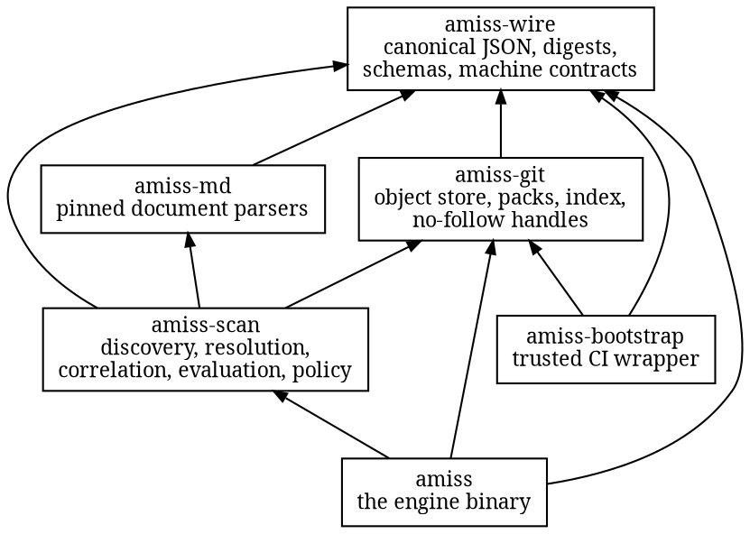
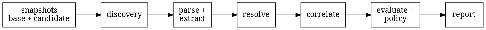

# Architecture

Six crates, one direction of trust.

`amiss-wire` is the bottom: strict JSON with canonicalization, the digest domains, the report
envelope, and every machine contract. Nothing in it knows what a repository is.

`amiss-git` is the object store behind the no-follow handle boundary: loose objects, packs,
deltas, and the index, each under a rejecting grammar and a resource contract. It never
follows a link and never repairs a malformed object.

`amiss-md` holds the document parsers, pinned against the upstream CommonMark and GFM
conformance corpora plus the MDX grammar suite. The pin is a checked-in manifest with node
counts, extraction goldens, and byte spans for every corpus case; a parser change that moves
any of them moves the manifest, and review sees it.

`amiss-scan` is the evaluation: discovery, reference resolution, block correlation, the
base-versus-candidate comparison, policy application, and report construction. It is a
library with no I/O of its own beyond the store handed to it.

`amiss` is the binary: the closed command grammar, the in-process evaluation, and the two
output projections. `amiss-bootstrap` is the CI wrapper that validates a pinned action tree
as data and launches a verified engine; it is the one crate allowed to spawn a process, and
the engine it spawns is the thing it just verified. A seventh crate, `amiss-fixtures`, exists
only for tests and benches: it writes hostile git bytes directly into stores so the same
fixtures exist on every platform.

The evaluation pipeline inside a run:

Every stage charges its resource contract before it works, every stage refuses rather than
repairs, and the report at the end is a pure function of the two trees and the invocation.
