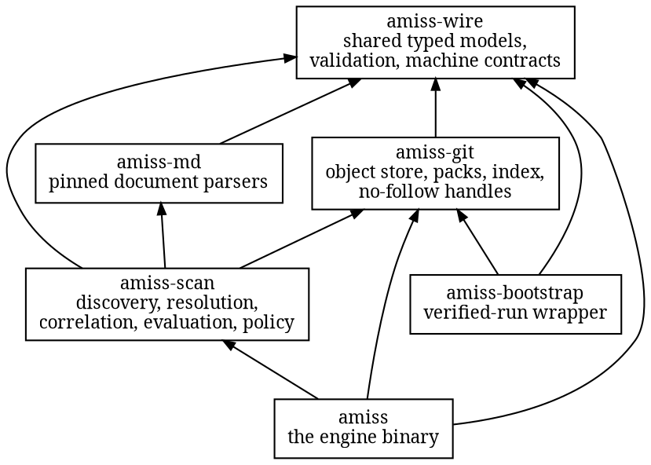
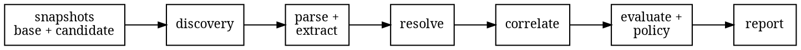

# Architecture

The engine has six production crates, and trust flows in one direction; a seventh exists only
for tests. The unpublished provider-controller crates share the same workspace and depend on the
engine, never the other way round.

```dot process
digraph amiss {
  rankdir = BT;
  node [shape = box, fontname = "Latin Modern, Georgia, serif", fontsize = 11];
  edge [arrowsize = 0.7];
  wire  [label = "amiss-wire\nshared typed models,\nvalidation, machine contracts"];
  git   [label = "amiss-git\nobject store, packs, index,\nno-follow handles"];
  md    [label = "amiss-md\npinned document parsers"];
  scan  [label = "amiss-scan\ndiscovery, resolution,\ncorrelation, evaluation, policy"];
  cli   [label = "amiss\nthe engine binary"];
  boot  [label = "amiss-bootstrap\nverified-run wrapper"];
  git -> wire;
  md -> wire;
  scan -> git;
  scan -> md;
  scan -> wire;
  cli -> scan;
  cli -> git;
  cli -> wire;
  boot -> git;
  boot -> wire;
}
```

The graph above is the root workspace. `amiss-wire` owns the shared report, control, request,
and evidence models and their validation rules. Serde reads and writes those types directly;
`serde_json_canonicalizer` supplies RFC 8785 output, and RustCrypto supplies hashing and HMAC.
Models derive their Serde implementations and use library attributes and adapters. Handwritten
Serde implementations, visitors, field codecs, and forwarding serialization helpers are forbidden.
Domain validation checks identities, digest bindings, sorted sets, and resource limits after
decoding; it does not implement JSON syntax.

Readers now accept standard Serde JSON behavior. Named structs can also deserialize from
positional arrays in declaration order. Known duplicate struct fields are rejected; ignored
fields and maps follow Serde's normal behavior, including last-value-wins map entries. Numbers
are governed by the destination Rust type rather than a document-wide safe-integer rule.
Typed integer fields still reject fractional values, and domain-specific numeric limits remain.
The default `serde_json` recursion checks replace the former 512-container profile. Complete
input readers still reject trailing data.

Generic models rely on Serde's inferred trait bounds, without handwritten `serde(bound)`
overrides. Ordinary `Option<T>` fields accept either omission or `null` as `None`.
Their output still follows the model's existing `skip_serializing_if` attributes.
The relocation hint `same_object_at` retains three states (absent, explicit null, and a
path) because they enter fact digests; its existing library adapter preserves those states.

GitHub, GitLab, and Gitea response models select only the fields Amiss uses and let Serde
ignore the rest, including extra nested fields. Amiss-owned reports, requests, configuration,
and stored records retain `deny_unknown_fields` where their contracts are closed.

This broadens accepted input without changing emitted object shapes or canonical examples.
The published JSON Schemas describe the object representation. Canonical-byte comparisons and
digest checks can still reject alternate representations at authenticated report and request
boundaries; accepting a value through Serde does not establish its domain validity.

Domain values keep their types after admission. CLI adoption retains digests, owners, and
instants; release staging retains repository identities, object formats, OIDs, artifact IDs,
and repository paths. Scanner forge context carries a repository identity and optional branch
refs, so an absent ref has no empty-string spelling. `BranchRef` names only `refs/heads/`;
provider pull-request/train refs and private acquisition refs have different domains. The Git
transport uses gix's validated full-name type after enforcing its private ref namespace.

The controller owns provider identities and opaque IDs. Its `AcquiredCommit` carries typed
commit, tree, and parent OIDs for the object resolver and GitLab/Gitea adapters. Wire-owned
`RequiredStatusName` supplies the same existing grammar to execution constraints, controller
checks, relation destinations, and provider configuration. Unrelated remote check names stay
text so their presence cannot invalidate a response. Provider states and webhook actions use
each provider's own enums. Unknown strings remain representable; the consuming operation
explicitly decides whether they are ignored, nonpassing, or invalid.

Persistent records reuse domain models and typed schema markers, IDs, digests, refs, and
verdicts. The inbox serializes the production delivery model, using Serde library adapters for
base64 bytes and its bare hexadecimal content digest. Artifact and ledger digests retain their
`sha256:` spelling. Record field order, omission rules, and hash domains remain part of stored
identity: the ledger's repository projection deliberately retains its historical host/owner/name
order. Generic sidecar audits carry the publication or relation verdict enum directly.
Consumers take ownership when inputs are no longer needed, and validation inspects borrowed
values. Inbox claims move decoded deliveries after persisting the lease; ledger replay moves
metadata into publications without rebuilding objects for validation or comparison.

A type name alone does not establish validity. `UtcInstant`, `OwnerId`, and structured repository
identities still require their existing domain validators after ordinary derived deserialization.
Limits, timestamp ordering, object-format agreement, authorization, and identity binding remain
separate checks. Parsed transport API bases use `Url`; evidence URLs retain their exact spelling
because normalization could change a bound identity.

Open wire contracts are not narrowed to whichever values current producers happen to emit.
External report modes and document strings, nonempty external `checked_at` evidence, rule IDs,
site routes, locale page keys, and binary report paths retain their existing contracts. A stricter
shared type for those fields requires agreement across their producers, schemas, and validators.
Trusted-time run IDs also retain their wire grammar, which differs from controller opaque IDs.
Source text, diagnostic prose, signatures, labels, versions, and rendering output remain text.

`amiss-git` reads Git storage behind the never-follow-links boundary: loose objects, packs,
deltas, and the index, each under a parser that rejects malformed input and a published
resource ceiling. It repairs nothing.

`amiss-md` holds the document parsers, pinned against the official [CommonMark](https://commonmark.org) and
[GFM](https://github.github.com/gfm/) test
suites plus the [MDX](https://mdxjs.com) grammar's own tests. The pin is a checked-in manifest recording node
counts, extraction results, and byte positions for every test case. A parser change that
moves any of those moves the manifest, and review sees the diff.

`amiss-scan` is the evaluation itself: discovery, resolution, correlation, the
base-versus-candidate comparison, policy, and report construction. It is a library that
does no I/O beyond the store handed to it. It also carries the ten heading-identity rules,
each pinned against the renderer it models rather than written from its documentation.

`amiss` is the binary: the closed public command grammar, the in-process run, the two output
formats, and a private sealed entry reserved for the bootstrap. `amiss-bootstrap` validates a
pinned action tree and externally supplied constraint as data, validates three canonical
requests, and launches the verified engine with a cleared environment and a closed stdin
frame. It is the root production crate allowed to start a process, and the process it starts
is the binary it just verified. The sealed path exists but is not integrated into the
published convenience Action; [Project status](status.md) keeps that distinction explicit.
A seventh crate, `amiss-fixtures`, exists only for tests: it writes hostile Git bytes
straight into test repositories so the same fixtures exist on every platform.

The root [`api/`](https://github.com/HardMax71/amiss/tree/main/api) specialist and
[`controller/`](https://github.com/HardMax71/amiss/tree/main/controller) crates sit outside that
graph. They are unpublished and nothing above depends on them. `amiss-api` normalizes bounded
Rustdoc JSON into semantic records without entering provider binaries. The controller crates keep
provider, HTTP, storage, credential, Git acquisition, and runtime dependencies out of the scanner.
`amiss-controller` owns the provider-neutral orchestration and supervised bootstrap contracts;
`amiss-controller-git` owns bounded protocol-v2 acquisition; and `amiss-controller-service` owns
the bounded webhook, synchronous evaluation, and authenticated artifact endpoints, durable raw
inbox, and worker. Small provider crates and service binaries add the GitHub App Check Run, GitLab
merge-train policy job, and Gitea or Forgejo dedicated-reviewer gates. All durable state uses
ordinary files rather than SQL or a database.

[Controller delivery](controller.md) defines the neutral record and retry rules.
[Provider-verified controls](provider-controls.md) compares the concrete flows and links each
provider's setup and trust boundary.

Inside an engine run, the stages form a line:

```dot process
digraph pipeline {
  rankdir = LR;
  node [shape = box, fontname = "Latin Modern, Georgia, serif", fontsize = 11];
  edge [arrowsize = 0.7];
  snap  [label = "snapshots\nbase + candidate"];
  disc  [label = "discovery"];
  parse [label = "parse +\nextract"];
  res   [label = "resolve"];
  corr  [label = "correlate"];
  eval  [label = "evaluate +\npolicy"];
  rep   [label = "report"];
  snap -> disc -> parse -> res -> corr -> eval -> rep;
}
```

Each stage charges resource counters at a defined admission or observation point, and a
crossed ceiling is a refusal, never a repair. Not every counter is a pre-work bound:
document bytes are admitted before parsing, while parser node and nesting totals are
charged after the grammar returns. [Security model](security.md) records the CPU-boundary
limitation that follows from that ordering. Subject to those declared inputs and
boundaries, the report is a pure function of the two snapshots and the invocation.
