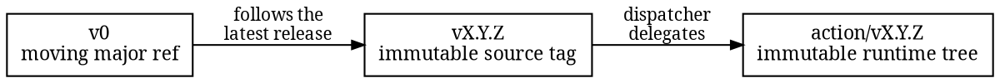

# Running it in CI

The short form is the published GitHub convenience Action. It carries the engine inside the
selected action tree, derives both commits from the triggering event, and turns findings into
file feedback on the pull request. It is not the provider-authenticated controller lane:

```yaml
- uses: actions/checkout@9c091bb21b7c1c1d1991bb908d89e4e9dddfe3e0 # v7.0.0
  with:
    fetch-depth: 2
- uses: HardMax71/amiss@v0
  with:
    profile: observe
```

The published first run uses `observe`: introduced problems appear as Fixes without blocking,
changed targets appear as summary-only Checks, and pre-existing problems remain Existing
inventory. An incomplete or untrusted run still fails. Triage the initial report, adopt any
repository policy it needs, then switch the input to `profile: enforce`.

## What the Action does

Before running anything it verifies the selected binary against the release manifest shipped
in the same tree. A wall-clock watchdog backstops the engine's resource ceilings, and a scan
that outlives the window is ended so the job fails with no result, never a verdict. Under the
default `enforce` profile the job fails on exit classes 1 and 2. The outputs `exit-class` and
`report` expose the verdict class and the JSON report path for anything downstream.

| Input | Default | Role |
| --- | --- | --- |
| `profile` | `enforce` | `observe` reports without blocking |
| `base` | derived | full commit ID, overrides the event derivation |
| `candidate` | derived | full commit ID, overrides the event derivation |
| `repo` | `.` | repository root inside the workspace |
| `object-format` | `sha1` | or `sha256` |
| `annotations` | `true` | displayed Fixes and scan errors become file annotations |
| `watchdog-seconds` | `120` | wall-clock window before the scan is ended |

When `base` and `candidate` stay empty, the event supplies them:

| Event | Base | Candidate |
| --- | --- | --- |
| `pull_request` | the candidate's own first parent | the merge result |
| `merge_group` | the group's base commit | the group's head |
| `push` | the event's `before` | the pushed head |

The first parent is deliberate: the payload's base tip races the merge ref GitHub rebuilds
lazily after a base branch moves, while the first parent is exactly the base the test merge
was built from and is present in any checkout that holds the candidate at all. Both commits
must exist in the checkout: `fetch-depth: 2` covers the normal merge checkout, and a batched
push or unusual checkout may need `fetch-depth: 0`.

The identity host comes from the event's server URL, so on GitHub Enterprise Server the
report claims the instance's own host and recognizes that host's blob and tree links, with
the github dialect declared explicitly. Release assembly supplies the host the same way, to a
[manifest builder](https://github.com/HardMax71/amiss/blob/main/crates/amiss-bootstrap/src/build.rs)
that stores an open build-source identity instead of assuming `github.com`; the
[release workflow](https://github.com/HardMax71/amiss/blob/main/.github/workflows/release.yml)
is a checkable example of that input. The report and request formats are forge-neutral.

## Pinning the Action

The moving major ref follows the engine's semver major, `v0` for the 0.x series and `v1`
from 1.0.0 on, so one series can never rewrite another's ref. A `vX.Y.Z` source tag is an
immutable exact pin whose dispatcher delegates to the equally immutable `action/vX.Y.Z`
runtime tag; a source commit pins the dispatcher but still makes that second hop. Pin
`action/vX.Y.Z` directly, or its generated Action commit, when policy requires the complete
runtime tree in one ref.



## Invoking the engine directly

The long form is useful outside GitHub Actions or when a workflow constructs the exact
evaluation itself. Amiss's own
[self-scan workflow](https://github.com/HardMax71/amiss/blob/main/.github/workflows/ci.yml)
builds the pull request's engine, assembles a local action tree with its manifest, and runs
that composite under `--profile enforce`. A minimal adjacent-commit direct invocation is:

```yaml
- uses: actions/checkout@9c091bb21b7c1c1d1991bb908d89e4e9dddfe3e0 # v7.0.0
  with:
    fetch-depth: 2
    persist-credentials: false
- run: cargo install --locked --registry crates-io --version '=<reviewed-version>' amiss
- env:
    REPOSITORY: ${{ github.repository }}
    BRANCH: ${{ github.head_ref || github.ref_name }}
    DEFAULT_BRANCH: ${{ github.event.repository.default_branch }}
  run: |
    amiss check --repo . --object-format sha1 \
      --base "$(git rev-parse HEAD~1)" \
      --candidate "$(git rev-parse HEAD)" \
      --repository "github.com/${REPOSITORY,,}" \
      --ref "refs/heads/${BRANCH}" \
      --default-branch-ref "refs/heads/${DEFAULT_BRANCH}" \
      --profile observe --format json > amiss-report.json
```

Replace `<reviewed-version>` with the exact release you reviewed. The leading `=` makes the
Cargo requirement exact, Cargo checks the crate archive against the crates.io index checksum,
and `--locked` refuses to recompute the packaged lockfile, so the command pins both the
released crate and its dependency graph. The placeholder is deliberately release-independent.
Repository and branch names travel through environment variables because a branch can be
named anything and text pasted into a shell script becomes code; the owner is lowercased in
shell because GitHub hands it over with its registered capitals and Amiss refuses anything
but lowercase. A scan is a pure function of the two snapshots and the invocation, so there is
no baseline cache to warm between runs. As with the Action, graduate to `--profile enforce`
once the first report is triaged.

## Reading a run

When a run blocks, use the grouped feedback to orient, then read the exact JSON findings for
repair evidence. The Action and human views show at most ten Fix and Check items combined, in
engine order, with one overflow line; only a displayed Fix with a candidate text location
becomes a file annotation, while Checks and Existing inventory stay in the summary and
report. If the scan failed, feedback is unavailable and at most ten retained errors are
annotated instead. The blocking rows remain the report's `errors` and findings whose
`effective_disposition` is `fail`, and the complete grouped and raw sets always remain in the
report. The Action's `report` output names that JSON file, so a later step reads it without
rerunning anything. One line lists every grouped PR item with its target and affected-place
count:

```sh
jq -r '.payload.feedback
  | select(.status == "available")
  | .items[]
  | [.action, .effective_disposition,
     ((.target | strings) // "-"), .location_count]
  | @tsv' amiss-report.json
```

## What this surface is not

The Action invokes the public command: its branch is the candidate ref used for URL
resolution, its report target ref is null, and it does not acquire provider-authenticated
external controls, invoke the sealed bootstrap path, or publish through an independently
authenticated integration. Caller-supplied identity fields never become provider authority.
The authenticated lanes are separately operated source-built services: a GitHub App
publishing an App-owned Check Run on the authoritative test merge, a GitLab pipeline
execution policy job authenticated through OIDC, and a dedicated Gitea or Forgejo reviewer
required by the effective branch rule. [Provider-verified controls](provider-controls.md)
compares those lanes and links their setup, and [Controller delivery](controller.md)
documents the shared retry record; the GitHub lane's own page is
[GitHub provider lane](provider-github.md).

## Before a commit exists

The same check runs on the staged index. The repository publishes a
[pre-commit](https://pre-commit.com) hook that scans the staged state against `HEAD` with an
installed `amiss` binary:

```yaml
repos:
  - repo: https://github.com/HardMax71/amiss
    rev: v0.5.1
    hooks:
      - id: amiss
```
