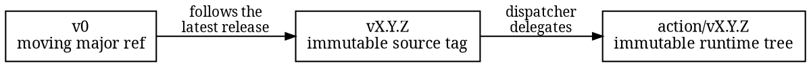

# Running it in CI

The short form is the published GitHub convenience Action. It carries the engine inside the
selected action tree, derives both commits from the triggering event, and turns findings into
file feedback on the pull request. It is not the provider-authenticated controller lane:

```yaml
name: docs
on:
  pull_request:
  push:
    branches: [main]
permissions:
  contents: read
jobs:
  amiss:
    runs-on: ubuntu-latest
    steps:
      - uses: actions/checkout@3d3c42e5aac5ba805825da76410c181273ba90b1 # v7.0.1
        with:
          fetch-depth: ${{ github.event_name == 'pull_request' && 2 || 0 }}
      - id: amiss
        uses: HardMax71/amiss@v0
        with:
          profile: observe
      - if: always()
        uses: actions/upload-artifact@043fb46d1a93c77aae656e7c1c64a875d1fc6a0a # v7.0.1
        with:
          name: amiss-report
          path: ${{ steps.amiss.outputs.report }}
          if-no-files-found: ignore
```

The published first run uses `observe`: introduced problems appear as Fixes without blocking,
changed targets appear as summary-only Checks, and pre-existing problems stay as pre-existing
inventory. An incomplete or untrusted run still fails. Triage the initial report, adopt any
repository policy it needs, then switch the input to `profile: enforce`. When the site is
built somewhere else the tree carries no generator configuration, so every destination is read
against the source files until `.amiss/router.yml` names the router;
[What a documentation router serves](route-spellings.md) has the names. A repository whose
backlog outlives its first triage can gate the middle of that road with
`enforce-introduced`, which blocks what a pull request introduces while the carried
findings stay warnings in the same reports.

## What the Action does

Before running anything it verifies the selected binary against the release manifest shipped
in the same tree. A wall-clock watchdog backstops the engine's resource ceilings, and a scan
that outlives the window is ended so the job fails with no result, never a verdict. The window
defaults to 120 seconds, far above a real scan: this repository takes 0.26 seconds and a
1,620-document Docusaurus site 4.2 seconds. Under the default `enforce` profile the job fails
on exit classes 1 and 2. The outputs `exit-class` and `report` expose the verdict class and
the JSON report path for anything downstream; the file sits in the runner's temp directory,
which is why the workflow above uploads it as the `amiss-report` artifact. A run that ends
before the engine could scan, on an unsupported runner or a checkout missing a commit, reports
exit class 2, and the path then names a file that was never written, which the upload step's
`if-no-files-found: ignore` tolerates.

| Input | Default | Role |
| --- | --- | --- |
| `profile` | `enforce` | `observe` reports without blocking, `enforce-introduced` blocks what the change introduces and warns on the backlog, `enforce` blocks every failing finding |
| `base` | derived | full commit ID, overrides the event derivation |
| `candidate` | derived | full commit ID, overrides the event derivation |
| `repo` | `.` | repository root inside the workspace |
| `object-format` | `sha1` | or `sha256` |
| `annotations` | `true` | displayed Fixes and scan errors become file annotations |
| `watchdog-seconds` | `120` | wall-clock window before the scan is ended |

When `base` and `candidate` stay empty, the event supplies them:

| Event | Base | Candidate |
| --- | --- | --- |
| `pull_request` | the candidate's own first parent | the merge result |
| `pull_request_target` | the payload's base tip | the pull request's head |
| `merge_group` | the group's base commit | the group's head |
| `push` | the event's `before` | the pushed head |

The first parent is deliberate: the payload's base tip races the merge ref GitHub rebuilds
lazily after a base branch moves, while the first parent is exactly the base the test merge
was built from. Both commits must exist in the checkout. At the checkout default of depth 1
the Action deepens the checkout by one commit from its own head before it gives up, which
reaches the merge commit's parents and a single-commit push, so `fetch-depth: 2` only saves
a round trip; a push of several commits needs `fetch-depth: 0`, which the workflow above
gives pushes. A `pull_request_target` checkout is the base branch,
so the head is absent by design and the Action never fetches it: give actions/checkout
`ref: ${{ github.event.pull_request.head.sha }}` with `fetch-depth: 0` for that event.

The identity host comes from the event's server URL, so on GitHub Enterprise Server the
report claims the instance's own host and recognizes that host's blob and tree links, with
the github dialect declared explicitly. Release assembly supplies the host the same way, to a
[manifest builder](https://github.com/HardMax71/amiss/blob/main/crates/amiss-bootstrap/src/build.rs)
that stores an open build-source identity instead of assuming `github.com`; the
[release workflow](https://github.com/HardMax71/amiss/blob/main/.github/workflows/release.yml)
is a checkable example of that input. The report and request formats are forge-neutral.

## Pinning the Action

The moving major ref follows the engine's semver major, `v0` for the 0.x series and `v1`
from 1.0.0 on, so one series can never rewrite another's ref. A `vX.Y.Z` source tag is an
immutable exact pin whose dispatcher delegates to the equally immutable `action/vX.Y.Z`
runtime tag; a source commit pins the dispatcher but still makes that second hop. Pin
`action/vX.Y.Z` directly, or its generated Action commit, when policy requires the complete
runtime tree in one ref.


```dot process
digraph pins {
  rankdir = LR;
  node [shape = box, fontname = "Latin Modern, Georgia, serif", fontsize = 11];
  edge [arrowsize = 0.7, fontname = "Latin Modern, Georgia, serif", fontsize = 10];
  major    [label = "v0\nmoving major ref"];
  source   [label = "vX.Y.Z\nimmutable source tag"];
  runtime  [label = "action/vX.Y.Z\nimmutable runtime tree"];
  major -> source [label = "follows the\nlatest release"];
  source -> runtime [label = "dispatcher\ndelegates"];
}
```

## Invoking the engine directly

The long form is useful outside GitHub Actions or when a workflow constructs the exact
evaluation itself. Amiss's own
[self-scan workflow](https://github.com/HardMax71/amiss/blob/main/.github/workflows/ci.yml)
builds the pull request's engine, assembles a local action tree with its manifest, and runs
that composite under `--profile enforce`. A minimal adjacent-commit direct invocation is:

```yaml
- uses: actions/checkout@9c091bb21b7c1c1d1991bb908d89e4e9dddfe3e0 # v7.0.0
  with:
    fetch-depth: 2
    persist-credentials: false
- run: cargo install --locked --registry crates-io --version '=<reviewed-version>' amiss
- env:
    REPOSITORY: ${{ github.repository }}
    BRANCH: ${{ github.base_ref || github.ref_name }}
    DEFAULT_BRANCH: ${{ github.event.repository.default_branch }}
  run: |
    amiss check --repo . --object-format sha1 \
      --base "$(git rev-parse HEAD~1)" \
      --candidate "$(git rev-parse HEAD)" \
      --repository "github.com/${REPOSITORY,,}" \
      --ref "refs/heads/${BRANCH}" \
      --default-branch-ref "refs/heads/${DEFAULT_BRANCH}" \
      --profile observe --format json > amiss-report.json
```

Replace `<reviewed-version>` with the exact release you reviewed. The leading `=` makes the
Cargo requirement exact, Cargo checks the crate archive against the crates.io index checksum,
and `--locked` refuses to recompute the packaged lockfile, so the command pins both the
released crate and its dependency graph. The placeholder is deliberately release-independent.
In a pull request `--ref` names the branch it merges into: the candidate is what that branch
will hold after the merge, so a link pinned to it resolves against the candidate, and a
link that breaks fails the pull request rather than the merge.
Repository and branch names travel through environment variables because a branch can be
named anything and text pasted into a shell script becomes code; the owner is lowercased in
shell because GitHub hands it over with its registered capitals and Amiss refuses anything
but lowercase. A scan is a pure function of the two snapshots and the invocation, so there is
no baseline cache to warm between runs. As with the Action, graduate to `--profile enforce`
once the first report is triaged.

The external rail extends any direct invocation into web evidence, advisory: derive
[the plan](external-plan.md) from the written report, probe its introduced destinations,
and judge through [the assessment](external-assessment.md). Amiss runs exactly this chain
on its own pull requests, in the `external-advisory` job of the same workflow linked
above, with every defect degrading into one summary line rather than a failed check:

```yaml
- env:
    GH_TOKEN: ${{ github.token }}
  run: |
    gh release download v<reviewed-version> --repo HardMax71/amiss --pattern amiss-probe-linux-x86_64
    gh attestation verify amiss-probe-linux-x86_64 --repo HardMax71/amiss \
      --signer-workflow HardMax71/amiss/.github/workflows/release.yml
    chmod +x amiss-probe-linux-x86_64
- run: |
    amiss external-plan --report amiss-report.json --format json > amiss-plan.json
    ./amiss-probe-linux-x86_64 --plan amiss-plan.json > amiss-evidence.json
    amiss external-assess --plan amiss-plan.json --evidence amiss-evidence.json
```

The assessment refutes only what a probe or forge API positively disproved, so its rows
are telemetry to read, not a gate to wire, until the rates have earned that. Its human summary
also windows permanent-redirect retarget suggestions; temporary redirects remain evidence and
never become edit suggestions. The prober
ships beside the engine in every release, in the same `SHA256SUMS` and sigstore bundle,
so the download above is the same [Verified consumption](security.md) recipe with the
pattern changed. A release cut before the prober has no such asset; there the source
build `cargo build --locked --release -p amiss-probe` stands in, which is also what the
dogfood job runs so it probes with the pull request's own prober.

That dogfood job uses
[GitHub's cache](https://docs.github.com/en/actions/reference/workflows-and-actions/dependency-caching)
only to replay successful, nonempty evidence when the same workflow run is retried. The exact
generation key carries the cache schema and probe options, runner platform, immutable run and
commit identities, and the attempt number. Restore fallback is confined to that prefix, so only an
older generation from the same run and commit can match. The first attempt restores nothing, and
empty evidence saves nothing. A restored file is still untrusted input: `external-assess` must
accept its exact plan binding before the probe is skipped. A miss, cache outage, or invalid body
runs the probe again; nonempty corrected evidence is saved as the current attempt's generation for
later retries. Every attempt derives the assessment locally. A new workflow run therefore never
inherits an observation from the old one, and the cache never becomes a baseline or changes the
advisory policy.

The SARIF projection turns the same run into GitHub code-scanning alerts on the lines the
findings name. Two steps after any direct invocation, in a job whose `permissions` block adds
`security-events: write` beside `contents: read`:

```yaml
- run: amiss check <the check flags above> --format sarif > amiss.sarif
- uses: github/codeql-action/upload-sarif@24c7eb380a2dc368f2d129e4c65e51d172983a1e # v4
  with:
    sarif_file: amiss.sarif
    category: amiss
```

The `category` keeps Amiss's alerts distinct from any other SARIF producer in the
repository. The uploaded rows are ordinary code-scanning alerts, so GitHub's remediation
surfaces operate on them directly,
[agentic autofix](https://github.blog/changelog/2026-07-10-agentic-autofix-for-code-scanning-alerts-in-public-preview/)
included. What each result carries is stated in
[The report](report.md).

Code scanning reads less of the file than the file holds, in three ways. It renders no SARIF
`fixes`, so the replacement a finding carries reaches `amiss fix` and other SARIF viewers but
never the alert. It tracks an alert by the
[line hash](https://docs.github.com/en/code-security/code-scanning/integrating-with-code-scanning/sarif-support-for-code-scanning)
upload-sarif computes and ignores every other fingerprint, so the finding key does not follow
an alert across runs, and two findings of one kind on one line are one alert. And a pull
request shows an alert only when its line is in the diff, while a drift finding usually sits
in a document the change never touched. The Action's annotations and job summary list those,
so keep the Action or the human output beside the upload rather than in place of it.

On GitLab the whole job ships as a pinned template. GitLab's CI/CD Catalog only serves
components hosted on a GitLab instance, so a GitHub-hosted project publishes the honest
equivalent: a template consumed as a remote include from a tagged URL.

```yaml
include:
  - remote: https://raw.githubusercontent.com/HardMax71/amiss/v<reviewed-version>/integrations/gitlab/amiss.gitlab-ci.yml

variables:
  AMISS_VERSION: v<reviewed-version>
```

Both pins name the release you reviewed and move together, and the job's image is pinned by
digest. The
[template](https://github.com/HardMax71/amiss/blob/main/integrations/gitlab/amiss.gitlab-ci.yml)
runs on merge-request pipelines and on the default branch, refuses to run with exit 2 until
`AMISS_VERSION` is set, and verifies the downloaded binary against the release's `SHA256SUMS`
before executing it. It scans under `AMISS_PROFILE` (`observe` until the first report is
triaged, the same ramp as everywhere else). A merge request compares its diff base with its
head, a merged-results or merge-train pipeline compares its merge commit with that commit's
first parent, so drift already on the target is not charged to the merge request, and the
default branch compares each push with the commit before it; a project's first commit has none,
so its checkout is read whole through `--index`. It declares the project's identity
from GitLab's own variables, the server host and the lowercased project path with the `gitlab`
dialect, the branch a merge request targets as `--ref`, and the default branch, so a URL into
the project's own files is checked like a relative link rather than left external. It renders
Code Quality and JUnit
from that same validated report without a second scan, and uploads three artifacts: the
exact JSON report, a
[Code Quality report](https://docs.gitlab.com/ci/testing/code_quality/) rendered in the
merge-request widget and inline on the diff, and a JUnit report for the test widget. The
fingerprint is the finding key, so the widget's new-versus-resolved diff, taken against the
default branch's own report, follows the same identity the report uses. An exit-2 run writes no Code Quality rows, since the widget would
read an empty file as a clean run; the JUnit report carries the error instead. This is
rendering, not the trust lane: a blocking run still fails the job by exit class, and the
provider-verified gate is [the GitLab policy lane](provider-gitlab.md).

On Gitea and Forgejo the published Action runs unchanged, and it reads the Gitea URL
dialect there, since both runners say which they are. Gitea Actions resolves
`uses:` references through github.com by default, so the same two steps shown at the top
of this page work in a `.gitea/workflows/` file verbatim: verified on Gitea 1.24.7 with
act_runner 0.6.1, where a broken reference failed the job with the engine's exit class
and its file annotation, and the repaired push went green. This is the convenience
surface, not [the Gitea and Forgejo provider lane](provider-gitea.md), whose own floor
is stated there.

## Reading a run

When a run blocks, use the grouped feedback to orient, then read the exact JSON findings for
repair evidence. The Action and human views show at most ten Fix and Check items combined, in
engine order, then at most ten pre-existing items in a window of their own, each window with its
own overflow line, so a run with many new Fixes still names the backlog item that blocks it. Only
a displayed Fix with a candidate text location becomes a file annotation, while Checks and
pre-existing inventory stay in the summary and report, and every control byte a path carries
reaches the annotation escaped. If the scan failed, feedback is unavailable and at most ten retained errors are
annotated instead. The blocking rows remain the report's `errors` and findings whose
`effective_disposition` is `fail`, and the complete grouped and raw sets always remain in the
report. The Action's `report` output names that JSON file, so a later step reads it in place
without rerunning anything. One step lists every grouped PR item with its target and
affected-place count:

```yaml
- if: always()
  env:
    REPORT: ${{ steps.amiss.outputs.report }}
  run: |
    [ -s "$REPORT" ] || exit 0
    jq -r '.payload.feedback
      | select(.status == "available")
      | .items[]
      | [.action, .effective_disposition,
         ((.target | strings) // "-"), .location_count]
      | @tsv' "$REPORT"
```

## What this surface is not

The Action invokes the public command: its branch is the candidate ref used for URL
resolution, its report target ref is null, and it does not acquire provider-authenticated
external controls, invoke the sealed bootstrap path, or publish through an independently
authenticated integration. Caller-supplied identity fields never become provider authority.
The authenticated lanes are separately operated source-built services: a GitHub App
publishing an App-owned Check Run on the authoritative test merge, a GitLab pipeline
execution policy job authenticated through OIDC, and a dedicated Gitea or Forgejo reviewer
required by the effective branch rule. [Provider-verified controls](provider-controls.md)
compares those lanes and links their setup, and [Controller delivery](controller.md)
documents the shared retry record; the GitHub lane's own page is
[GitHub provider lane](provider-github.md).

## Before a commit exists

The same check runs on the staged index. The repository publishes a
[pre-commit](https://pre-commit.com) hook that scans the staged state against `HEAD` with
the `amiss` binary on the path (`cargo install --locked amiss`, at the version CI reviews).
The hook runs on every commit, since a staged rename breaks links in files the commit never
touched, and it runs under `enforce-introduced` unless told otherwise: what the commit
introduces blocks and an older backlog only warns. It reads the index Git hands the hook, so
`git commit -a` and `git commit <path>` are checked as they will commit. `args` picks the
profile:

```yaml
repos:
  - repo: https://github.com/HardMax71/amiss
    rev: v<reviewed-version>
    hooks:
      - id: amiss
        args: [--profile, enforce]
```

Replace `v<reviewed-version>` with the exact release you reviewed, the same convention
as every version pin on this page. When the staged check reports fixes, [`amiss fix`](invocation.md) applies them to the
working tree in place; restage and the same hook judges the repaired state.
