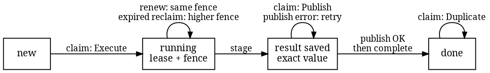

# Controller delivery

Provider deliveries are repeated, workers overlap, and a process can stop at any point around
publication. The controller therefore needs a small durable record that answers two questions:
who may evaluate this delivery now, and which exact result must a retry publish?

In code, [`DeliveryLedger`](https://github.com/HardMax71/amiss/blob/main/controller/src/orchestration/ledger.rs)
is the coordination interface for that record. It is a behavior contract rather than a required
storage format. [`FileLedger`](https://github.com/HardMax71/amiss/blob/main/controller/src/file_ledger.rs)
is its first durable implementation; it uses ordinary files, not SQL or a database. This record is
separate from [the scan ledger](ledger.md), which records project research, and from the
repository-owned review memory rejected in [Provenance](provenance.md). The scanner itself remains
offline and stateless.

## Before the record

The contract takes each route from controller-owned configuration, never from the request body.
It fixes the provider instance, the accepted trust-anchor set, and its signed-time rule. Before an
adapter sees a delivery, [`IngressPolicy`](https://github.com/HardMax71/amiss/blob/main/controller/src/ingress/policy.rs)
caps the exact body, header count, and total header bytes and checks the controller-recorded
receipt time against a short queue window. Only an `IngressCheck` that passed those checks can
enter `ProviderAdapter::authenticate`.

Each verifier consumes the `IngressCheck` itself. Authentication returns the provider facts and a
small proof: which configured anchor matched, which trust set it belonged to, an optional signed
issue time, and the replay identity. That proof also binds the controller-selected route, receipt
time, exact header sequence, and exact body. Its fields are private; an adapter can join decoded
provider facts to a successful proof, but cannot relabel its trust set, remove its signed time, or
move it to another request. The controller checks that binding, applies the route's signed-time
rule, chooses the replay lifetime, and creates the delivery key. None of those steps trusts a
decoded body field before the signature succeeds.

The replay key depends on what the provider actually signs:

| Provider input | What is authenticated | Replay key | Time rule |
| --- | --- | --- | --- |
| GitHub `X-Hub-Signature-256` | HMAC-SHA256 over the exact body | Domain-separated digest of the exact body | Replay-only; there is no signed delivery-attempt timestamp header. |
| Gitea-family `X-Gitea-Signature` or `X-Forgejo-Signature` | HMAC-SHA256 over the exact body | Domain-separated digest of the exact body | Replay-only; there is no signed delivery-attempt timestamp header. |
| GitLab Standard Webhooks | HMAC-SHA256 over `webhook-id.webhook-timestamp.body` | Signed `webhook-id` | `SignedTimePolicy::Required(max_age)`; replay-only is not a valid GitLab route. |
| GitLab policy-job OIDC | RS256 token with exact issuer, audience, policy origin, project, job, pipeline, runner, train commit, issue time, and `jti` | Domain-separated runner ID and `jti` digest | Required signed age plus token `nbf` and `exp`; replay-only is invalid. |

This follows the providers' published contracts: [GitHub signs the payload body](https://docs.github.com/en/webhooks/using-webhooks/validating-webhook-deliveries),
[Gitea signs the raw body](https://docs.gitea.com/usage/repository/webhooks), and
[GitLab's signing token follows Standard Webhooks](https://docs.gitlab.com/user/project/integrations/webhooks/).
The matching library code is split into the
[GitHub](https://github.com/HardMax71/amiss/blob/main/controller/src/webhook/github.rs),
[Gitea-family](https://github.com/HardMax71/amiss/blob/main/controller/src/webhook/gitea.rs), and
[GitLab](https://github.com/HardMax71/amiss/blob/main/controller/src/webhook/gitlab.rs) verifiers.
GitLab's legacy plaintext `X-Gitlab-Token` is deliberately unsupported. `GitLabWebhook`
authenticates the timestamp but does not choose the route policy. Ingress rejects that proof under
a replay-only route, so the signed timestamp cannot be silently discarded. A GitHub or Gitea
delivery header is useful for logs, but using it as the
durable key would let a captured signed body bypass replay protection by changing an unsigned
header.

The supported GitLab lane instead uses GitLab's
[OIDC ID-token contract](https://docs.gitlab.com/ci/secrets/id_token_authentication/) through the
[`GitLabOidc`](https://github.com/HardMax71/amiss/blob/main/controller/gitlab/src/oidc.rs)
verifier. It pins reviewed RSA keys and binds the small merge-request hint only after the token
claims authenticate it. The Standard Webhook verifier remains available as an independent
library surface, not as this lane's request path.

`WebhookKeyring` holds one through eight HMAC keys in zeroizing, redacted memory. Anchor IDs and
secret bytes must be unique. The ring owns the trust-set ID carried into its proof, so an adapter
does not relabel a successful match by hand. Each key has an inclusive start and exclusive end
time selected against controller-owned receipt time. Overlapping windows permit rotation;
removing an anchor revokes it. GitLab `whsec_` tokens have a strict, secret-safe constructor.
Exact-body replay IDs do not include the matching anchor, so rotating a key cannot turn the same
signed delivery into new work.

The controller also fixes one `ReplayWindow`: the largest signed age any route may accept and the
largest ingress queue age. A route may require a shorter signed age but cannot exceed that fixed
ceiling. An authenticated message ID and signed issue time receive an inclusive replay end computed
from the issue time plus both fixed ceilings. Exact-body and other replay-only requests are marked
permanent because they carry no authenticated time from which safe deletion can be derived. This
choice reaches the ledger as part of `AcceptedDelivery` rather than being derived from payload
fields, and the file record rejects a bounded delivery from a different replay window.

These verifiers establish webhook origin and integrity, not current authorization or an exact
repository snapshot. The GitHub and Gitea-family lanes add signed pull-request decoding,
controller-owned refresh, merge-rule checks, acquisition, and provider publication. The GitLab
lane uses a separately verified OIDC token from its protected policy job instead of the Standard
Webhook verifier. Its authenticated claims enter the same delivery and replay contract.
Deployment and provider-specific trust rules live in
[Provider-verified controls](provider-controls.md).

## The full flow

The controller owns the provider route. The selected adapter authenticates the untouched headers
and body before any body field is trusted. Only the resulting authenticated delivery reaches the
durable record.

```dot process
digraph controller_delivery {
  rankdir = LR;
  node [shape = box, fontname = "Latin Modern, Georgia, serif", fontsize = 11];
  edge [arrowsize = 0.7, fontname = "Latin Modern, Georgia, serif", fontsize = 10];
  raw      [label = "raw delivery"];
  gate     [label = "bounds + receipt time"];
  auth     [label = "authenticate\n+ replay identity"];
  claim    [label = "claim"];
  first    [label = "first refresh\n+ renew"];
  run      [label = "run if active\n+ heartbeat\n+ renew"];
  second   [label = "final refresh\n+ renew"];
  stage    [label = "save exact result"];
  publish  [label = "publish"];
  complete [label = "mark done"];
  raw -> gate -> auth -> claim -> first -> run -> second -> stage -> publish -> complete;
  claim -> publish [label = "saved retry\ncheck binding"];
}
```



The first refresh resolves the event-bound provider run, not the change's latest head. It supplies
the exact repository, URL dialect, refs, commits, and trees given to the runner, plus the
provider-owned commit on which the required result is enforced. The second refresh checks the
same identity, gate commit, and current authorization before the result is saved. If the change
was closed, revoked, or superseded, the controller may publish that fail-closed status; it never
publishes an old pass or block as if it were still current. A provider adapter may complete a
stale publication without an external write only after independently proving that its staged
provider gate is no longer current.

## The logical record

This is the logical schema required by the contract. It is not a file format, wire schema, or
prescription for how bytes are stored.

| Part | Logical value | Rule |
| --- | --- | --- |
| Delivery key | Provider namespace, provider instance, integration ID, delivery ID | Names one authenticated provider delivery. |
| Fixed binding | Repository, change, provider run ID and attempt, object format, event candidate commit | Reusing the key with a different binding fails before refresh, run, or publication. |
| Replay lifetime | Permanent, or an inclusive replay end based on authenticated time | Decided by trusted ingress and stored with the fixed binding. Only an ended bounded lifetime can permit deletion. |
| Evaluation ID | Opaque controller-created ID with fresh random bytes | Created on the first claim and kept through retries and reclaims. A later row cannot reuse it. |
| Temporary ownership | Evaluation ID, lease deadline, fence | Grants permission to evaluate; the record, not a worker's clock, decides whether it is still live. |
| Saved result | Evaluation ID, check-plan binding, fence, provider run, full run identity, provider gate commit, conclusion, optional report | Frozen as one exact value before provider I/O. |
| State | New, running, result saved, done | Each change happens atomically: fully or not at all. |

Here, “delivery ID” means the replay identity accepted by ingress. It is the signed message ID for
a GitLab Standard Webhook, a domain-separated runner-and-`jti` identity for the supported GitLab
OIDC job, or the controller's digest of the exact signed body for GitHub and Gitea-family
requests. It is never an unsigned convenience header.

### The file record

`FileLedger` maps the authenticated delivery identity to a fixed lowercase digest. Provider text
never becomes a path. One controller-owned root contains fixed metadata and locks plus bounded row
files:

```text
.amiss-root.state
.amiss-maintenance.lock
.amiss-admission.lock
.amiss-clock.lock
.amiss-row-00.lock ... .amiss-row-ff.lock  (created only when used)
<delivery-key>.state
<delivery-key>.report                     (only while a result needs it)
```

The maintenance lock is shared by ordinary row work and exclusive during cleanup. The admission
lock serializes the count-and-create step for a new identity, and the clock lock serializes durable
high-water updates. The first byte of the delivery digest selects one of 256 stable row-lock files;
a shard collision may serialize unrelated rows but cannot let two processes win one transition.
These fixed names avoid one permanent lock file per delivery.

Root metadata is itself a versioned, checksummed frame. It fixes the lease duration, maximum record
count, and signed-age and queue ceilings for every process using that root, and stores the highest
trusted controller time the ledger has seen. Opening the same root with a different lease, record
cap, or replay window fails. New identities are counted and admitted atomically; once the cap is
full they fail before a state file is created, while an existing row can still renew, save, publish,
and complete.
Operators must size the cap to include permanent replay markers.

The state file is a versioned, length-delimited, checksummed frame containing canonical JSON and is
capped at 128 KiB. The reader accepts only its current row schema. The older v2 schema contains no
check-plan binding, so it is rejected instead of attaching a caller-supplied policy to old work; a
future schema change needs an explicit migration that preserves every stored authorization field.
A report is kept separately at one fixed path, bounded by the machine-report byte ceiling, while
its digest and length remain in the saved state. Saving removes any dead report, writes and syncs
the new report, then atomically replaces the state that names it. Completion first saves `done`,
then removes the report. A stop between those steps can leave an unreferenced report, but cannot
expose a saved state whose report was never written. Retrying completion and cleanup both remove
that dead file.

The implementation uses Rust's standard `File::lock` and the `atomicwrites` crate, leaving the
operating-system calls behind those maintained boundaries. Replacement first syncs the new file.
On Unix the crate replaces the destination and syncs its parent directory; on Windows it uses
`MoveFileExW` with replace-existing and write-through flags. `FileLedger` therefore has one
cross-platform contract on supported local filesystems: the current path contains either the old
complete bytes or the new complete bytes. A stopped write may leave a temporary file, but cannot
make partial bytes current.

The root must already exist as a real, private local directory outside the repository and action
tree. `FileLedger` rejects a missing root or a root symlink. The service operator must own the
directory and set its permissions or access-control list. Anyone who can read or change that
directory is inside the controller trust boundary. The checksums detect damage, not a malicious
writer. Shared and network filesystems are not supported.

Malformed, oversized, non-regular, unknown-field, non-canonical, or digest-mismatched saved data
fails closed, as does a missing report named by a saved state. Opening a root runs cleanup, and the
same operation is public for later maintenance. Under the exclusive maintenance lock it advances
and saves the high-water clock, validates the complete root, then removes unreferenced reports,
recognized atomic-write leftovers, and bounded `done` rows strictly after their inclusive
replay end. It never removes running or saved work, even after that time, and never
ages out a permanent `done` row. Unknown root entries and unsafe temporary-directory shapes fail
closed instead of being deleted.

| Saved state | Cleanup rule |
| --- | --- |
| `running` | Keep it, even after a bounded replay end, because a worker may still own or reclaim it. |
| `staged` (result saved) | Keep the state and its valid report until publication can finish. |
| `done`, permanent | Keep the small state marker; it is the replay defense. |
| `done`, bounded | Keep it through the inclusive replay end, then remove it. |

Persisting the high-water clock before deletion means a local clock rollback cannot make an ended
delivery look fresh. A claim for a bounded delivery whose row is gone but lifetime has ended returns
`Expired`. Completion after deletion returns `Lost`, because the exact saved digest is gone; only a
retained exact `done` marker can return repeat-safe `Completed`. A new record receives a fresh
random evaluation suffix, so deletion cannot make a stale publication retry match a later row.
Together, the record cap, fixed lock set, per-file ceilings, and one report path per row bound the
named durable state. Known crash leftovers are removed on the next open or cleanup. Permanent
replay rows deliberately consume capacity until an operator changes trust policy outside this
record; cleanup must not guess an age for signatures that contain no trusted time.

The public Rust boundary has four operations. This abridged excerpt omits documentation and type
bounds; the [ledger module](https://github.com/HardMax71/amiss/blob/main/controller/src/orchestration/ledger.rs)
is authoritative.

```rust
pub trait DeliveryLedger {
    type Error;

    fn claim(&mut self, delivery: &AcceptedDelivery)
        -> Result<DeliveryClaim, Self::Error>;
    fn renew(&mut self, delivery: &AcceptedDelivery, lease: &DeliveryLease)
        -> Result<LeaseRenewal, Self::Error>;
    fn stage(
        &mut self,
        delivery: &AcceptedDelivery,
        lease: &DeliveryLease,
        publication: &Publication,
    ) -> Result<StageOutcome, Self::Error>;
    fn complete(&mut self, delivery: &AcceptedDelivery, staged: &StagedPublication)
        -> Result<LeaseCompletion, Self::Error>;
}
```

`claim` is the one entry point for new work and retries:

| Result | Plain meaning | Controller action |
| --- | --- | --- |
| `Execute` | This caller has a live lease. | Refresh and evaluate. |
| `Publish` | An exact result was already saved. | Check its binding, then publish it without refreshing or running again. |
| `Busy` | Another live claim currently owns the work. | Return the evaluation ID and retry time; do no provider or runner work. |
| `Duplicate` | The saved result was published and marked done. | Do nothing. |
| `BindingConflict` | The same delivery key was reused for different authenticated work. | Reject it before any provider refresh, run, or publication. |

`FileLedger` can also reject a new identity with `Full`, reject an already ended bounded delivery
with `Expired`, or reject a root whose saved lease duration, cap, or replay window differs from the
configured one.
These are fail-closed admission results, not reasons to evict live, saved, or permanent replay
rows.

## Four states

The record has four logical states. A lease is temporary permission to run. Its fence is an
always-increasing generation number: reclaiming expired work keeps the first evaluation ID but
uses a higher fence.



A claim against live work may return `Busy` without changing state. A different authenticated
binding returns `BindingConflict`. A stale renewal or stage returns `Lost`; the controller does
not turn uncertainty into ownership.

The stored deadline is a scheduling hint, not proof. Renewal must preserve the evaluation ID and
fence and must not move that deadline backward. After each renewal, the controller subtracts its
own current time and returns only the positive time left. The concrete runner renews before launch
and halfway through each returned window, capped at five seconds between checks. A zero window or
a lost, malformed, or uncheckable renewal returns `Stop`; the runner then cancels its ProcessKit
tree and discards the output. The heartbeat boundary is cooperative, while this runner turns its
refusal into process cancellation.

Provider refresh calls have no heartbeat. A concrete adapter must therefore give each refresh a
timeout comfortably shorter than the lease window. The controller also renews after the runner
returns; the final atomic stage remains the decisive stale-owner check.

## Races and retries

Suppose one worker holds fence 7 and another tries to reclaim the expired work:

- If reclaim wins, the record moves to fence 8. The first worker can no longer renew or save a
  result, so it makes no publication call.
- If saving wins, the exact result is frozen under fence 7. Reclaim no longer grants an execution
  lease; every claim receives `Publish` until that value is marked done.

Saving happens before external provider I/O because the record and provider cannot share one
transaction. Publication may therefore be attempted more than once after an error or ambiguous
acknowledgement. The adapter must make publishing the same result again have the same effect,
using the authenticated delivery and evaluation ID as its repeat-safe key. A different result
under that key must fail closed.

That is the controller contract. GitHub's create-Check-Run API does not offer an atomic
transaction or caller idempotency key: an accepted create with a lost reply can be retried before
the first run is visible and leave a duplicate. The concrete adapter reconciles one exact visible
run and rejects visible duplicates. [Provider-verified controls](provider-controls.md) records
that provider limit.

| Stop point | What the next claim sees | Safe next action |
| --- | --- | --- |
| During a live run | `Busy`, or `Execute` after expiry | Wait, or evaluate again with the same evaluation ID and a higher fence. |
| After saving, before publication | `Publish` | Publish the exact saved value. |
| Provider accepted, but its reply was lost | `Publish` | Repeat the same provider update. |
| After publication, while completion is unclear | `Publish` or `Duplicate` | Repeat the same update if needed, then complete the exact saved value. |
| After completion | `Duplicate` | Do nothing. |

`complete` accepts only the exact saved value and is repeatable for that value while its done marker
exists. A completion error after the provider accepted an update is kept distinct from an error
before publication. On retry, the record must expose either the saved value or the done state,
never a new execution lease. Once cleanup safely removes an ended bounded marker, later completion
is honestly `Lost` rather than guessed from missing evidence.

## Failure behavior

| Condition | Required behavior |
| --- | --- |
| Raw ceilings, receipt time, signature, anchor window, route, trust set, or required signed request time fails | Reject the delivery before claiming it. |
| The key has a different authenticated binding | Reject it before provider or runner work. |
| A saved result does not match the authenticated delivery | Reject it before provider I/O. |
| Another claim is live | Report in progress and do no work. |
| Lease renewal cannot prove ownership | Stop, discard runner output, and do not publish it. |
| A valid refresh for the same delivery reports closure or revocation | Save and publish the matching unavailable result, never the old pass or block. |
| A valid refresh for the same delivery reports supersession or changes its URL dialect, refs, base commit, trees, or provider gate commit | Save `Superseded` and invoke publication, which may prove the staged gate stale and write nothing; never publish the old pass or block. |
| A refresh returns another repository, change, object format, or event candidate | Reject it without saving or publishing a result. |
| Runner output is missing, timed out, too large, tampered with, or bound to the wrong identity or tree | Save and publish the matching unavailable result without a report. |
| Atomic stage loses the fence race | Make no publication call. |
| Publication fails or its acknowledgement is unclear | Keep the exact saved result for another publication attempt. |
| Completion cannot be confirmed | Report a completion error; retry only the exact saved result. |

The trusted runner promises that a completed engine result already passed its engine, exit-class,
and request checks. The controller independently checks the returned identity, nonempty output,
and size. It does not authenticate the engine report itself.

## Supervised bootstrap run

`run_bootstrap` implements the provider-neutral execution step once exact repository and action
trees have been acquired. It first reopens both repositories and verifies the requested commits
and trees. It derives the sealed bootstrap job from the `RunRequest` and trusted instants rather
than accepting a separately assembled job, so a caller cannot pair one run with another run's
control files. It also reads the selected bootstrap under a fixed byte ceiling and matches its
digest to the frozen execution plan before copying it into a fresh private scratch directory.

The directory holds only the copied bootstrap, canonical request files, report, and final result
record. The controller creates both output files and retains their open handles. The bootstrap may
write through the fixed path names, but the controller never reopens those names; replacing a name
therefore cannot replace the object that will be read. The child starts with a cleared environment
and closed stdin, stdout, and stderr. The report is bounded by `MACHINE_JSON_BYTES`; the small
result record is written last, so a missing record cannot be confused with a completed report.
Exit status and that record are checked together. Missing output, oversized reports, timeout, and
runtime tampering retain distinct fail-closed outcomes. Signals, heartbeat loss, and spawn failure
all fail closed as `Unavailable`.

Supervision uses pinned ProcessKit 2.2.5 with Tokio through one cross-platform path. ProcessKit
selects the host's process-tree boundary. The controller enforces a positive wall limit no greater
than 120 seconds and renews the ledger before launch and halfway through each newly proven lease
window, capped at five seconds between checks. After every terminal path it hard-kills the group
and waits up to two seconds for ProcessKit to report it empty before reading either output. Failure
to prove that drain is unavailable, not completion. This also covers a clean leader exit, so a
surviving descendant cannot escape merely by letting its parent finish. A heartbeat refusal
cancels the same tree and discards its output. These bounds cover ordinary supervised execution;
they do not promise recovery from a host kernel call that itself never returns.

Focused tests cover wrong commits and trees, a wrong bootstrap digest, the cleared child
environment, timeout and heartbeat races, descendants that remain alive after their leader exits,
path replacement, and missing, malformed, and oversized output. Every provider service calls this
runner only after its adapter has refreshed provider state and acquired the exact roots.

## What exists now

The nested workspace contains the provider-neutral identities, bounded ingress gate, rotating
key ring, signature verifiers, durable raw inbox, `DeliveryLedger`, `FileLedger`, worker,
orchestrator, acquisition boundary, and supervised bootstrap runner. Focused tests cover ingress
limits and tampering, replay, rotation and revocation, file corruption, cross-process ownership,
reclaim, exact publication retry, full roots, clock rollback, runner timeout, process descendants,
and output replacement.

Three merge-gate shapes join those pieces. GitHub uses a signed pull-request event, App refresh,
strict App-bound ruleset, authoritative test merge, and App-owned Check Run. GitLab uses policy
job OIDC, an enforced merge train, independently owned pipeline execution policy, and the policy
job's own result. Gitea and Forgejo use a signed pull-request event, effective protected-branch
rule, dedicated reviewer identity, and that account's approval or request for changes. All three
acquire exact SHA-1 repository and action objects through the same fixed-budget protocol-v2 path,
run the bootstrap, and refresh the provider gate again.

[Provider-verified controls](provider-controls.md) compares the lanes and links each deployment
reference. The GitLab Standard Webhook verifier remains an independent library surface; the
supported GitLab lane authenticates OIDC instead. The engine's `forge` field still chooses only a
URL dialect and never authenticates a provider.
