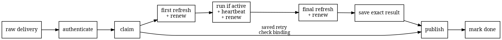
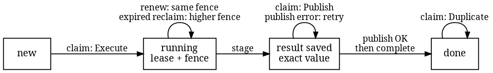

# Controller delivery

Provider deliveries are repeated, workers overlap, and a process can stop at any point around
publication. The controller therefore needs a small durable record that answers two questions:
who may evaluate this delivery now, and which exact result must a retry publish?

In code, `DeliveryLedger` is the coordination interface for that record. It is a behavior
contract, not a storage format. Amiss ships no durable implementation, SQL, or database. A future
implementation must provide the operations on this page through a non-database mechanism. This
record is also separate from [the scan ledger](ledger.md), which records project research, and
from the repository-owned review memory rejected in [Provenance](provenance.md). The scanner
itself remains offline and stateless.

## The full flow

The controller owns the provider route. The selected adapter authenticates the untouched headers
and body before any body field is trusted. Only the resulting authenticated delivery reaches the
durable record.



The first refresh resolves the event-bound provider run, not the change's latest head. It supplies
the exact repository, URL dialect, refs, commits, and trees given to the runner. The second refresh
checks the same identity and current authorization before the result is saved. If the change was
closed, revoked, or superseded, the controller may publish that fail-closed status; it never
publishes an old pass or block as if it were still current.

## The logical record

This is the logical schema required by the contract. It is not a file format, wire schema, or
prescription for how bytes are stored.

| Part | Logical value | Rule |
| --- | --- | --- |
| Delivery key | Provider namespace, provider instance, integration ID, delivery ID | Names one authenticated provider delivery. |
| Fixed binding | Repository, change, provider run ID and attempt, object format, event candidate commit | Reusing the key with a different binding fails before refresh, run, or publication. |
| Evaluation ID | Opaque controller-created ID | Created on the first claim and kept through retries and reclaims. |
| Temporary ownership | Evaluation ID, lease deadline, fence | Grants permission to evaluate; the record, not a worker's clock, decides whether it is still live. |
| Saved result | Evaluation ID, fence, provider run, full run identity, conclusion, optional report | Frozen as one exact value before provider I/O. |
| State | New, running, result saved, done | Each change happens atomically: fully or not at all. |

The public Rust boundary has four operations. This abridged excerpt omits documentation and type
bounds; the [source contract](https://github.com/HardMax71/amiss/blob/main/controller/src/orchestration.rs)
is authoritative.

```rust
pub trait DeliveryLedger {
    type Error;

    fn claim(&mut self, delivery: &AuthenticatedDelivery)
        -> Result<DeliveryClaim, Self::Error>;
    fn renew(&mut self, delivery: &AuthenticatedDelivery, lease: &DeliveryLease)
        -> Result<LeaseRenewal, Self::Error>;
    fn stage(
        &mut self,
        delivery: &AuthenticatedDelivery,
        lease: &DeliveryLease,
        publication: &Publication,
    ) -> Result<StageOutcome, Self::Error>;
    fn complete(&mut self, delivery: &AuthenticatedDelivery, staged: &StagedPublication)
        -> Result<LeaseCompletion, Self::Error>;
}
```

`claim` is the one entry point for new work and retries:

| Result | Plain meaning | Controller action |
| --- | --- | --- |
| `Execute` | This caller has a live lease. | Refresh and evaluate. |
| `Publish` | An exact result was already saved. | Check its binding, then publish it without refreshing or running again. |
| `Busy` | Another live claim currently owns the work. | Return the evaluation ID and retry time; do no provider or runner work. |
| `Duplicate` | The saved result was published and marked done. | Do nothing. |
| `BindingConflict` | The same delivery key was reused for different authenticated work. | Reject it before any provider refresh, run, or publication. |

## Four states

The record has four logical states. A lease is temporary permission to run. Its fence is an
always-increasing generation number: reclaiming expired work keeps the first evaluation ID but
uses a higher fence.



A claim against live work may return `Busy` without changing state. A different authenticated
binding returns `BindingConflict`. A stale renewal or stage returns `Lost`; the controller does
not turn uncertainty into ownership.

The deadline is a scheduling hint, not proof. Long runner work receives a heartbeat and must renew
before it may cross the current deadline. Renewal must preserve the evaluation ID and fence and
must not move the deadline backward. If renewal is lost, malformed, or cannot be checked, the
heartbeat returns `Stop`, the exact error is retained, and the runner's output is discarded. This
is cooperative stopping, not preemptive cancellation.

Provider refresh calls have no heartbeat. A concrete adapter must therefore give each refresh a
timeout comfortably shorter than the lease window. The controller also renews after the runner
returns; the final atomic stage remains the decisive stale-owner check.

## Races and retries

Suppose one worker holds fence 7 and another tries to reclaim the expired work:

- If reclaim wins, the record moves to fence 8. The first worker can no longer renew or save a
  result, so it makes no publication call.
- If saving wins, the exact result is frozen under fence 7. Reclaim no longer grants an execution
  lease; every claim receives `Publish` until that value is marked done.

Saving happens before external provider I/O because the record and provider cannot share one
transaction. Publication may therefore be attempted more than once after an error or ambiguous
acknowledgement. The adapter must make publishing the same result again have the same effect,
using the authenticated delivery and evaluation ID as its repeat-safe key. A different result
under that key must fail closed.

| Stop point | What the next claim sees | Safe next action |
| --- | --- | --- |
| During a live run | `Busy`, or `Execute` after expiry | Wait, or evaluate again with the same evaluation ID and a higher fence. |
| After saving, before publication | `Publish` | Publish the exact saved value. |
| Provider accepted, but its reply was lost | `Publish` | Repeat the same provider update. |
| After publication, while completion is unclear | `Publish` or `Duplicate` | Repeat the same update if needed, then complete the exact saved value. |
| After completion | `Duplicate` | Do nothing. |

`complete` accepts only the exact saved value and is repeatable for that value. A completion error
after the provider accepted an update is kept distinct from an error before publication. On retry,
the record must expose either the saved value or the done state, never a new execution lease.

## Failure behavior

| Condition | Required behavior |
| --- | --- |
| Authentication fails or the provider route is wrong | Reject the delivery before claiming it. |
| The key has a different authenticated binding | Reject it before provider or runner work. |
| A saved result does not match the authenticated delivery | Reject it before provider I/O. |
| Another claim is live | Report in progress and do no work. |
| Lease renewal cannot prove ownership | Stop, discard runner output, and do not publish it. |
| A valid refresh for the same delivery reports closure or revocation | Save and publish the matching unavailable result, never the old pass or block. |
| A valid refresh for the same delivery reports supersession or changes its URL dialect, refs, base commit, or trees | Save and publish `Superseded`, never the old pass or block. |
| A refresh returns another repository, change, object format, or event candidate | Reject it without saving or publishing a result. |
| Runner output is missing, timed out, too large, tampered with, or bound to the wrong identity or tree | Save and publish the matching unavailable result without a report. |
| Atomic stage loses the fence race | Make no publication call. |
| Publication fails or its acknowledgement is unclear | Keep the exact saved result for another publication attempt. |
| Completion cannot be confirmed | Report a completion error; retry only the exact saved result. |

The trusted runner promises that a completed engine result already passed its engine, exit-class,
and request checks. The controller independently checks the returned identity, nonempty output,
and size. It does not parse or authenticate the engine report itself.

## What exists now

The provider-neutral identities, adapter registry, `ProviderAdapter`, `DeliveryLedger`, `Runner`,
orchestrator, and focused flow tests exist in the nested Rust workspace. The in-memory and scripted
records used by tests are test fakes, not production implementations: they do not establish
durability, reclaim, crash recovery, corruption handling, or retention.

There is no webhook or HTTP transport, provider adapter or signature verifier, provider SDK or
credential source, repository and action-tree acquisition worker, durable non-database record,
real bootstrap runner or hard cancellation, provider publisher, deployable service, or end-to-end
provider lane. GitHub, GitLab, Gitea-family providers, and their self-hosted instances are all
unsupported today. The engine's `forge` field chooses a URL dialect; it is not authenticated
provider support.

[Project status](status.md) records this boundary. [Roadmap](roadmap.md) lists the work needed to
turn the contract into a provider-verified lane, while [Security model](security.md) defines the
larger trust boundary.
