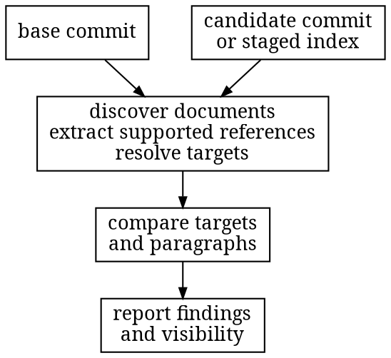

# Introduction

Documentation [drifts](drift.md): code moves and the prose that points at it doesn't. Tests
catch the code half. The prose half sails through review, since a paragraph that didn't
change draws no eye. Amiss is the gate for that half. It compares two exact states of a
repository, extracts the references its grammar supports from every document it discovers,
resolves each against the tree, and reports what broke, what changed under unchanged prose,
and what it could not check. It never reads meaning: it can't tell you whether a sentence
is true, and it doesn't try.

Just want to run it? [Quickstart](quickstart.md) goes from install to a green run on one
page.

Two closed sets draw the line. Which files count as documents is fixed by name: Markdown,
MDX, AsciiDoc and reStructuredText by extension, six bare basenames like README, and two
advisory files that carry no references; [Discovery](discovery.md) has the exact rows, and
repository policy can bind one of the five built-in adapters to any path it names. Which
references count is explicit link syntax only: bare path-like prose is never inferred, and a
destination the tree alone cannot answer (a site route, a code symbol, a live URL, another
repository) stays a visible boundary row instead of a guess; [Resolution](resolution.md) has
those rows.

## The four questions

A run takes a base and a candidate: two full commit IDs, or a commit and the staged index
when you pass `--index`. Amiss answers four questions about them, and nothing else:

1. Does every supported explicit reference still point at something in the candidate tree?
2. Did the selected content or file mode of a referenced target change between base and
   candidate?
3. Did the paragraph holding the reference change too, stay exactly the same, disappear, or
   become impossible to match up without guessing?
4. What did the scan actually see: which documents it read, skipped, could not parse, or
   found unreachable?

The fourth question matters as much as the first three. A checker that silently skips what
it can't handle is worse than no checker, since its green claims more than it checked. So
everything Amiss cannot read or follow becomes a visible row in the report, and a document
it cannot decode at all is named there as unsupported instead of dropping out of it.

## What a run never does

The scanner keeps no state. No baseline file, no cache, no database, nothing committed to
your repository. Repository policy can expand discovery and raise three finding kinds; it
can never lower a disposition or hide a finding. [Provenance](provenance.md) tells how the
project arrived at that stance, and [Controls and policy](controls.md) draws the exact
boundary.

Each promise below is pinned by tests:

- A check never writes. The
  [no-write suite](https://github.com/HardMax71/amiss/blob/main/crates/amiss/tests/suite/no_write.rs)
  snapshots every byte under the repository root, `.git` included, runs five check
  invocations over it, and proves the snapshot unchanged; on Unix it also scans a fully
  read-only repository. The two verbs that do write, `amiss fix` and `amiss adopt`, touch
  exactly the paths their output names and nothing else.
- It never runs repository code and never calls the `git` command. It reads
  [Git](https://git-scm.com)'s objects, packs, and index directly through the
  [repository reader](https://github.com/HardMax71/amiss/blob/main/crates/amiss-git/src/repo.rs).
- It never follows symlinks while reading. Every file opens relative to a held directory
  handle with following disabled, and a link at the repository root, at `.git`, or
  anywhere along an object's path is refused. The refusal is never confused with a missing
  file.
- It never touches the network. The dependency gate bans the socket stack from the
  engine's graph, so a missing object is a typed refusal, not a fetch.
- The same repository, commits, and engine binary give the same report bytes, run after
  run, even across a repacked object store.
- Resource ceilings have names and published values, all listed in
  [Limits and refusals](limits.md). A measured crossing produces a typed error naming the
  limit and the observed lower bound. Parser CPU spent before node accounting is a
  disclosed limitation in [Security model](security.md), not covered by a stronger
  "nothing can hang" promise.

The rest of this book walks those promises in the order a run does: what counts as input,
what gets scanned, how references resolve, what the report says, and where the boundaries
sit.

## Licensing

Amiss source code and documentation ship under the
[Functional Source License 1.1, ALv2 Future License](https://github.com/HardMax71/amiss/blob/main/LICENSE.md).
The repository's [third-party notices](https://github.com/HardMax71/amiss/blob/main/THIRD_PARTY_NOTICES.md)
attribute the parser evidence, documentation assets, and fonts. Released Action trees carry
the project license and a plain-text license bundle built from the locked dependency graph.
The Latin Modern webfonts this book serves are covered by the
[GUST Font License](fonts/GUST-FONT-LICENSE.txt), and the notices mdBook embeds in generated
JavaScript and SVG assets stay in the published site.
