# Provider-verified controls

Provider lanes run Amiss behind an identity and merge rule owned outside the repository being
checked. They authenticate a provider-created request, refresh the exact change and merge gate,
acquire the named Git objects, run the sealed bootstrap, refresh again, and leave evidence in the
provider's protected merge path.

This is separate from the GitHub convenience Action and from calling `amiss check` in an ordinary
job. Those paths are useful scanners, but repository-controlled input does not become provider
authority merely because a CI system supplied it.

## Supported lanes

| Provider family | Required provider gate | Amiss evidence | Supported deployment |
| --- | --- | --- | --- |
| GitHub | Strict required check bound to one GitHub App | App-owned Check Run on the test-merge commit | GitHub.com and compatible GHES |
| GitLab | Enforced merge train plus an independently owned pipeline execution policy job | The policy job succeeds only after the exact train result passes | GitLab 19.3 or newer, Ultimate |
| Gitea | One required approval restricted to a dedicated reviewer | That reviewer approves or requests changes on the checked pull request | Gitea 1.27 or newer |
| Forgejo | One required approval restricted to a dedicated reviewer | That reviewer approves or requests changes on the checked pull request | Forgejo 16 or newer |

All current lanes require SHA-1 repositories, Git protocol v2, a root-mounted HTTPS provider, and
an action repository on the same provider instance. They are source-built services, not hosted
Amiss products or release binaries. Building the provider workspace requires the pinned Rust
toolchain and a working C/C++ compiler for its AWS-LC cryptography backend. Compatible forks are
not implied by the table.

The provider-specific setup and configuration live on separate pages:

- [GitHub provider lane](provider-github.md)
- [GitLab provider lane](provider-gitlab.md)
- [Gitea and Forgejo provider lane](provider-gitea.md)

## Common flow

```dot process
digraph provider_controls {
  rankdir = LR;
  node [shape = box, fontname = "Latin Modern, Georgia, serif", fontsize = 11];
  edge [arrowsize = 0.7, fontname = "Latin Modern, Georgia, serif", fontsize = 10];
  source [label = "provider-created\nrequest"];
  auth   [label = "authenticate\noutside repo"];
  first  [label = "refresh exact\nchange + gate"];
  fetch  [label = "acquire exact\nrepo + action"];
  boot   [label = "sealed\nbootstrap"];
  final  [label = "refresh gate\nagain"];
  save   [label = "save exact\nresult"];
  proof  [label = "provider merge\nevidence"];
  source -> auth -> first -> fetch -> boot -> final -> save -> proof;
}
```

The provider adapter owns authentication, live-state refresh, and publication. The shared
controller owns plan selection, replay, leases, the two-refresh race rule, exact acquisition, the
supervised process, and durable result staging. Adding a provider does not add a provider enum to
the engine or change the scanner report.

GitHub, Gitea, and Forgejo arrive as signed webhooks. A bounded receiver authenticates the exact
body and stores it before returning `202`; a worker authenticates the stored bytes again. GitLab
uses a short-lived OIDC token from the policy job and waits synchronously for the result, because
the job's own success is the protected evidence.

## Shared trust boundary

Run a provider service on a host controlled independently of the checked repository. Keep its API
credential, webhook secret or OIDC keys, bootstrap, execution constraint, optional controls,
scratch directory, and file-ledger root outside the repository and action trees. Webhook lanes
also have a separate raw-inbox root. All roots must be pre-created private local directories;
shared and network filesystems are unsupported.

The listener is plain HTTP. Bind it to loopback or a private network and put an
operator-controlled TLS terminator in front. The proxy must preserve signed headers and the exact
body, and must cap connections plus total, header, body, idle, and slow-body time. `/healthz`
reports only process liveness. A webhook service also takes one of its configured delivery
permits before reading a body and holds it through durable inbox admission. That bounds in-process
work. Both endpoint shapes stop an unfinished body after 30 seconds; neither limit replaces the
proxy's public connection limits.

Shared hard ceilings cap bodies at 8 MiB, header count at 128, aggregate header bytes at 32 KiB,
ledger rows at 100,000, and in-process endpoint concurrency at 64. Webhook inboxes add ceilings of
1,024 rows, 128 MiB total, and 16 MiB for one row. A provider service may clamp these lower; the
GitLab policy-job endpoint, for example, accepts at most a 1 KiB body and 32 headers.
GitHub and Gitea-family completion rows cannot age out because their signatures contain no trusted
time. Their provider pages describe the required secret-and-ledger cutover before that finite
record cap fills.

The service and the provider evidence cannot update in one transaction. A result is saved locally
before an external provider update or GitLab's synchronous success response. An ambiguous reply
may therefore require reconciliation, and each provider page states what can and cannot be
repeated safely. The file ledger uses bounded, checksummed ordinary files and atomic replacement;
it has no SQL or embedded database.

Provider administrators, repository administrators who can change the protected merge rule,
integration owners, policy-project owners, credential issuers, configured bypass actors, and
anyone who controls the service host or its trust files remain inside the lane's trust boundary.
A lane proves only what those authorities jointly enforce.

## What the report means

The engine report remains the same canonical evaluation envelope. It is not signed by the
provider or controller, its sandbox assurance remains `self-asserted`, and it has no
`provider_verified` field. A control with `status: "verified"` means that the engine checked the
control's digest and identity bindings; it does not identify the caller.

Provider origin lives in the provider gate: the GitHub App-owned Check Run, the GitLab policy
job, or the dedicated Gitea-family review, together with the matching protected-merge settings.
Copied report bytes alone are not an attestation.
