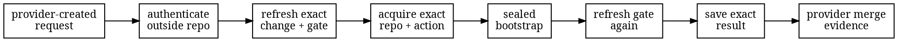

# Provider-verified controls

Provider lanes run Amiss behind an identity and merge rule owned outside the repository being
checked. They authenticate a provider-created request, refresh the exact change and merge gate,
acquire the named Git objects, run the sealed bootstrap, refresh again, and leave evidence in the
provider's protected merge path.

This is separate from the GitHub convenience Action and from calling `amiss check` in an ordinary
job. Those paths are useful scanners, but repository-controlled input does not become provider
authority merely because a CI system supplied it.

## Supported lanes

| Provider family | Required provider gate | Amiss evidence | Supported deployment |
| --- | --- | --- | --- |
| GitHub | Strict required check bound to one GitHub App | App-owned Check Run on the test-merge commit | GitHub.com and compatible GHES |
| GitLab | Enforced merge train plus an independently owned pipeline execution policy job | The policy job succeeds only after the exact train result passes | GitLab 19.3 or newer, Ultimate |
| Gitea | One required approval restricted to a dedicated reviewer | That reviewer approves or requests changes on the checked pull request | Gitea 1.27 or newer |
| Forgejo | One required approval restricted to a dedicated reviewer | That reviewer approves or requests changes on the checked pull request | Forgejo 16 or newer |

All current lanes require SHA-1 repositories, Git protocol v2, a root-mounted HTTPS provider, and
an action repository on the same provider instance. Compatible forks are not implied by the
table.

The provider-specific setup and configuration live on separate pages:

- [GitHub provider lane](provider-github.md)
- [GitLab provider lane](provider-gitlab.md)
- [Gitea and Forgejo provider lane](provider-gitea.md)

## Common flow

The provider adapter owns authentication, live-state refresh, and publication. The shared
controller owns plan selection, replay, leases, the two-refresh race rule, exact acquisition, the
supervised process, and durable result staging.


```dot process
digraph provider_controls {
  rankdir = LR;
  node [shape = box, fontname = "Latin Modern, Georgia, serif", fontsize = 11];
  edge [arrowsize = 0.7, fontname = "Latin Modern, Georgia, serif", fontsize = 10];
  source [label = "provider-created\nrequest"];
  auth   [label = "authenticate\noutside repo"];
  first  [label = "refresh exact\nchange + gate"];
  fetch  [label = "acquire exact\nrepo + action"];
  boot   [label = "sealed\nbootstrap"];
  final  [label = "refresh gate\nagain"];
  save   [label = "save exact\nresult"];
  proof  [label = "provider merge\nevidence"];
  source -> auth -> first -> fetch -> boot -> final -> save -> proof;
}
```

GitHub, Gitea, and Forgejo arrive as signed webhooks. A bounded receiver authenticates the exact
body and stores it before returning `202`; a worker authenticates the stored bytes again. GitLab
uses a short-lived OIDC token from the policy job and waits synchronously for the result, because
the job's own success is the protected evidence.

## One tree, small crates

Each lane is a pair of small crates in the nested workspace under
[`controller/`](https://github.com/HardMax71/amiss/tree/main/controller): an adapter that speaks
one provider's API and a service binary that deploys it. Provider differences end at those
crates. The shared controller stays provider-neutral, the engine gains no provider enum, and the
scanner report does not change shape because a forge was added.

The nested workspace is also a dependency boundary. HTTP clients, provider APIs, credentials,
TLS, and service storage live inside it, with its own lockfile and dependency policy, while the
engine workspace keeps its bans on networking and async runtimes. Auditing the scanner never
means auditing a webhook stack.

The lanes are deliberately unpublished: source-built services, not hosted Amiss products,
release binaries, or registry crates. One commit of this repository pins everything a lane
trusts at once: the engine, the wire contracts, the bootstrap whose digest the execution
constraint binds, and the service source. Built at that commit, there is no second repository or
registry whose version has to agree with the first. The contracts are pre-1.0 and still move
together, so a version seam between engine and service would sit exactly where skew is most
dangerous. It also keeps these pages honest: the lane documentation lives beside the lane code,
and the repository's own scan checks the references between them on every change.

Building the provider workspace requires the pinned Rust toolchain and a working C/C++ compiler
for its AWS-LC cryptography backend.

## Offline configuration check

Before starting a lane, run its service binary with `--check` and the same absolute config path
used at startup. The check uses the service's strict loader, so it reads and validates the config,
the named credentials and trust files, the bound plan, the execution constraint, the bootstrap,
the limits, and the path layout.

It then exits before entering the service runtime, binding the listener, opening mutable inbox or
ledger state, running the bootstrap, or contacting the provider. Success prints the service name
followed by `configuration valid`; failure prints the same configuration error that startup would
report.

This is a local preflight, not readiness or provider evidence. It cannot prove that the configured
address is available, that state roots are writable and healthy, that credentials have the
required provider permissions, or that the live merge rule matches the documented setup. Those
checks still require startup and retained runs against the provider.

## Service operation

Every provider service uses the same three private `GET` endpoints:

| Path | Contract |
| --- | --- |
| `/healthz` | Returns `200` while the HTTP process can answer. It is liveness only. |
| `/readyz` | Returns `200` only after local initialization, and `503` before readiness or during drain. |
| `/metrics` | Returns the fixed process-local OpenMetrics counters below. |

Initialization includes opening and validating the lane's local state, building its worker or
evaluation path, and binding the listener. Readiness becomes false before a requested drain and
as soon as supervision observes a worker or maintenance stop, before remaining work drains. A
provider `POST` returns `503` while readiness is false;
`/healthz` can therefore remain live while `/readyz` correctly removes the process from service.

`/metrics` has exactly ten label-free counters:

| Counter | Counts |
| --- | --- |
| `amiss_controller_provider_requests_total` | Configured provider `POST` requests answered. |
| `amiss_controller_provider_acceptances_total` | Provider requests accepted for durable or synchronous work. |
| `amiss_controller_provider_refusals_total` | Provider requests refused by authentication, bounds, request shape, or policy. |
| `amiss_controller_provider_unavailable_total` | Provider requests that returned an unavailable result. |
| `amiss_controller_delivery_attempts_total` | Durable deliveries attempted by a webhook worker. |
| `amiss_controller_delivery_completions_total` | Durable deliveries completed. |
| `amiss_controller_delivery_retries_total` | Durable deliveries left for retry. |
| `amiss_controller_delivery_discards_total` | Durable deliveries removed after failed reauthentication. |
| `amiss_controller_maintenance_runs_total` | Ledger maintenance scans completed. |
| `amiss_controller_maintenance_removals_total` | Durable records, reports, and temporary entries removed by maintenance. |

The set cannot grow from a repository, request, provider identity, or result. It has no labels,
and all values reset on restart. Counters that do not apply to a lane remain zero. The metrics
endpoint remains scrapeable during drain until the listener closes; it does not make the
listener safe to expose.

Runtime lifecycle events are one compact JSON object per stderr line. The schema is
`amiss/controller-event/v1`, and the only keys are `schema`, `level`, `event`, and `component`.
Normal transitions are `ready`, `draining`, and `stopped`, with level `info` and component
`service`. A required background component failure uses event `failed`, level `error`, and
component `worker` or `maintenance`. It appears before `draining` when the component initiates
shutdown and after `draining` when admitted work fails while finishing.

```json
{"schema":"amiss/controller-event/v1","level":"info","event":"draining","component":"service"}
```

These events deliberately carry no request body, header, credential, repository, path, object ID,
provider reply, or free-form error. This keeps lifecycle logging bounded and avoids echoing
secret-bearing input.

On a termination signal, the service marks itself unready before it stops accepting new work.
The HTTP server finishes requests already in flight. A webhook worker finishes its current
delivery and leaves the remaining durable inbox backlog for the next process. The synchronous
GitLab lane finishes admitted evaluations and any ledger maintenance already running. This
includes blocking work whose provider connection closed after admission. A second termination
signal aborts a stuck drain. Do not depend on a final metrics scrape after drain starts: the
listener may close before the other components finish.

Bind this listener only to loopback or a private operator network. If a TLS proxy accepts provider
traffic, publish only the configured provider `POST` path through it; keep `/healthz`, `/readyz`,
and `/metrics` private. None of the three operator endpoints is authenticated.

## Shared trust boundary

Run a provider service on a host controlled independently of the checked repository. Keep its API
credential, webhook secret or OIDC keys, bootstrap, execution constraint, optional controls,
scratch directory, and file-ledger root outside the repository and action trees. Webhook lanes
also have a separate raw-inbox root. All roots must be pre-created private local directories;
shared and network filesystems are unsupported.

Build the constraint from the exact local action and bootstrap bytes with
[Prepare the execution constraint](execution-constraint.md). The generator checks every
dependency lock and the selected platform's runtime closure but does not authenticate either
input; independent acquisition and protected placement remain operator responsibilities.

The listener is plain HTTP. Bind it to loopback or a private network and put an
operator-controlled TLS terminator in front. The proxy must preserve signed headers and the exact
body, and must cap connections plus total, header, body, idle, and slow-body time. `/healthz`
reports only process liveness; the full probe and drain contract is in
[Service operation](#service-operation). A webhook service also takes one of its configured delivery
permits before reading a body and holds it through durable inbox admission. That bounds in-process
work. Both endpoint shapes stop an unfinished body after 30 seconds; neither limit replaces the
proxy's public connection limits.

The hard ceilings are shared by every lane:

| Ceiling | Value |
| --- | --- |
| Request body | 8 MiB |
| Header count | 128 |
| Aggregate header bytes | 32 KiB |
| Ledger rows | 100,000 |
| In-process endpoint concurrency | 64 |
| Webhook inbox rows | 1,024 |
| Webhook inbox total | 128 MiB |
| One webhook inbox row | 16 MiB |

A provider service may clamp these lower; the GitLab policy-job endpoint, for example, accepts at
most a 1 KiB body and 32 headers. GitHub and Gitea-family completion rows cannot age out because
their signatures contain no trusted time. Their provider pages describe the required
secret-and-ledger cutover before that finite record cap fills.

The service and the provider evidence cannot update in one transaction. A result is saved locally
before an external provider update or GitLab's synchronous success response. An ambiguous reply
may therefore require reconciliation, and each provider page states what can and cannot be
repeated safely. The file ledger uses bounded, checksummed ordinary files and atomic replacement;
it has no SQL or embedded database.

Provider administrators, repository administrators who can change the protected merge rule,
integration owners, policy-project owners, credential issuers, configured bypass actors, and
anyone who controls the service host or its trust files remain inside the lane's trust boundary.
A lane proves only what those authorities jointly enforce.

## What the report means

The engine report remains the same canonical evaluation envelope. It is not signed by the
provider or controller, its sandbox assurance remains `self-asserted`, and it has no
`provider_verified` field. A control with `status: "verified"` means that the engine checked the
control's digest and identity bindings; it does not identify the caller.

Provider origin lives in the provider gate: the GitHub App-owned Check Run, the GitLab policy
job, or the dedicated Gitea-family review, together with the matching protected-merge settings.
Copied report bytes alone are not an attestation.
