# Gitea and Forgejo provider lane

The unpublished
[`amiss-controller-gitea-service`](https://github.com/HardMax71/amiss/tree/main/controller/gitea-service)
crate serves one repository, one dedicated reviewer account, and one protected target branch. The
same data-shaped adapter supports Gitea 1.27 or newer and Forgejo 16 or newer. It does not infer a
forge from HTTP headers: the operator sets the provider namespace, and live API capabilities
decide which supported protection shape is present.

This lane uses a review because Gitea-family status contexts are not bound to the identity that
wrote them. A protected branch can require an approval from one named account, so the service
owns that reviewer account and writes the final review itself.

## Flow

```dot process
digraph gitea_provider {
  rankdir = LR;
  node [shape = box, fontname = "Latin Modern, Georgia, serif", fontsize = 11];
  edge [arrowsize = 0.7, fontname = "Latin Modern, Georgia, serif", fontsize = 10];
  forge  [label = "signed pull-request\nevent"];
  tls    [label = "TLS terminator"];
  inbox  [label = "authenticate\n+ raw inbox"];
  first  [label = "refresh PR,\nreviewer + rule"];
  fetch  [label = "acquire exact\nrepo + action"];
  boot   [label = "sealed\nbootstrap"];
  final  [label = "refresh gate\nagain"];
  save   [label = "save exact\nresult"];
  review [label = "dedicated reviewer\napproval or rejection"];
  forge -> tls -> inbox -> first -> fetch -> boot -> final -> save -> review;
}
```



The receiver accepts only the configured `POST` path with no query string. It bounds headers and
body, takes a configured delivery permit before reading the body and holds it through durable
admission, requires exactly one supported family signature header, verifies lowercase
HMAC-SHA256 over the untouched body, binds the configured repository and target branch, and saves
the raw request before returning `202 Accepted`. The worker verifies the saved bytes again.

The source accepts `opened`, `reopened`, and `synchronized` pull-request actions. An `edited`
event is accepted only when its signed change record says that the base ref changed. The unsigned
delivery UUID is not trusted; replay identity is a domain-separated digest of the exact signed
body.

Using the dedicated reviewer's token, the adapter refreshes the token identity, repository, pull
request, target branch, effective protection rule, exact commits and trees, and existing reviews.
It requires the event head to remain current, the pull request to be open and mergeable, and the
head to be based on the current target. It then acquires exact SHA-1 objects, runs the sealed
bootstrap, refreshes everything again, saves the result, and posts or reuses one exact review.

| Controller result | Review |
| --- | --- |
| Pass | `APPROVED` |
| Block | `REQUEST_CHANGES` |
| Unavailable | `REQUEST_CHANGES` |
| Stale or closed before publication | No new review |

The review body binds the evaluation, conclusion, provider, repository, pull request, provider
run, refs, commits, trees, plan, execution constraint, and report digest. The
`required_status_name` from the execution constraint is a readable review label and retry binding;
the provider gate itself is the dedicated reviewer identity.

## Dedicated reviewer

Create a separate restricted account for this lane. Give it write access only to the checked
repository and read access to the pinned action repository when that is separate. The account
must be able to submit official pull-request reviews. Do not use a maintainer's personal account
or reuse one reviewer for another plan on the same protected branch.

Create a scoped access token with the smallest instance-specific permissions that cover:

- reading the current user;
- reading the repository, branch protection, pull request, commits, and reviews;
- cloning the checked and action repositories over HTTPS; and
- creating a pull-request review.

On current Forgejo this means `read:user` and `write:repository`; the account's repository access
should supply the remaining boundary. Follow the equivalent current Gitea token scopes and
[Forgejo's token-scope contract](https://forgejo.org/docs/latest/user/token-scope/). Store the
token as exact bytes in a private regular file. A trailing newline is part of the token and makes
the configuration invalid.

The reviewer token, account recovery path, and any session able to act as that account are trust
anchors. A human who can approve as the reviewer can satisfy the gate without Amiss.

## Protected branch

An exact protection rule for the configured target branch is easiest to audit and is recommended.
A wildcard rule is supported: the service reads the branch's effective rule name, fetches that
rule, and requires the two names to match. Keep overlapping wildcard priorities under the same
operator control. The service refuses the run unless all of these common facts are true:

- direct push is disabled;
- push allowlists are disabled and empty;
- no deploy key may push;
- unprotected file patterns are empty;
- exactly one approval is required;
- approvals are restricted to exactly the dedicated reviewer, with no team;
- rejected reviews block merging;
- stale approvals are dismissed and not ignored;
- an outdated pull request cannot merge;
- administrators must follow the rule.

The empty unprotected-file rule matters. Gitea documents that such patterns permit direct pushes
to selected files even when ordinary push is disabled. A missing, false, unknown, or contradictory
protection capability fails closed.

The setup names follow the providers'
[Gitea protected-branch](https://docs.gitea.com/usage/access-control/protected-branches) and
[Forgejo branch-protection](https://forgejo.org/docs/latest/user/protection/) pages. The live API
response, not the UI label, is what the adapter accepts.

The two supported API shapes close their remaining paths differently:

- Gitea must report force push and bypass disabled, every related allowlist empty, no deploy key
  able to force-push, `block_admin_merge_override: true`, and repository
  `allow_manual_merge: false`.
- Forgejo must report `apply_to_admins: true`. Forgejo 16's official repository response omits
  `allow_manual_merge` and the Gitea-only force-push and bypass fields, so the adapter requires
  those fields to be absent rather than inventing values for them.

The adapter accepts exactly one complete shape and rejects mixed or contradictory fields. This is
a capability check on live provider data, not a branch on a provider-name enum.

## Webhook

Create a repository webhook for pull-request events:

- method `POST`;
- content type `application/json`;
- a strong random secret;
- the configured service URL; and
- the native Gitea or Forgejo webhook type.

Gitea sends `X-Gitea-Signature`; Forgejo sends `X-Forgejo-Signature`. Both are lowercase
hexadecimal HMAC-SHA256 over the raw body. The service accepts exactly one of the two names and
rejects duplicates or a request carrying both. The TLS proxy must not decode, decompress, trim, or
rewrite the body.

See the native [Gitea](https://docs.gitea.com/usage/repository/webhooks) and
[Forgejo](https://forgejo.org/docs/latest/user/webhooks/) webhook contracts for provider-side
delivery setup.

Neither signature carries a trusted creation time. A completed exact-body replay marker is
therefore permanent. Removing it would reopen a signed request that remains valid.

## Build and run

Build the nested workspace from source:

```sh
cargo build --manifest-path controller/Cargo.toml --release --locked \
  -p amiss-controller-gitea-service --bin amiss-controller-gitea
```

Pre-create the private scratch, inbox, and ledger directories, then pass one absolute config path:

```sh
controller/target/release/amiss-controller-gitea /etc/amiss/gitea.json
```

Bind the plain HTTP listener to loopback or a private network and put the bounded TLS edge
described in [Provider-verified controls](provider-controls.md) in front.

## Configuration

Configuration is strict JSON. Unknown and duplicate fields are errors. All file and directory
paths are absolute, and the writable roots must be separate real directories outside the
repository and action trees.

```json
{
  "listen": "127.0.0.1:8080",
  "webhook_path": "/webhooks/gitea",
  "provider": {
    "namespace": "gitea",
    "instance": "forge.example",
    "api_base": "https://forge.example/api/v1",
    "reviewer": {
      "id": 77,
      "login": "amiss-controller",
      "token_file": "/etc/amiss/reviewer.token"
    },
    "webhook_keys": [
      {
        "id": "current",
        "secret_file": "/etc/amiss/webhook.secret",
        "active_from_unix_millis": 1784764800000,
        "active_until_unix_millis": null
      }
    ]
  },
  "repository": {
    "id": 101,
    "owner": "example",
    "name": "project",
    "target_branch": "main"
  },
  "plan": {
    "profile": "enforce",
    "execution_constraint_file": "/etc/amiss/execution-constraint.json",
    "organization_floor_file": "/etc/amiss/organization-floor.json",
    "debt_snapshot_file": null,
    "waiver_bundle_file": null
  },
  "paths": {
    "bootstrap": "/opt/amiss/amiss-bootstrap",
    "scratch": "/var/lib/amiss/scratch",
    "inbox": "/var/lib/amiss/inbox",
    "ledger": "/var/lib/amiss/ledger"
  }
}
```

Use namespace `forgejo` for Forgejo. Provider instance, repository owner, repository name, and
reviewer login are lowercase canonical values. `target_branch` is one branch name such as `main`,
not a full ref. Only root-mounted HTTPS instances are supported; ports, user information, query
strings, fragments, alternate API roots, and insecure TLS are rejected.

The optional `limits` object has two strict sections:

```json
{
  "limits": {
    "execution": {
      "api_request_millis": 20000,
      "git_request_seconds": 120,
      "bootstrap_seconds": 120
    },
    "queue": {
      "max_concurrent_deliveries": 16,
      "inbox_records": 64,
      "retry_max_millis": 60000
    }
  }
}
```

Omitted values use the defaults listed in the
[GitHub lane's limit table](provider-github.md#configuration). `execution` covers ingress,
ledger, provider HTTP, Git, and bootstrap bounds. `queue` covers webhook concurrency, the raw
inbox, retry, and polling. `max_concurrent_deliveries` must be between 1 and 64.
The shared 8 MiB body, 128-header, 32 KiB aggregate-header, 100,000-ledger-row,
1,024-inbox-row, 128 MiB inbox, 16 MiB inbox-row, and 64-concurrent-delivery ceilings apply here
too.

The action repository in the execution constraint must use the same provider host and SHA-1
object format. The reviewer's token must be able to read it. The service requires Git protocol v2
and uses the fixed pack limits described in the [GitHub lane](provider-github.md#configuration).

## State, replay, and rotation

The inbox and ledger use bounded checksummed files, not SQL or an embedded database. One process
owns an inbox. The worker removes raw bytes only after controller completion; the ledger retains
the exact result and permanent body-replay marker.

The hard 100,000-row ceiling gives one webhook-secret trust period a finite delivery lifetime.
Before it fills, stop the old route, replace the provider webhook secret, remove the old secret
from the service key ring, and start a new route with empty inbox and ledger roots. Never accept
the old secret against that empty ledger: a captured old delivery would authenticate without its
old replay marker. Keep the stopped ledger as an audit record, but it no longer needs to serve
replay checks once the old secret is permanently revoked. The cutover can miss an event, so leave
the reviewer requirement in place and trigger a fresh pull-request event after the new route is
live.

Review creation is not atomic with the ledger. Before creating a review, the adapter refreshes
the pull request and existing reviews. It reuses one exact current review and rejects a conflicting
review carrying the same evaluation marker. If the provider accepted a create but its reply was
lost, a later lookup normally finds the exact review; an ambiguous stale lookup can still create
a duplicate, after which conflicting state fails closed.

Gitea-family approval freshness is based on changed pull-request content. The service posts a
review on the exact candidate commit and checks the exact commit and tree before publication, but
the provider may continue to count an approval across a commit-only rewrite with the same diff.
The honest claim is therefore an exact-tree gate, not provider-enforced exact-commit freshness.

For ordinary webhook-secret rotation on the same ledger, overlap key windows, then remove the old
key on restart. For a plan, bootstrap, control, repository, or target change, use a new dedicated
reviewer account and a new empty inbox and ledger route. The visible review label alone cannot
separate two plans because branch protection binds the account, not the label. Preserve the old
ledger while its old webhook secret remains accepted; after permanent revocation, retain it only
for audit.
