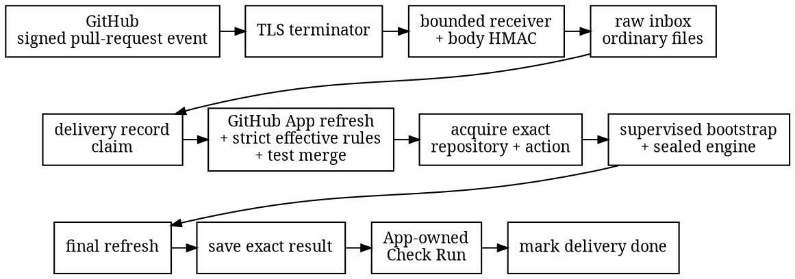

# GitHub provider lane

The unpublished
[`amiss-controller-github-service`](https://github.com/HardMax71/amiss/tree/main/controller/github-service)
crate serves one GitHub repository, one App installation, and one protected target branch. It
supports GitHub.com and compatible GitHub Enterprise Server (GHES) releases, and it is built from
source rather than distributed as a hosted service, container, or release binary.

This lane is separate from the published GitHub convenience Action. The Action is the simple
way to run Amiss inside a repository workflow. The service is the stronger path: its webhook
secret, App key, policy files, bootstrap, and state live outside the repository being checked.

## Flow

The receiver accepts only the configured `POST` path with no query string. It bounds headers
and body before admission, verifies GitHub's HMAC over the exact body, decodes only supported
pull-request events, checks the configured repository, target branch, and plan, then saves the raw
request before returning `202 Accepted`. The worker authenticates the saved bytes again before
use.



The supported pull-request actions are `opened`, `reopened`, and `synchronize`. An `edited`
event is accepted only when its signed `changes.base.ref.from` field records a base-branch
change. Other edits do not create work.

Using an App installation token, the adapter refreshes the exact repository, pull request,
base and candidate commits and trees, default branch, GitHub test merge, and effective rules for
the configured protected branch. The test merge must be ready and mergeable, with the exact base
and candidate parents and evaluated tree. The adapter acquires the repository and pinned action
revision into private directories. The provider-neutral controller then runs the sealed
bootstrap, refreshes GitHub again, saves the exact result, and publishes it on that authoritative
test-merge commit. A changed head or gate, closed pull request, removed authorization, timeout,
missing output, or tampered runtime cannot turn the new evaluation into a pass.

The raw inbox is not the replay authority. It removes a row after the controller finishes.
The separate [`FileLedger`](file-ledger.md) keeps the final delivery state and makes a repeated
publication use the same evaluation and result.

## GitHub App

Create a GitHub App owned by the account that controls the repository. Give it only these
repository permissions:

| Permission | Access | Why |
| --- | --- | --- |
| Metadata | Read | Read repository identity and effective rules. |
| Contents | Read | Fetch the exact repository and pinned action objects. |
| Pull requests | Read | Refresh the authenticated pull request. |
| Checks | Read and write | Read and create the App-owned Check Run. |
| Commit statuses | Read and write | Make the App available as the selected source when configuring the required status. |

Subscribe the App to the `pull_request` webhook event, set a strong webhook secret, and grant
the installation access to the configured repository. The pinned action repository must be on
the same provider instance. If it is another private repository, that installation must be able
to read it too. GHES operators must therefore mirror and pin the action on their GHES instance;
the lane will not cross from GHES to `github.com` for runtime code. The service does not need
repository Administration permission: it reads the effective rule and refuses when the expected
rule is absent.

Create an active branch ruleset for the configured target branch. Enable strict required checks,
so GitHub requires the pull request to be up to date with that branch. Add a required status check
whose name exactly matches `required_status_name` in the execution constraint, and select this
GitHub App as the expected source. GitHub documents why selecting an App matters:
[a required check from another person or integration must not satisfy that rule](https://docs.github.com/en/repositories/configuring-branches-and-merges-in-your-repository/managing-rulesets/available-rules-for-rulesets).
The service reads the
[effective rules for the branch](https://docs.github.com/en/rest/repos/rules), including
applicable organization rules. A missing rule, a non-strict rule, an “any source” rule, or a
conflicting rule revokes authorization for that run.

Classic branch protection is not supported by this lane. Configure a ruleset even if the
repository also has a classic protection rule.

## Build and run

Build the nested workspace without adding its network dependencies to the offline root
workspace:

```sh
cargo build --manifest-path controller/Cargo.toml --release --locked \
  -p amiss-controller-github-service --bin amiss-controller-github
```

Pre-create the private state and scratch directories, then pass exactly one absolute config
path:

```sh
controller/target/release/amiss-controller-github /etc/amiss/github.json
```

The listener is plain HTTP. Bind it to loopback or a private network and put a TLS terminator
in front of it. The proxy must preserve the exact body and required GitHub headers; it must not
decode, decompress, or rewrite the signed body. The service takes a configured delivery permit
before reading a body and holds it through durable inbox admission, but it does not own the public
connection budget. The proxy must still cap concurrent connections and apply total, header, body,
idle, and slow-body deadlines. `/healthz` is a liveness response only; it does not prove that
GitHub, the worker, or either state directory is ready.

The delivery endpoint returns:

| Status | Meaning |
| --- | --- |
| `202` | The authenticated raw request is durable, or the exact request was already saved. |
| `400` | The request shape, path query, or stored delivery is invalid. |
| `401` | Authentication failed. |
| `403` | The signed event names another repository, target, or plan. |
| `409` | The same source identity was reused for different bytes. |
| `413` | The body limit was crossed. |
| `431` | The header count or byte limit was crossed. |
| `503` | Trusted time, storage, capacity, or the receiver worker is unavailable. |

## Configuration

Configuration is strict JSON: unknown and duplicate fields are errors. All file and directory
paths are absolute. The three writable roots must already exist as separate real directories;
none may contain another. The bootstrap must be a real file whose digest matches the loaded
execution constraint.

```json
{
  "listen": "127.0.0.1:8080",
  "webhook_path": "/webhooks/github",
  "github": {
    "instance": "github.com",
    "api_base": "https://api.github.com",
    "app_id": 12345,
    "installation_id": 67890,
    "private_key_file": "/etc/amiss/github-app.pem",
    "webhook_keys": [
      {
        "id": "current",
        "secret_file": "/etc/amiss/webhook.secret",
        "active_from_unix_millis": 1784764800000,
        "active_until_unix_millis": null
      }
    ]
  },
  "repository": {
    "id": 112233,
    "owner": "example",
    "name": "project",
    "target_branch": "main"
  },
  "plan": {
    "profile": "enforce",
    "execution_constraint_file": "/etc/amiss/execution-constraint.json",
    "organization_floor_file": "/etc/amiss/organization-floor.json",
    "debt_snapshot_file": null,
    "waiver_bundle_file": null
  },
  "paths": {
    "bootstrap": "/opt/amiss/amiss-bootstrap",
    "scratch": "/var/lib/amiss/scratch",
    "inbox": "/var/lib/amiss/inbox",
    "ledger": "/var/lib/amiss/ledger"
  }
}
```

Repository owner and name are lowercase. `target_branch` is one branch name such as `main`, not a
full `refs/heads/...` value. It binds admission, the plan route, effective-rules lookup, and the
protected target of every run.

`instance` is `github.com` for GitHub.com. For GHES, use its lowercase host as `instance` and its
REST root, normally `https://github.example/api/v3`, as `api_base`. The server must support the
App, rules-for-branch, pull-request, commit, and Check Run APIs used by this lane under the pinned
GitHub API version. Its HTTPS certificate must chain to a CA trusted by the service's Rust TLS
clients; there is no insecure-TLS switch. The API URL must use HTTPS and the provider host;
credentials, ports, query strings, and fragments are rejected.

This lane accepts exact SHA-1 object IDs and Git protocol v2. A GHES deployment must support both.
The execution constraint's action repository must name that same GHES instance.

The App private key, webhook secrets, execution constraint, and optional controls are loaded
from bounded regular files when the service starts. Secret-file bytes are exact: an accidental
trailing newline changes the webhook secret. A webhook key is active from its inclusive start
through its exclusive end. Overlapping windows allow rotation; removing an old key revokes it.

The optional `limits` object has separate execution and queue sections:

```json
{
  "limits": {
    "execution": {
      "api_request_millis": 20000,
      "git_request_seconds": 120,
      "bootstrap_seconds": 120
    },
    "queue": {
      "max_concurrent_deliveries": 16,
      "inbox_records": 64,
      "retry_max_millis": 60000
    }
  }
}
```

Each omitted field uses its default:

| Section | Fields | Defaults |
| --- | --- | --- |
| `execution` | `body_bytes`, `header_count`, `header_bytes` | 2 MiB, 64, 32 KiB |
| `execution` | `queue_age_seconds`, `future_skew_seconds` | 86,400, 5 |
| `execution` | `ledger_lease_seconds`, `ledger_records` | 60, 50,000 |
| `execution` | `api_connect_millis`, `api_read_millis`, `api_write_millis` | 5,000, 15,000, 15,000 |
| `execution` | `api_request_millis`, `git_request_seconds` | 20,000, 120 |
| `execution` | `bootstrap_seconds`, `statement_validity_seconds` | 120, 300 |
| `queue` | `max_concurrent_deliveries` | 16 |
| `queue` | `inbox_lease_seconds`, `inbox_records` | 600, 64 |
| `queue` | `inbox_bytes`, `inbox_record_bytes` | 128 MiB, 3 MiB |
| `queue` | `retry_min_millis`, `retry_max_millis`, `idle_poll_millis` | 1,000, 60,000, 250 |

Limits are checked together at startup. In particular, one inbox record must hold a maximum
request, the API operation deadline must fit inside the ledger lease, the bootstrap wall limit
cannot exceed 120 seconds, future skew cannot exceed 300 seconds, and the idle poll cannot exceed
five seconds. Concurrent deliveries must be between 1 and 64. Execution fields govern
authentication, provider calls, Git acquisition, the delivery ledger, and bootstrap. Queue fields
govern only webhook admission, the durable raw inbox, and its worker.

Configuration cannot raise the shared hard ceilings: 8 MiB per request body, 128 headers, 32 KiB
of aggregate header bytes, 100,000 ledger rows, 1,024 inbox rows, 128 MiB for the whole inbox,
16 MiB for one inbox row, and 64 concurrent admissions. HTTP phase and operation timeouts cannot
exceed 30 seconds, Git acquisition cannot exceed 120 seconds, and the queue poll cannot exceed
five seconds. Smaller values remain available for a tighter deployment.

Provider API responses are capped at 8 MiB. Effective-rule and Check Run lists stop at ten pages
of 100 rows, or 1,000 rows total. Oversized responses, inconsistent counts, malformed pages, and
pagination that does not finish inside that bound fail closed.

Git acquisition has a second, fixed fail-closed budget:

| Git resource | Fixed limit |
| --- | --- |
| Pack bytes | 2 GiB |
| Declared objects | 2,000,000 |
| One inflated stream or resolved object | 128 MiB |
| All inflated streams | 4 GiB |
| All resolved objects | 4 GiB |
| Delta depth | 128 |
| Reference deltas (`REF_DELTA`) | Rejected |
| Pack indexing | One thread |

The client requires Git protocol v2 and asks for the authenticated SHA-1 commits directly, with
no moving ref selection, tags, or local “have” negotiation. It receives a depth-one pack, checks
the header and object count before allocating the entry table, validates the stream and delta
shape while spooling it, then indexes the same bytes. For each repository or action fetch, one
`git_request_seconds` deadline is shared by network requests, pack receipt, validation, and the
final indexing acceptance check. A crossing or an unsupported pack form fails the run; it is not
silently retried with a weaker Git path.

## State and replay

Both state stores use checksummed ordinary files with bounded rows and atomic replacement.
There is no SQL server, embedded database, or schema migration service. Use private local
filesystems; network and shared filesystems are unsupported. Anyone who can read or alter the
App key, webhook secret, control files, bootstrap, scratch root, inbox, ledger, or TLS proxy is
inside this lane's trust boundary. GitHub, repository and organization administrators, App
owners and key issuers, and configured ruleset bypass actors are also trusted. None of these
actors is made atomic with the local file records.

Only one live process may own an inbox. It has fixed row, byte, and per-row caps. A full inbox
returns `503` instead of dropping an accepted request. A crash leaves a claimed row available
for a later retry; successful controller completion removes the raw body.

The ledger has its own fixed record cap. GitHub signs the body but no delivery timestamp, so a
completed exact-body replay marker is permanent. Cleanup must not invent an age for it. Size
`ledger_records` for the expected lifetime before creating the root: when it is full, new
identities fail closed while saved work can finish. Changing its lease, cap, or replay window
requires a new empty root. Changing the repository, installation, target branch, or plan also
changes the service route; drain the old inbox before starting that route on another empty inbox.

The hard 100,000-row ceiling gives one webhook-secret trust period a finite delivery lifetime.
Before it fills, stop the old route, replace the GitHub webhook secret, remove the old secret from
the service key ring, and start a new route with empty inbox and ledger roots. Do not overlap the
old secret with the empty ledger: a captured old delivery would authenticate without its old
replay marker. Keep the stopped ledger as an audit record, but it no longer needs to serve replay
checks once the old secret is permanently revoked. This cutover can miss an event, so leave the
required check in place and trigger a fresh pull-request event after the new route is live.

Controller-plan, external-control, execution-constraint, bootstrap, repository, or target-branch
changes need a required-check context rotation. Choose a new `required_status_name` and add it to
the strict ruleset, still bound to this App, while the old required context remains. Start the new
route on an empty inbox and prove that it can publish the new check. The overlap fails closed
because both checks are required. Then remove the old required context and stop the old route.
Preserve the existing ledger: its permanent rows are still the replay record for deliveries
accepted under the old route. Do not reuse the old status name for a different plan merely
because the local files changed.

## Published evidence

The Check Run is attached to GitHub's authoritative test-merge commit, not merely the pull
request's head commit. The evaluation ID becomes its `external_id`. Before reading or creating a
run, the adapter fetches the pull request again. If its head, base, refs, or test-merge commit no
longer matches the staged publication, the stale delivery completes without writing a Check Run.
This keeps an older out-of-order delivery from cancelling or replacing evidence on the newer gate.
Otherwise the adapter reads checks for that gate commit, required name, and App. It ignores
historical rows with another external ID, reuses one exact current match, and fails closed on
duplicate or conflicting current rows.

| Controller result | GitHub Check Run conclusion |
| --- | --- |
| Pass | `success` |
| Block | `failure` |
| Unavailable | `failure` |
| Superseded while its staged gate is still current | `cancelled` |

The Check Run summary names the provider, repository, change, provider run, gate commit, refs,
commits, trees, plan, execution constraint, and report digest. An unavailable result also carries
one stable `failure` label such as `timeout` or `tampered-runtime`. Together with a strict active
ruleset bound to this App, that Check Run is provider evidence for the configured branch.

GitHub's [create-Check-Run call](https://docs.github.com/en/rest/checks/runs) has no transaction
with the local ledger. If GitHub accepts a create but its reply is lost, the exact result remains
staged and the worker retries. A later lookup normally finds and reuses the run, but an ambiguous
response followed by a stale lookup can create a duplicate; once both are visible the adapter
fails closed. This is retry reconciliation, not an atomic exactly-once claim.

Required checks are commit-scoped. If two pull-request numbers resolve to the identical GitHub
test-merge commit, an App-owned green check with the same required name can satisfy both. The
service also reacts to signed events; it does not continuously poll every old gate. A ruleset,
authorization, policy, or credential change does not proactively revoke an already green commit
without a new accepted event. Use the status-name rotation above for policy and trust changes, and
treat repository and organization administrators, App owners, key issuers, and ruleset bypass
actors as part of the trust boundary.

The engine report itself remains unchanged. It is canonical evidence of what the engine
evaluated, but it is not signed by GitHub or the controller. `status: "verified"` on a control
means the engine checked that control's digest and identity bindings; it does not identify the
caller. Sandbox assurance also remains `self-asserted`. There is no `provider_verified` report
field. Consumers that need provider origin must inspect the App-owned Check Run and its ruleset,
not treat copied report bytes as an attestation.
