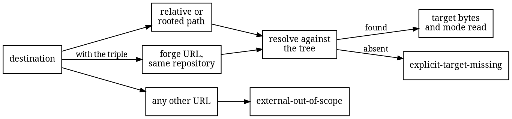

# Resolution

Parsing turns each document into a list of occurrences: inline links and images, reference
style links, and autolinks. Each occurrence keeps two spellings of its destination. The raw
one is the exact bytes from the source. The semantic one is what those bytes mean after the
format's own decoding. So `[a](&amp;b)` records both `&amp;b` and `&b`, and a change to
either the spelling or the meaning is visible later.

What the parser cannot see into is declared instead of skipped. Raw HTML blocks and [MDX](https://mdxjs.com)
expressions become opaque regions, reported with their size and place as
`opaque-html-region` and `opaque-mdx-region` findings, so a link hidden inside JSX is a
stated blind spot rather than an invisible one.

Each destination then resolves against the tree, and only three shapes are in scope. A
relative path resolves from the document's own directory and must stay inside the
repository; `../../etc/passwd` is an `invalid-reference`, not a file read. A
repository-rooted path resolves from the root. And when the invocation provides the
`--repository` triple and a dialect, a URL on the declared host that names this same
repository in the dialect's own spelling and a ref the scan can vouch for is converted to
the path it points at. Every other URL is `external-out-of-scope`: counted, reported,
left alone.

Three dialects exist, each pinned to the exact URL grammar its forge's browser emits.
The github dialect reads `owner/name/blob-or-tree/ref/path` and serves GitHub and any
GitHub Enterprise host the identity declares. The gitlab dialect reads the canonical
separator form `group[/subgroup]/name/-/blob-or-tree/ref/path`, nested groups compared
whole. The gitea dialect serves Gitea, Forgejo, and Codeberg with typed selectors:
`src/branch/` splits like the others, `src/commit/` resolves exactly when its full
lowercase object id is the candidate commit and is out of version scope otherwise, and
`src/tag/` is always out of version scope because no tag is a trusted ref. Line anchors
follow the forge: `#L10-L20` is a line reference on github and gitea, `#L10-20` on
gitlab, and each spelling is nothing on the other's forge. A recognized reference's
intent kind names the dialect that read it, not the host, so an Enterprise repository's
links carry the same kind GitHub's do.

One document, every destination shape:

```markdown
[guide](guide.md)                     resolves beside this document
[root](/docs/guide.md)                resolves from the repository root
[escape](../../etc/passwd)            invalid-reference: it leaves the repository
[dir](sub/)                           the author promised a directory
[gh](https://github.com/o/r/blob/main/src/lib.rs)   a path, when the triple names o/r on github.com
[web](https://example.com/manual)     external-out-of-scope: counted, left alone
[anchor](guide.md#setup)              the path resolves; the fragment is recorded, not checked
```

The same decision, drawn:



Resolution is exact, and the small rules matter. A trailing slash means the author promised
a directory, so `sub/` must be a tree and `guide.md/` is a type mismatch even though
`guide.md` exists. Percent-encoding is decoded exactly once, so `%252F` stays as the
literal three characters `%2F` in the name instead of turning into a second slash. A
percent escape may decode to bytes that are not text at all, and those bytes are simply
the path: `bad-%FF-name.md` resolves against the tree entry carrying that exact byte,
because Git names files in bytes and so does the resolver. Query strings and fragments are
recorded as digests but ignored for resolution, because a tree has no queries and no
anchors. One narrow divergence is deliberate: a fragment whose escapes decode outside
UTF-8 is dropped rather than digested, since carrying it would change the recorded
identity of every existing observation for no resolution gain. Heading anchors, site
routes, code symbols, and version-pinned references are all reported as
`unsupported-reference-semantics`: real checks for those belong to tools that have the
right information, and a guess here would turn honest ignorance into a false pass.

Each resolved target is read from the object store and hashed, so the comparison knows the
exact bytes and file mode on both sides. A symlink or submodule target is
`unsupported-target-kind`, because following one leaves the world of exact bytes where the
guarantees live. A [Git LFS](https://git-lfs.com) pointer file is recognized and its
declared content digest is carried, so swapping the large file behind a pointer counts as
a change even though the pointer text barely moves.
