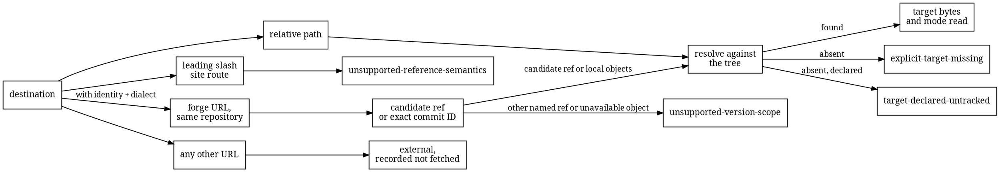

# Resolution

Parsing turns each document into a list of occurrences: inline links and images, reference
style links, autolinks, and any reference definition no reference in the document consumes,
since an orphaned `[api]: ./guide.md` still maintains a destination someone will trust.
Each occurrence keeps two spellings of its destination. The raw one is the exact bytes from
the source. The semantic one is what those bytes mean after the format's own decoding. So `[a](&amp;b)` records both `&amp;b` and `&b`, and a change to
either the spelling or the meaning is visible later.

Markdown is read the way Python-Markdown nests a block under an opener line. The
admonition, details and tabbed extensions put a body under `!!! note`, `??? tip` or
`=== "Tab"` by indenting it four columns, which CommonMark reads as indented code once a
blank line comes before it. That body is parsed as Markdown instead, so a link inside a
MkDocs admonition is checked like any other, and the same lines inside a fence stay the
example they show. Across the corpus only MkDocs trees write an opener with a body under
it, so the reading is not gated on a `mkdocs.yml`.

What the parser cannot see into is declared instead of skipped. Raw HTML blocks and [MDX](https://mdxjs.com)
expressions become opaque regions, reported with their size and place as
`opaque-html-region` and `opaque-mdx-region` findings, so a link hidden inside JSX is a
stated blind spot rather than an invisible one. JSX splits in two there, and the split is
the MDX grammar's own. A tag standing alone on its line opens a block, so what stands
between it and its closing tag is Markdown of the page, already parsed into blocks: that
body is read like any other, and only the tags on either side are opaque. A tag in the run
of a line is one paragraph's phrasing instead, and it stays opaque whole, attributes and
body together. Either way the attributes and any expression among them stay unread, so
an identity a component computes is still a blind spot. That holds for a lowercase `<a href>`
or `` too. An MDX build hands those values to the browser as written, and
Docusaurus turns a path into a bundled file only when Markdown syntax writes it, so a JSX
path answers to the page URL rather than the tree. The one exception is a literal `id` or
`name` on a lowercase element, read as the identity it declares, since reading one too
many identities can only leave a broken anchor unreported. An HTML region still yields what a
renderer would follow: `<a href>` and `` values resolve like any markdown
destination, character references decoded into the semantic spelling, alongside the
headings and `id` attributes the anchor tables already harvest. A tag spelled inside a
comment or a script, style, textarea, or title body is followed by no renderer and is
never mined, and the rest of the region stays the declared blind spot. Raw output
injection is opaque in every dialect: AsciiDoc passthrough blocks and reStructuredText
`raw` directives inject output the parser cannot read and count as opaque regions too.
Markdown and MDX draw the line wider and treat every raw HTML region as opaque, comments
included, while AsciiDoc and reStructuredText code blocks, literal blocks, and comments
render as visible text or not at all and are never opaque. An AsciiDoc URL written directly
is a link the way Asciidoctor reads it, with an attribute list, `https://host/page[text]`,
bare, or between angle brackets, a bare one ending before the punctuation that closes its
sentence, and a `mailto:` only with an attribute list.

Each destination then passes through the generic
[resolver](https://github.com/HardMax71/amiss/blob/main/crates/amiss-scan/src/resolve.rs);
trusted absolute forge spellings continue through the private
[dialect module](https://github.com/HardMax71/amiss/blob/main/crates/amiss-scan/src/resolve/forge.rs).
A relative path resolves from the document's own directory and must stay inside the
repository; `../../../etc/passwd` is an `invalid-reference`, not a file read, and so is
`!file-loader!./asset.pdf`, which is a bundler's inline request rather than a path. A path
beginning with `/` is a site route, not a repository-root shorthand. It stays unsupported unless sealed,
candidate-bound site-build evidence maps that exact route and optional decoded anchor to a
published source-backed or generated page, either directly or through a proved fragment-aware
terminal redirect, unless it is a Sphinx `:doc:` target under a `conf.py` the tree holds, or
unless a `.amiss/router.yml` above the document declares the URL path its own directory is
served at and the tree holds the page the rest of the route names.
Forge URLs need the complete identity group, not only the repository name. When
the invocation provides `--repository`, `--ref`, and `--default-branch-ref` and
selects a dialect, a URL on the declared host that names the same repository in that
dialect's spelling is converted to a path when it names the candidate branch or one full lowercase
object ID in the run's declared SHA-1 or SHA-256 format. Exact IDs on all five dialects resolve
only through that commit and its objects already present under the declared Git roots. A completely
walked local tree can prove a missing path; an unavailable commit, tree, or target object instead
retains `unsupported-version-scope` with the exact commit and contained path, plus the decoded URL
for the provider-evidence layer. The engine still fetches nothing. A named branch or tag outside the
candidate remains version-scoped without guessed commit identity. Forge query semantics remain
unsupported except for Bitbucket Cloud's canonical `fileviewer=file-view-default` presentation
choice and Bitbucket Data Center's exact revision selectors. Transclusion-dependent historical
absence remains unsupported because an object walk is not a historical site build. A URL outside the
declared repository is external. It records the decoded destination so the
layer that does fetch can read the list without walking the tree again, and it raises no finding,
because there is nothing it decided.

Five dialects exist, each pinned to the exact URL grammar its forge's browser emits.
The github dialect reads `owner/name/blob-or-tree/ref/path` and serves GitHub and any
GitHub Enterprise host the identity declares. The `raw` form reads the same way, and on
github.com so does the content host, `raw.githubusercontent.com/owner/name/ref/path`, which
serves files only; any of them may spell the branch as `refs/heads/main`. The gitlab
dialect reads the canonical separator form
`group[/subgroup...]/name/-/blob-or-tree/ref/path`, nested groups compared whole. The
gitea dialect serves Gitea, Forgejo, and Codeberg with typed selectors:
`src/branch/` splits like the others, `src/commit/` resolves its full lowercase object ID from the
local object database and retains a known immutable scope when those objects are unavailable, and
`src/tag/` is always out of version scope because no tag is a trusted ref.
The [bitbucket-cloud dialect](https://support.atlassian.com/bitbucket-cloud/docs/hyperlink-to-source-code-in-bitbucket/)
reads `owner/name/src/commitish/path`; Cloud places the
commitish in one segment, so another branch or tag still retains a known path, while a candidate
branch containing `/` cannot match that form. Its canonical default-viewer query is presentation
only. The bitbucket-data-center dialect accepts an optional literal installation context with no
`projects` or `users` segment, followed by
`projects/<key>/repos/<name>/browse/<path>` or the corresponding `users/<slug>` personal route.
No query means the declared default branch; `at=` must carry the exact candidate ref, another full
branch or tag ref, or one full object ID. The history selector Atlassian documents as
`until=<oid>&untilPath=<path>` is accepted only when the full ID has the run's object format and the
decoded path repeats the browse path. These boundaries follow Atlassian's
[repository route](https://support.atlassian.com/bitbucket-data-center/kb/repositories-are-not-visible-under-projects-in-bitbucket-ui/),
[commit browsing](https://jira.atlassian.com/browse/BSERV-8859), and
[history URL](https://support.atlassian.com/bitbucket-data-center/kb/different-file-content-for-the-same-commit-is-being-displayed-in-bitbucket-server/)
contracts. Line anchors follow the forge: `#L10-L20` is a line reference on github and gitea,
`#L10-20` on gitlab, `#lib.rs-10` on bitbucket-cloud when `lib.rs` is the target's exact
basename, and [`#10-20`](https://jira.atlassian.com/browse/BSERV-13422) on
bitbucket-data-center. Relative references use the run's declared dialect
when one is present. A recognized reference's
intent kind names the dialect that read it, not the host, so an Enterprise repository's
links carry the same kind GitHub's do. A branch spelled exactly like a full object ID is refused as
ambiguous rather than assigned whichever interpretation happens to win on a forge.

One document, every destination shape:

```markdown
[guide](guide.md)                     resolves beside this document
[guide](guide)                        resolves to guide.md, the spelling a router serves
[site](/docs/guide/)                  resolves only from matching sealed site-build evidence
[escape](../../../etc/passwd)         invalid-reference: it leaves the repository
[dir](sub/)                           the author promised a directory
[gh](https://github.com/o/r/blob/main/src/lib.rs)   a path only for o/r, github, and --ref refs/heads/main
[lines](../src/lib.rs#L45-L48)         exact inclusive line selection under github or gitea
[web](https://example.com/manual)     external: recorded with its destination, never fetched
[wiki](https://ja.wikipedia.org/wiki/日本)   external too: judged as the URL a browser requests for it
[anchor](guide.md#setup)              resolves when a known renderer publishes that heading identity
```

The same decision, drawn:


```dot process
digraph resolve {
  rankdir = LR;
  node [shape = box, fontname = "Latin Modern, Georgia, serif", fontsize = 11];
  edge [fontname = "Latin Modern, Georgia, serif", fontsize = 10, arrowsize = 0.7];
  dest  [label = "destination"];
  rel   [label = "relative path"];
  route [label = "leading-slash
site route"];
  forge [label = "forge URL,
same repository"];
  scope [label = "candidate ref
or exact commit ID"];
  other [label = "any other URL"];
  tree  [label = "resolve against
the tree"];
  ext   [label = "external,
recorded not fetched"];
  vers  [label = "unsupported-version-scope"];
  unsup [label = "unsupported-reference-semantics"];
  hit   [label = "target bytes
and mode read"];
  miss  [label = "explicit-target-missing"];
  decl  [label = "target-declared-untracked"];
  dest -> rel; dest -> forge [label = "with identity + dialect"]; dest -> route; dest -> other;
  rel -> tree; forge -> scope; scope -> tree [label = "candidate ref or local objects"];
  scope -> vers [label = "other named ref or unavailable object"]; route -> unsup; other -> ext;
  tree -> hit [label = "found"]; tree -> decl [label = "absent, declared"];
  tree -> miss [label = "absent"];
}
```

A relative destination the tree does not hold is asked once more, under the spellings a
documentation router serves: `guide` and `guide.html` for `guide.md`, a directory's
`index` for its `README.md`, and last the route a document publishes for itself, which is the
`id` or `slug` its frontmatter declares in a tree that holds a `docusaurus.config.*`. The
first spelling that names a file resolves the reference to
that file, and the report names the file that answered while the occurrence keeps the
destination the author wrote. A spelling reaches nothing that is not already in the tree, so
it can widen what resolves and never invents a target; a promised directory and a
same-repository forge URL are never re-spelled at all. A site generator whose configuration
file is in the tree anchors a destination somewhere other than beside the document: an Antora
resource ID at its family directory, a Docusaurus bare path or `@site/` alias at the content
root or the site directory, a Sphinx `:doc:` target with a leading slash at the directory
holding `conf.py`, a raw HTML destination under a `mkdocs.yml` at the directory the page is
published at, a Zola `@/` destination at the `content` directory beside `config.toml`, a
Jekyll `` or `` tag at the site's source, a Hugo `ref` or `relref` beside
the page and then under the language's `content` directory, and an mdBook destination climbing
past its book's root under the `src` of the book that holds the page it names. Markdown never
reads those templates as links, since each holds spaces, so they are read out of prose where
they open, and a quoted URL through `relative_url` is the site route it names. Both generators
fail the build on a template naming nothing, so such a target is missing rather than undecided,
while one with no site of its generator above the page is `unsupported-reference-semantics`.
The file's presence selects the rule, and three of them are read further for what they bind:
an Antora descriptor for its name, a `conf.py` for the suffixes it reads, and a Hugo
configuration for the content root and base a site route is answered under. The
nearest such file above the document selects it, and where none is above it and the tree
holds exactly one, that one does, since a site in `website/` reads pages that sit outside it.
An alias in a tree holding several sites and none above the document is
`unsupported-reference-semantics` rather than a directory of that name, since the value
arrives when the site is built and this run cannot say which site would arrive.

Other generators decide a page's URL in a configuration this engine never opens, and a
relative destination is resolved against that URL rather than against the file. Under a
Hugo configuration, a `_config.yml`, an `eleventy.config.*`, an `.eleventy.js` or an
`astro.config.*` on the document's ancestor chain, a destination the tree does not hold takes
`unsupported-reference-semantics` with `reason: unmodelled-route`, the answer a leading-slash
site route already takes, instead of being claimed missing. A destination ending in `.md`,
`.mdx` or `.markdown` is the exception: a build reads those files and serves what it made
under a name of its own, so the missing path stands. Under a `book.toml` the same
answer covers a destination ending in `.html` that no book source reaches, because that names
a page of the built site. Only the path side moves: a fragment on a document the tree holds
is still read against the identities that document publishes, and a tree declaring none of
these files reports every missing path it reported before.

A tree whose site is built somewhere else keeps no such configuration, so it names its own
router in `.amiss/router.yml` instead. That turns on the spellings that reach files the tree
already holds, and no others. The same file says where the directory is published, and a
slash-rooted route opening with that base is read as a path under it. A route reaching no file
keeps the boundary it had, so the base can resolve a destination and cannot claim one. The one
exception runs the other way: when the base side served a route from a page the candidate no
longer holds, the candidate reads that route under the base's anchoring, so deleting the page is
the missing target it is rather than a reference that seems to have left. The same holds under a
generator whose build might supply a path, such as an Antora component an extension assembles: a
page the base held in the tree was no build's, so deleting it is missing rather than left to the
build.

[What a documentation router serves](route-spellings.md) holds the spellings, the routers
they were harvested from, the generator rules and what selects each, and what the union costs.
[What a repository declares](route-spellings.md#what-a-repository-declares-about-its-own-build)
is the section with the names you can write and four trees read with the file and without it.

A destination that opens `{{` or `{%` never reaches the tree at all. The build fills it in, so
it takes the same `unsupported-reference-semantics` an AsciiDoc `{attribute}` takes. The
opening is enough, since an HTML attribute value ends at the next quote and hands over an
expression with the closer cut off, and a file whose own name carries a single brace stays a
path.

A destination no spelling reaches, in a tree that declares no such generator, is
`kind: missing` with `reason: path-not-found`. The path
that row names is the destination read from the document's own directory wherever a rule kept
that reading, so a finding never carries a directory a rule anchored at: a raw
`` under a `mkdocs.yml` is missing at `img/gone.png` rather than
under the directory the page is published at. The row also carries `near`: the one tracked
path equal to the missed one apart from case,
when exactly one exists and null otherwise. It answers the break a case-insensitive
working copy hides, where `Guide.md` opens locally and resolves nowhere on the tree the
forge and Linux CI read. A repository holding both spellings names a real ambiguity and
stays bare. A lone reference whose written path part is the missed intent's exact tail
turns that neighbor into the finding's `fix`, replacing only the bytes the author wrote
while a fragment rides untouched beside them.

When the missed path existed in the base tree and disappeared from the candidate, the same
resolution also carries `same_object_at` if exactly one candidate-added entry has the identical
Git mode and object ID and that identity belongs to exactly one removed path. Copies, duplicate
content, mode changes, and edited moves leave it null. An index holds no directory entries, so
under `--index` a removed directory pairs with the one added directory holding exactly its files,
and only when no other removed directory held the same tree. This is candidate-tree evidence that Git
stores identical bytes at another path, not evidence of author intent: it never supplies a `fix`
or replacement bytes. The human form prints it after the reason as `same bytes at` and the path.
The case-only `near` fact remains independent.

A destination no spelling reaches is asked one last question, against a declaration the
repository already publishes for Git rather than for this engine. Only the tracked
`.gitignore` files on the path's own ancestor chain can name it, and the nearest one that
answers travels with the finding. What comes back is `target-declared-untracked`, a record
under both profiles, so the reference stays counted rather than cleared. The engine never asks
whether a path is ignored; it asks whether a line's own spelling bounds what that line can
clear, since a line reaching further than it spells would answer for an unbounded number of
references.

Two shapes qualify. The first is a literal that a slash anchors to the file's own directory,
at the front or in the middle, with no pattern or escape byte and no empty, `.`, or `..`
segment; it names one path, and a trailing slash makes it answer for that path's descendants
too. The second is the bare `*`, which says the directory holding the file keeps nothing, so
it answers for every path under that directory. A negation is counter-evidence to a `*`
standing beside it: `!.gitignore` keeps that one entry out of the declaration, while a
negation this cannot bound, `!*.md` or anything carrying a slash, drops the emptied directory
altogether.

Everything else is refused. A pattern with no slash matches wherever the tree happens to hold
that name, at any depth, so one word in a root file could answer for a path anywhere in the
repository; those references stay missing targets. Git applies no ignore rule to a file
already tracked, and neither does this: a path the tree holds never reaches the question.

AsciiDoc destinations reach one rule of their own before anything else. A target still
holding `{name}` cannot be a path, because the value arrives when the site is built and this
engine reads two trees, so it is `unsupported-reference-semantics` rather than a guess at a
directory called `{name}`. Across Quarkus that is roughly a quarter of every reference, so
reporting them as missing would have buried the real breaks. The double-angle shorthand keeps an
unambiguous `document.adoc#anchor` as an inter-document target rather than turning the entire value
into a local ID. Inside an Antora component, a document under `modules/<name>/` with
`antora.yml` at the component root, an xref, a family-qualified include, or an image is read as
the resource ID Antora reads it as and anchored at the family directory of its module, so
`xref:index.adoc[]` in `modules/api/nav.adoc` names `modules/api/pages/index.adoc`. The
component is every source root whose `antora.yml` spells the same name, and one reserving the
`ext` block is assembled by an extension, so a resource it does not hold is undecided rather
than absent. Outside Antora an image joins `imagesdir`, which is empty unless a document sets
it, so a document that sets none reads its images beside itself, the way Asciidoctor and a
forge's preview both do, and one whose header sets a single literal directory reads them under
it. A document another includes takes its includer's value, and one that sets it anywhere past
the header, twice, or through an attribute leaves its images undecided. A heading anchor on an AsciiDoc target resolves through the Asciidoctor rule in
[What thirteen renderers call a heading](anchor-rules.md), the only rule whose identities all
carry a prefix.

An AsciiDoc destination that needs the build's own state is declined as attribute-dependent
rather than guessed: one holding an unexpanded `{attribute}`, an image whose `imagesdir` the
run cannot know, since it is an attribute too, and a cross reference to an extensionless name,
which is a page identity a site catalogue answers. A link or an include is read as written,
so `link:LICENSE[]` names that file, `include::NOTICE[]` is missing when the tree lacks it, and
a climb out of the tree is a traversal, and an image at a URL is external.

An AsciiDoc document publishes three identities a cross reference can name. A block anchor,
`[#install]`, `[[install]]`, `[source#install]` or `[id=install]` on a line of its own, and an
inline anchor, `[[remove-refs]]`, `[[[bib]]]` or `anchor:remove-refs[]` in the flow of a list
item, a paragraph or a section title, are identities as written. A section title is the
reference text a natural cross reference names, so `<<API entrypoints>>` reaches the section
titled `API entrypoints` however far down the page it sits, which is the reverse lookup
Asciidoctor runs when the target is no known ID. It runs that lookup only where the target
carries a space or a capital, so a title carrying neither publishes nothing beyond the
identity the renderer rules already give it, and an inline anchor is read only where its ID
follows Asciidoctor's own grammar, since that scan runs over prose rather than over a line
that carries nothing else. A paragraph whose first line is indented is literal text, rendered
as the characters it holds, so nothing inside it is a reference or an anchor at all: the
`s!Figure (\d+)!<<fig-$1>>!g` in a shell command in Asciidoctor's own migration page is not a
cross reference to `fig-$1`. An indented line carrying a list marker is a list item, which
Asciidoctor checks first.

A reStructuredText heading anchor resolves through the Docutils rule in
[What thirteen renderers call a heading](anchor-rules.md), and the labels a document declares
outright with `.. _name:` resolve as themselves. The Sphinx roles that name a document, a file
or a label are modelled by name, which is why the grammar profile says
`docutils-rst-sphinx-refs`: `:doc:`, `:download:`, `:ref:`, `:numref:` and `:term:`. A
`:download:` names a file as written, beside its document, or under the directory holding
`conf.py` when it opens with a slash, and so do the paths an `image`, `figure`, `include` or
`literalinclude` names, since Sphinx reads each of them the same way. A `:numref:` is a label
the way a `:ref:` is. A `:term:` names a term some `glossary` directive in the tree declares,
compared without case, and a term nobody declares is missing unless `conf.py` mentions
intersphinx anywhere, which can bring in another project's glossary through an extension
that never names it. An image a substitution
definition names, `.. |logo| image:: logo.png`, is an image like any other, and the link an
image or figure opens, its `:target:` option, is a destination of its own. A relative
`:doc:` target resolves beside its document, read under each suffix its root reads and again
as the author wrote it, so a docname carrying a dot of its own reaches the file that name
takes the suffix of. One already spelled with a suffix keeps it, since that spelling was the
adapter's and the adapter runs before any root is known. A
source-root-absolute one resolves under the directory holding `conf.py` when that file sits
above the document in the tree, under each suffix that `conf.py` declares, and stays a declared
site route when nothing names the Sphinx root. An entry of a `toctree` body is a docname the
same way and resolves the same way, bare or as `Title <docname>`; its options, `self`, URLs,
and glob patterns name no single document and are passed over. A `:ref:` resolves against the snapshot's label table, built after
discovery from every name a document whose profile reads roles declares and
bounded by `declared-labels-per-snapshot`, and a `:numref:` too: a unique declaration resolves to its
declaring document, a name nobody declares is a missing target, and a name declared
twice is undecided rather than guessed between. Labels follow the Docutils simple-name
rule, case-folded with whitespace runs collapsed, a phrase declaration may arrive
backtick-quoted or sit inside a list item or grid-table cell, and an undeclared name
carrying a colon is treated as another project's inventory, declared unsupported rather
than reported missing. So are `genindex`, `modindex`, `py-modindex` and `search`, which
Sphinx declares itself for the index and search pages every build writes. The
`extensions` a `conf.py` loads add two more: `sphinx.ext.autosectionlabel` declares every
section title as a label, prefixed with the docname and a colon where
`autosectionlabel_prefix_document` is true, and `sphinx.ext.autodoc` or
`sphinx.ext.autosummary` pull labels out of Python docstrings no document holds, so under
either one a name nothing here declares is declined as well. A prefixless name absent from the local table can resolve only through one
unique label in complete, candidate-bound [Intersphinx evidence](semantic-evidence.md) supplied
through the sealed trust boundary. Local declarations retain precedence; duplicate external labels
stay unsupported, while absent, partial, stale, malformed, or mismatched evidence leaves the name
missing. The engine never fetches an inventory. Every other role stays an open extension point,
declared rather than read into.

A Sphinx project that writes its pages in Markdown spells the same two roles in MyST, and they
are answered the same way. `` {doc}`quickstart` `` is the docname `:doc:` names, taking `.md`
rather than `.rst`, and `` {ref}`install-step` `` is the label `:ref:` names, looked up in the
same table, which a MyST document fills through `(name)=`, its attribute blocks, the
`:name:` a directive carries, the terms of a `{.glossary}` list and the object a
`domain:type` directive describes. `` {term}`environment` `` is answered the way `:term:` is. The `myst-link` rule in
[What thirteen renderers call a heading](anchor-rules.md) points a plain link
at that same table: `[text](name)` where the tree holds no such file, and `[text](#name)` where
the document itself publishes no such identity, are looked up as labels before either is
reported missing, so the tree keeps whatever answer it had and a name nobody declares stays
the missing target it was. A source-root docname such as `` {doc}`/api` `` resolves under that
root the same way, and a root that loads MyST reads `.md` beside the suffixes `conf.py`
declares, since MyST adds it when it loads, so a `:doc:` and a `{doc}` each reach a page
written in the other format. Every other role is counted and left alone: `` {py:class}`Widget` ``,
`` {func}`echo` `` and `` {issue}`4211` `` name a domain inventory Sphinx builds while it runs
or a link template `conf.py` holds, so each is recorded as unsupported semantics rather than
resolved, guessed, or reported missing. A plain link can name the same object,
`[Explicit text](#mypackage.MyClass)`. Where a `{py:class}` directive in the tree describes
that class the name is already in the table and the link reaches the page holding it, and
where nothing in the tree describes it the link stays a missing target, since reading any
dotted fragment as an inventory name would swallow every real anchor break whose slug
carries a dot.

Nothing here is read without a Sphinx declaration over the document, and two things count as
one. A `conf.py` above the file is the first. The second is a page under one that renders
the file in place of an `{include}`, since Sphinx parses an included file as part of the
page holding the directive. That is how a changelog at the repository root writes the labels
its site resolves, while the same file in a tree nothing includes stays the prose it looks like.
The second reading says which files Sphinx parses and nothing about what each publishes: the
including page's own identity set is unchanged, so a fragment into it is answered exactly as
before. The count says how many references the run saw rather than how many it answered.

Heading evaluation expands the closed local include subset in source order. An AsciiDoc
`include::path[]` or option-free, document-level reStructuredText `include` participates when its
literal relative target was already scanned under the same adapter; each nested path is relative to
the file that includes it. An MDX partial joins the same subset: a default import of a relative
Markdown document rendered as an element, which is how Docusaurus composes one page out of
several files, and the identities flow to the page rather than back to the partial. So a fragment
written inside a document Docusaurus publishes no page for is undecided rather than absent: the
identity it names belongs to whichever page renders the file, and one partial may be rendered
into several. [What a documentation router serves](route-spellings.md) holds the names a content
path excludes and what stays a path there. So does a
MkDocs snippet line, `--8<-- "path"`, under a tree that declares MkDocs, resolved from the
directory holding that declaration rather than from beside the document. Each include line is
also a reference of its own, since both generators expand it before Markdown reads the page,
in a fence as much as in prose: the snippet line under that declaration, and an mdBook
`{{#include}}`, `{{#rustdoc_include}}` or `{{#playground}}` in a page of the book's source
directory, read beside the page. So a deleted or renamed listing is a missing target, and one
that changes under unchanged prose is a check. A selector after the path, a line range or an
anchor name, stays in the written target and is not evaluated, so the whole file is what the
reference depends on, and a backslash before an mdBook command leaves it text. A generator
instruction under the same declaration, `::: pydantic.config`, is an edge this engine reads
and cannot follow, because what it pulls in is built by a program rather than held by the
tree, so the page keeps the identities it writes itself and absence in it stays undecided.
Two more spellings under that declaration are read the same way: a heading whose text is an
`<!-- md:setting name -->` comment a hook expands, and a `=== "Title"` content tab the
tabbed extension slugs under settings that live in `mkdocs.yml`. Neither identity is in the
tree, so neither page proves absence.
An option-free `literalinclude` contributes no parsed headings. Its selection is checked the
way a line fragment is: `:lines: 5-8` must fall inside the file and tracks those lines alone,
a list or an open end reads as the span from its first selected line to its last, and a
`:pyobject:` is a code fragment the run declines while still tracking the whole file. The
range is spelled the way a run with no forge, or a GitHub or Gitea one, spells a line
fragment, so under a GitLab or Bitbucket Data Center identity it goes unchecked. The graph
is bounded by `references-per-document`, `parser-nesting`, and
`aggregate-heading-anchor-evaluation-bytes-per-snapshot`. A cycle, an unscanned or non-local target,
a build-time attribute, include options, or a nested parser context leaves the identities collected
up to that edge partial: a published identity can still resolve, but absence stays undecided rather
than becoming a guessed missing anchor. Expanded AsciiDoc remains partial even when every edge is
available because its document-attribute and conditional state is not reproduced; reStructuredText
can prove absence inside the closed option-free subset. The same holds in the other direction for a
chapter: an AsciiDoc document another one includes renders inside the book that includes it, and
so does one an Antora component keeps among its partials or examples, so a cross reference in it
may name an identity another chapter declares. Absence there stays undecided too, while a document
nothing includes still proves it.

Resolution is exact, and the small rules matter. A trailing slash means the author
promised a directory, so `sub/` must be a tree and `guide.md/` is a type mismatch even
though `guide.md` exists. A GitHub or GitLab URL promises no kind at all: both forges
redirect a `blob` URL naming a directory to its `tree` and back, and serve either with a
trailing slash. A destination that normalizes to nothing names the repository
root: `.` in a root document, `..` one directory down, or a forge URL with nothing after its
ref. Every snapshot holds the root and no repository path spells it, so the link is declined
as `unsupported-reference-semantics` with `reason: repository-root` rather than called
invalid. Percent-encoding is decoded exactly once: `%252F` stays as the
literal three characters `%2F` instead of turning into a second slash. A percent escape
may decode to bytes that are not text at all, and those bytes are simply the path.
`bad-%FF-name.md` resolves against the tree entry carrying that exact byte, because Git
names files in bytes and so does the resolver.

Fragments split by kind. Query strings are recorded as digests and acquire no semantics
here. One narrow divergence is deliberate: a fragment whose escapes decode outside UTF-8 is
dropped rather than digested, since carrying it would change the recorded identity of
every existing observation for no resolution gain. A recognized numeric line fragment
selects the inclusive raw lines. A range beyond the blob is resolution `kind: missing` with
`reason: line-fragment-out-of-range`, reported as an explicit missing target. A valid range
replaces the whole-file projection with only the selected bytes and file mode, so a change
outside the range does not claim this occurrence's dependency changed. Git LFS pointers and
trees have no line selection and stay unsupported.

Every other fragment on a document target is a heading anchor, and a heading identity
belongs to the renderer rather than to Markdown. Twelve rules are pinned, one per renderer or
per configuration of one, and the resolver asks whether any of them would publish the
anchor, counting the headings a document writes as raw HTML and the identities it declares
outright, in raw HTML or in an attribute block, as well. A definition-list term is read
beside them, because one renderer publishes an identity for a term on the counter its
headings occupy. An anchor no rule
publishes is `kind: missing` with `reason: heading-anchor-not-found`, an ordinary missing
target; the row also carries `near`, the one published identity the fragment names apart from
typography when exactly one exists and null otherwise. The fold covers the two spellings
the pinned rules disagree on, case and the separator character, in two steps: case alone
first, then case and the separator together, since the `mdn` rule publishes with `_` what
most rules publish with `-`. A duplicate suffix written `_1` still folds together with `-1`
in the second step, and a lone reference over a verbatim-located fragment turns that
neighbor into the finding's `fix`. A fragment holding `:~:` carries a text directive, which a
browser answers by finding text on the page, so it names no identity and is declined as an
unsupported fragment. The union is deliberate: adding a rule can only grow what an anchor may match, and no
repository policy narrows it. A document can add to it, by declaring an identity the way it
would add a heading, which is an edit to the target that a reviewer reads rather than a
setting that clears a finding. A footnote joins the union too, under the spellings six
renderers publish for a note and its first call, `fn:1` and `fnref:1` among them.
[What thirteen renderers call a heading](anchor-rules.md) holds the rules, what each was checked
against, and how far apart they are.

What the check will not do is judge on a parse that did not happen. A target that is not a
parsing document class, an LFS pointer, a document the parser rejects, one the anchor
budget cannot afford, or one no router publishes as a page keeps
`unsupported-reference-semantics`, which now means exactly "not evaluated". The projection
stays the whole file: an anchor says where to look, not which bytes the reference depends on.

Version scope is equally narrow. The candidate is read, and a full immutable ID is read only from
objects already present under the declared Git roots; unavailable objects are delegated for
provider evidence instead of fetched. `--default-branch-ref` supplies a second trusted spelling so
the resolver can split a ref from its path without guessing, and a URL naming the default branch
while the candidate ref differs is still `unsupported-version-scope`. Site generators and
language-aware tools still own route and symbol semantics. A complete site-build producer can
contribute exact positive source-backed or generated route, anchor, and fragment-aware
terminal-redirect facts for the candidate; absent, ambiguous, or stale mappings remain unsupported,
while conflicting ownership and broken declared redirects become build defects retaining every
available source. Guessing beyond that evidence would turn honest ignorance into a false pass. The
[resolver tests](https://github.com/HardMax71/amiss/tree/main/crates/amiss-scan/tests/resolve)
pin these distinctions.

Each resolved target is read from the object store and hashed, so the comparison knows the
exact selected bytes and file mode on both sides. Numeric positions do not prove that those
bytes still mean what the prose claims; they only make movement and byte drift observable.
A symlink or submodule target, or a path beneath one, is
`unsupported-target-kind`, because following one leaves the world of exact bytes where the
guarantees live. A [Git LFS](https://git-lfs.com) pointer file is recognized and its committed
pointer bytes are hashed. Those bytes include the declared OID, so an OID-text change is
observable; a backing-store change that leaves the committed pointer unchanged is not.
