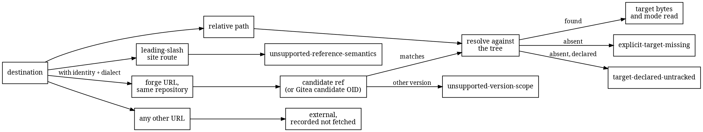

# Resolution

Parsing turns each document into a list of occurrences: inline links and images, reference
style links, and autolinks. Each occurrence keeps two spellings of its destination. The raw
one is the exact bytes from the source. The semantic one is what those bytes mean after the
format's own decoding. So `[a](&amp;b)` records both `&amp;b` and `&b`, and a change to
either the spelling or the meaning is visible later.

What the parser cannot see into is declared instead of skipped. Raw HTML blocks and [MDX](https://mdxjs.com)
expressions become opaque regions, reported with their size and place as
`opaque-html-region` and `opaque-mdx-region` findings, so a link hidden inside JSX is a
stated blind spot rather than an invisible one.

Each destination then passes through the generic
[resolver](https://github.com/HardMax71/amiss/blob/main/crates/amiss-scan/src/resolve.rs);
trusted absolute forge spellings continue through the private
[dialect module](https://github.com/HardMax71/amiss/blob/main/crates/amiss-scan/src/resolve/forge.rs).
A relative path resolves from the document's own directory and must stay inside the
repository; `../../etc/passwd` is an `invalid-reference`, not a file read. A path beginning
with `/` is a site route, not a repository-root shorthand, and is reported as unsupported
reference semantics. Forge URLs need the complete identity group, not only the repository
name. When the invocation provides `--repository`, `--ref`, and `--default-branch-ref` and
selects a dialect, a URL on the declared host that names the same repository in that
dialect's spelling is converted to a path only when it names the candidate branch or, for
Gitea, the exact candidate commit. A same-repository URL for any other version is
`unsupported-version-scope`; a URL outside that identity is external, and the engine never
fetches one. It records the occurrence with the destination the format decodes to, the address a fetcher
would request, so the layer that does fetch can read the list without walking the tree again, and it raises no finding,
because there is nothing it decided.

Three dialects exist, each pinned to the exact URL grammar its forge's browser emits.
The github dialect reads `owner/name/blob-or-tree/ref/path` and serves GitHub and any
GitHub Enterprise host the identity declares. The gitlab dialect reads the canonical
separator form `group[/subgroup...]/name/-/blob-or-tree/ref/path`, nested groups compared
whole. The gitea dialect serves Gitea, Forgejo, and Codeberg with typed selectors:
`src/branch/` splits like the others, `src/commit/` resolves exactly when its full
lowercase object id is the candidate commit and is out of version scope otherwise, and
`src/tag/` is always out of version scope because no tag is a trusted ref. Line anchors
follow the forge: `#L10-L20` is a line reference on github and gitea, `#L10-20` on
gitlab, and each range spelling is nothing on the other's forge. `#L10` is common to all
three. Relative references use the run's declared dialect when one is present. A recognized reference's
intent kind names the dialect that read it, not the host, so an Enterprise repository's
links carry the same kind GitHub's do.

One document, every destination shape:

```markdown
[guide](guide.md)                     resolves beside this document
[guide](guide)                        resolves to guide.md, the spelling a router serves
[site](/docs/guide.md)                unsupported site route; it is not rewritten as a tree path
[escape](https://github.com/HardMax71/amiss/blob/main/etc/passwd)            invalid-reference: it leaves the repository
[dir](sub/)                           the author promised a directory
[gh](https://github.com/o/r/blob/main/src/lib.rs)   a path only for o/r, github, and --ref refs/heads/main
[lines](../src/lib.rs#L45-L48)         exact inclusive line selection under github or gitea
[web](https://example.com/manual)     external: recorded with its destination, never fetched
[anchor](guide.md#setup)              resolves when a known renderer publishes that heading identity
```

The same decision, drawn:


```dot process
digraph resolve {
  rankdir = LR;
  node [shape = box, fontname = "Latin Modern, Georgia, serif", fontsize = 11];
  edge [fontname = "Latin Modern, Georgia, serif", fontsize = 10, arrowsize = 0.7];
  dest  [label = "destination"];
  rel   [label = "relative path"];
  route [label = "leading-slash
site route"];
  forge [label = "forge URL,
same repository"];
  scope [label = "candidate ref
(or Gitea candidate OID)"];
  other [label = "any other URL"];
  tree  [label = "resolve against
the tree"];
  ext   [label = "external,
recorded not fetched"];
  vers  [label = "unsupported-version-scope"];
  unsup [label = "unsupported-reference-semantics"];
  hit   [label = "target bytes
and mode read"];
  miss  [label = "explicit-target-missing"];
  decl  [label = "target-declared-untracked"];
  dest -> rel; dest -> forge [label = "with identity + dialect"]; dest -> route; dest -> other;
  rel -> tree; forge -> scope; scope -> tree [label = "matches"];
  scope -> vers [label = "other version"]; route -> unsup; other -> ext;
  tree -> hit [label = "found"]; tree -> decl [label = "absent, declared"];
  tree -> miss [label = "absent"];
}
```

A relative destination the tree does not hold is asked once more, under the spellings a
documentation router serves: `guide` and `guide.html` for `guide.md`, and a directory's
`index` for its `README.md`. The first spelling that names a file resolves the reference to
that file, and the report names the file that answered while the occurrence keeps the
destination the author wrote. A spelling reaches nothing that is not already in the tree, so
it can widen what resolves and never invents a target; a promised directory and a
same-repository forge URL are never re-spelled at all.
[What a documentation router serves](route-spellings.md) holds the spellings, the routers
they were harvested from, and what the union costs.

A destination no spelling reaches is asked one last question, against a declaration the
repository already publishes for Git rather than for this engine. Only the tracked
`.gitignore` files on the path's own ancestor chain can name it, and a line qualifies only
when it is anchored with a leading slash, carries no pattern or escape byte, is neither a
comment nor a negation, and spells a path with no empty, `.`, or `..` segment. The nearest
file that names the path answers and travels with the result, and a directory line answers for
its descendants. The result is `target-declared-untracked`, a record under both profiles, so
the reference stays counted rather than cleared. The engine never asks whether a path is
ignored; it asks whether a tracked ignore file names exactly that path, because one wildcard
would let a single line answer for an unbounded number of references. Git applies no ignore
rule to a file already tracked, and neither does this: a path the tree holds never reaches the
question.

AsciiDoc destinations reach one rule of their own before anything else. A target still
holding `{name}` cannot be a path, because the value arrives when the site is built and this
engine reads two trees, so it is `unsupported-reference-semantics` rather than a guess at a
directory called `{name}`. Across Quarkus that is roughly a quarter of every reference, so
reporting them as missing would have buried the real breaks. A heading anchor on an AsciiDoc target resolves
through the Asciidoctor rule in
[What twelve renderers call a heading](anchor-rules.md), which is the only rule whose separator
is `_` and whose identities all carry a prefix.

A reStructuredText heading anchor resolves through the Docutils rule in
[What twelve renderers call a heading](anchor-rules.md), and the labels a document declares
outright with `.. _name:` resolve as themselves. The two Sphinx roles are modelled by
name, which is why the grammar profile says `docutils-rst-sphinx-refs`. A relative
`:doc:` target takes the source suffix and resolves like any repository path, while a
source-root-absolute one stays a declared site route, because the engine does not know
the Sphinx root. A `:ref:` resolves against the snapshot's label table, built during
discovery from every `.. _name:` a scanned reStructuredText document declares and
bounded by `declared-labels-per-snapshot`: a unique declaration resolves to its
declaring document, a name nobody declares is a missing target, and a name declared
twice is undecided rather than guessed between. Labels follow the Docutils simple-name
rule, case-folded with whitespace runs collapsed, a phrase declaration may arrive
backtick-quoted or sit inside a list item or grid-table cell, and an undeclared name
carrying a colon is treated as another project's inventory, declared unsupported rather
than reported missing. One boundary stays open by nature: a prefixless `:ref:` that a
Sphinx build would satisfy through an intersphinx inventory is indistinguishable in the
tree from a dead label, so it reports missing, and under observe that is a signal for a
person rather than a verdict. Every other
role stays an open extension point, declared rather than read into. A target that includes another file,
through the AsciiDoc include or the reStructuredText `include` and `literalinclude`
directives, publishes identities this engine never read, so an anchor it does not hold
stays undecided rather than reported missing.

Resolution is exact, and the small rules matter. A trailing slash means the author
promised a directory, so `sub/` must be a tree and `guide.md/` is a type mismatch even
though `guide.md` exists. Percent-encoding is decoded exactly once: `%252F` stays as the
literal three characters `%2F` instead of turning into a second slash. A percent escape
may decode to bytes that are not text at all, and those bytes are simply the path.
`bad-%FF-name.md` resolves against the tree entry carrying that exact byte, because Git
names files in bytes and so does the resolver.

Fragments split by kind. Query strings are recorded as digests and acquire no semantics
here. One narrow divergence is deliberate: a fragment whose escapes decode outside UTF-8 is
dropped rather than digested, since carrying it would change the recorded identity of
every existing observation for no resolution gain. A recognized numeric line fragment
selects the inclusive raw lines. A range beyond the blob is resolution `kind: missing` with
`reason: line-fragment-out-of-range`, reported as an explicit missing target. A valid range
replaces the whole-file projection with only the selected bytes and file mode, so a change
outside the range does not claim this occurrence's dependency changed. Git LFS pointers and
trees have no line selection and stay unsupported.

Every other fragment on a document target is a heading anchor, and a heading identity
belongs to the renderer rather than to Markdown. Twelve rules are pinned, one per renderer or
per configuration of one, and the resolver asks whether any of them would publish the
anchor, counting the headings a document writes as raw HTML and the identities it declares
outright, in raw HTML or in an attribute block, as well. An anchor no rule
publishes is `kind: missing` with `reason: heading-anchor-not-found`, an ordinary missing
target; the row also carries `near`, the one case-fold neighbor from the published set when
exactly one exists and null otherwise; a lone reference over a verbatim-located
fragment turns that neighbor into the finding's `fix`. The union is deliberate: adding a rule can only grow what an anchor may match, and no
repository policy narrows it. A document can add to it, by declaring an identity the way it
would add a heading, which is an edit to the target that a reviewer reads rather than a
setting that clears a finding.
[What twelve renderers call a heading](anchor-rules.md) holds the rules, what each was checked
against, and how far apart they are.

What the check will not do is judge on a parse that did not happen. A target that is not a
parsing document class, an LFS pointer, a document the parser rejects, or one the anchor
budget cannot afford keeps `unsupported-reference-semantics`, which now means exactly
"not evaluated". The projection stays the whole file: an anchor says where to look, not
which bytes the reference depends on.

Version scope is equally narrow. Only the candidate version is read.
`--default-branch-ref` supplies a second trusted spelling so the resolver can split a ref
from its path without guessing, and a URL naming the default branch while the candidate
ref differs is still `unsupported-version-scope`. Site generators and language-aware tools
still own route and symbol semantics; guessing those here would turn honest ignorance into
a false pass. The
[resolver tests](https://github.com/HardMax71/amiss/tree/main/crates/amiss-scan/tests/resolve)
pin these distinctions.

Each resolved target is read from the object store and hashed, so the comparison knows the
exact selected bytes and file mode on both sides. Numeric positions do not prove that those
bytes still mean what the prose claims; they only make movement and byte drift observable.
A symlink or submodule target is
`unsupported-target-kind`, because following one leaves the world of exact bytes where the
guarantees live. A [Git LFS](https://git-lfs.com) pointer file is recognized and its committed
pointer bytes are hashed. Those bytes include the declared OID, so an OID-text change is
observable; a backing-store change that leaves the committed pointer unchanged is not.
